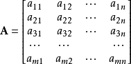
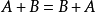
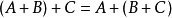
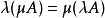
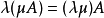
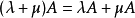
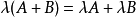

# A.2 线性代数

A.2.1 向量

一个n维向量的矩阵形式为：

其中

A.2.2 矩阵

由 m × n 个数aij排成的m行n列的数表称为m行n列的矩阵，简称m × n矩阵。记作：

这m×n
个数称为矩阵**A**的元素，简称为元，数aij位于矩阵**A**的第i行第j列，称为矩阵**A**的(i,j)元，以数
aij为(i,j)元的矩阵可记为(aij)或(aij)m × n，m×n矩阵**A**也记作**Amn**。

A.2.3 运算

### 加法

矩阵的加法满足下列运算律(**A**，**B**，**C**都是同型矩阵)：

### 数乘

矩阵的数乘满足以下运算律：

矩阵的加减法和矩阵的数乘合称矩阵的线性运算 [8] 。

### 转置

把矩阵A的行和列互相交换所产生的矩阵称为A的转置矩阵，这一过程称为矩阵的转置
