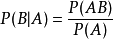
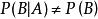
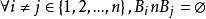
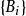
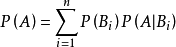
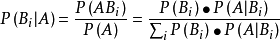

# A.3 概率统计

定义3：把试验中所观察的对象用X表示，X具有这样的特点：随着试验的重复X可以取不同值，并且在每次试验中X取什么值不能提前知道，是带有随机性，若满足称X是随机变量。

**定理1**

设A，B 是两个事件，且A不是不可能事件，则称

为在事件A发生的条件下，事件B发生的条件概率。一般地，

，且它满足以下三条件：

（1）非负性；（2）规范性；（3）可列可加性。

**定理2**

设E 为随机试验，Ω 为样本空间，A，B 为任意两个事件，设P(A)\>0，称

为在“事件A 发生”的条件下事件B 的条件概率。

**定理3**

**定义：（完备事件组/样本空间的划分）**

设B1，B2，…Bn是一组事件,若

（1）

（2）B1∪B2∪…∪Bn=Ω

则称B1，B2，…Bn样本空间Ω的一个划分，或称为样本空间Ω 的一个完备事件组。

定理（全概率公式）：

设事件组

是样本空间Ω 的一个划分，且P（Bi）\>0（i=1，2，…n）

则对任一事件B，有

**定理4**

设B1，B2，…Bn…是一完备事件组，则对任一事件A，P（A）\>0，有

