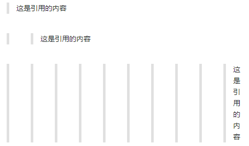
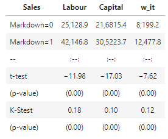

# B.2 Markdown基本语法

### B.2.1 标题

在想要设置为标题的文字前面加\#来表示  
一个\#是一级标题，二个\#是二级标题，以此类推。支持六级标题。

注：标准语法一般在\#后跟个空格再写文字，貌似简书不加空格也行。

示例：

\# 一级标题

\#\# 二级标题

\#\#\# 三级标题

\#\#\#\# 四级标题

\#\#\#\#\# 五级标题

\#\#\#\#\#\# 六级标题

效果如下：

### A.2.2 字体

#### 加粗

要加粗的文字左右分别用两个\*号包起来

#### 斜体

要倾斜的文字左右分别用一个\*号包起来

#### 斜体加粗

要倾斜和加粗的文字左右分别用三个\*号包起来

#### 删除线

要加删除线的文字左右分别用两个\~\~号包起来

示例：

\*\*这是加粗的文字\*\*

\*这是倾斜的文字\*\`

\*\*\*这是斜体加粗的文字\*\*\*

\~\~这是加删除线的文字\~\~

效果如下：

### A.2.3 引用

在引用的文字前加\>即可。引用也可以嵌套，如加两个\>\>三个\>\>\>n个...  
貌似可以一直加下去，但没神马卵用

示例：

\>这是引用的内容

\>\>这是引用的内容

\>\>\>\>\>\>\>\>\>\>这是引用的内容

效果如下：

### A.2.4 分割线

三个或者三个以上的 - 或者 \* 都可以。

示例：

\---

\----

\*\*\*

\*\*\*\*\*

效果如下

### A.2.5 图片

语法：

图片alt就是显示在图片下面的文字，相当于对图片内容的解释。

图片title是图片的标题，当鼠标移到图片上时显示的内容。title可加可不加

示例：

效果如下：

**上传本地图片直接点击导航栏的图片标志，选择图片即可**

### A.2.6 超链接

语法：

[超链接名](超链接地址 "超链接title")

title可加可不加

示例：

[百度](http://baidu.com)

效果如下：

百度

别的平台可能就不行了，如果想要在新页面中打开的话可以用html语言的a标签代替。

\<a href="超链接地址" target="_blank"\>空链接\</a\>

\<a href="http://grid.hust.edu.cn/" target="_blank"\>"SCTS&CGCL"\</a\>

[空链接](http://222.22.65.186:8888/files/%E8%B6%85%E9%93%BE%E6%8E%A5%E5%9C%B0%E5%9D%80)

["SCTS&CGCL"](http://grid.hust.edu.cn/)

### A.2.7 列表

-   **无序列表**

语法：

（无序列表用 - + \* 任何一种都可以）

\- 列表内容

\+ 列表内容

\* 列表内容

注意：- + \* 跟内容之间都要有一个空格

效果如下：

-   **有序列表**

    语法：  
    数字加点

1.列表内容

2.列表内容

3.列表内容

注意：序号跟内容之间要有空格

效果如下：

-   **列表嵌套**

**语法：上一级和下一级之间敲三个空格即可**

**示例：**

\+ 一级无序列表

\+ 二级无序列表

\+ 三级无序列表

\+ 四级无序列表

\+ 五级无序列表

\+ 六级无序列表

效果如下

示例

\+ 一级无序列表

\+ 二级无序列表

1\. 三级有序列表

\+ 四级无序列表

2\. 三级有序列表

\+ 五级无序列表

\+ 六级无序列表

效果如下

### A.2.8 表格

语法：

表头\|表头\|表头

\---\|:--:\|---:

内容\|内容\|内容

内容\|内容\|内容

第二行分割表头和内容。

\- 有一个就行，为了对齐，多加了几个

文字默认居左

\-两边加：表示文字居中

\-右边加：表示文字居右

注：原生的语法两边都要用 \| 包起来。此处省略

示例：

\|Sales\|Labour\|Capital\|w_it

\--\|:--:\|:--:\|:--:\|

Markdown=0\|25,128.9\|21,6815.4\|8,199.2\|1.13

Markdown=1\|42,146.8\|30,5223.7\|12,477.8\|0.99

\--\|:--:\|:--:\|:--:\|

t-test\|−11.98\|−17.03\|−7.62\|51.18

(p-value)\|(0.00)\|(0.00)\|(0.00)\|(0.00)

K-Stest\|0.18\|0.10\|0.12\|0.12

(p-value)\|(0.00)\|(0.00)\|(0.00)\|(0.00)

实际效果：

### A.2.9 代码

语法：

单行代码：代码之间分别用一个反引号包起来

\`代码内容\`

代码块：代码之间分别用三个反引号包起来，且两边的反引号单独占一行

(\`\`\`)

代码...

代码...

代码...

(\`\`\`)

示例：

单行代码

\`create database hero;\`

代码块

\`\`\`c

\#include \<stdio.h\>

int main()

{

/\* 我的第一个 C 程序 \*/

printf("Hello, World! \\n");

return 0;

}\|

\`\`\`

### A.10 数学公式

常用数学符号

在Markdown中插入数学公式的语法是\$数学公式\$和数学公式数学公式。

行内公式是可以让公式在文中与文字或其他东西混编，不独占一行。

独立公式使公式单独占一行，不与文中其他文字等混编。

行内公式使用\$....\$，行间公式使用\$\$...\$\$。常用符号如下表，其中部分符号首字母大写，符号也会变为大写的格式，箭头是变粗。

表A.1，A.2，A.3，A.4分别对Markdown数学编辑环境，常用的数学符号以及特殊形状进行了归纳整理。在本配套资源上有大量的Markdown数学公式实例，建议读者结合配套资源进行学习。

表A.1 编辑环境

| 环境名称                | 描述                                              |
|-------------------------|---------------------------------------------------|
| eqnarray and eqnarray   | 与alignat and alignat\*相似                       |
| multline and multline\* | 第一行左对齐，最后一行右对齐                      |
| gather and gather\*     | 没有对齐的连续方程                                |
| flalign and flalign\*   | 与align类似，但左对齐第一个方程列，右对齐最后一列 |
| alignat and alignat\*   | 采用指定列数的参数。 允许控制方程之间的水平空间   |

表A.2 数学环境：

| 环境名称  | 描述                                                          |
|-----------|---------------------------------------------------------------|
| gathered  | 允许多行（多组）方程式在彼此之下设置并分配单个方程式编号      |
| split     | 与align \*类似，但在另一个显示的数学环境中使用                |
| aligned   | 与align类似，可以在其他数学环境中使用。                       |
| alignedat | 与alignat类似，同样需要一个额外的参数来指定要设置的方程列数。 |

表A.3 数学转义符号

| **符号**  | **代码**           | **符号**    | **代码**          | **符号**     | **代码**              | **符号** | **代码**         |
|-----------|--------------------|-------------|-------------------|--------------|-----------------------|----------|------------------|
| ∑         | \$\\sum\$          | ×× \\times× | \$\\times\$       | ⇑            | \$\\Uparrow\$         | Δ        | \$\\Delta\$      |
|           | \$\\sum_{i=0}\^n\$ | ±           | \$\\pm\$          | ↓            | \$\\Downarrow\$       | *ϵϵ*     | \$\\epsilon\$    |
| ÷         | \$\\div\$          | ∣           | \$\\mid\$         | →            | \$\\rightarrow\$      | *εε*     | \$\\varepsilon\$ |
| ⋅         | \$\\cdot\$         | ∘           | \$\\circ\$        | ←            | \$\\leftarrow\$       | *ζ*      | \$\\zeta\$       |
| ∗∗ \\ast∗ | \$\\ast\$          | ≤           | \$\\leq\$         | ⇒            | \$\\Rightarrow\$      | *η*      | \$\\eta\$        |
| ⨂         | \$\\bigotimes\$    | ≥           | \$\\geq\$         | ⇐            | \$\\Leftarrow\$       | *θ*      | \$\\theta\$      |
| ⨁         | \$\\bigoplus\$     | ̸​=           | \$\\neq\$         | ⟸            | \$\\Longleftarrow\$   | Θ        | \$\\Theta\$      |
| ∏         | \$\\prod\$         | ≈           | \$\\approx\$      | ⟵            | \$\\longleftarrow\$   | *ϑ*      | \$\\vartheta\$   |
| ∐         | \$\\coprod\$       | ∬           | \$\\iint\$        | ⟶            | \$\\longrightarrow\$  | *ι*      | \$\\iota\$       |
| ⋯         | \$\\cdots\$        | ∫∫          | \$\\int\$         | Σ            | \$\\Sigma\$           | *π*      | \$\\pi\$         |
| ∇         | \$\\nabla\$        | ∮           | \$\\oint\$        | *ν*          | \$\\nu\$              | *ϕ*      | \$\\phi\$        |
| ∵         | \$\\because\$      | ∞           | \$\\infty\$       | *ξ*ξ \\xi*ξ* | \$\\xi\$              | *ψ*      | \$\\psi\$        |
| ∴         | \$\\therefore\$    | \≯          | \$\\not\>\$       | *τ*          | \$\\tau\$             | Ψ        | \$\\Psi\$        |
| ∀         | \$\\forall\$       |             | \$\\not\\subset\$ | *λ*          | \$\\lambda\$          | *ω*      | \$\\omega\$      |
| ∃         | \$\\exists\$       | ∅           | \$\\emptyset\$    | Λ            | \$\\Lambda\$          | Ω        | \$\\Omega\$      |
| ⋃         | \$\\bigcup\$       | ∈           | \$\\in\$          | *μ*          | \$\\mu\$              | *χ*      | \\chi            |
| ⋂         | \$\\bigcap\$       | ∉           | \$\\notin\$       | ∂            | \$\\partial\$         | *ρ*      | \$\\rho\$        |
| ⋁         | \$\\bigvee\$       | ⊂           | \$\\subset\$      | {}           | \$\\lbrace \\rbrace\$ | *ο*      | \$\\omicron\$    |
| ⋀         | \$\\bigwedge\$     | ⊆           | \$\\subseteq\$    | *a*          | \$\\overline{a}\$     | *σ*      | \$\\sigma\$      |
| *y*\^​     | \$\\hat{y}\$       | *α*         | \$\\alpha\$       | ⇔            | \$\\Leftrightarrow\$  | ∠        | \$\\angle\$      |
| *y*ˇ​      | \$\\check{y}\$     | *β*         | \$\\beta\$        | ⇌            | \\rightleftharpoons   | △        | \$\\triangle\$   |
| *y*˘​      | \$\\breve{y}\$     | *γ*         | \$\\gamma\$       | ↗            | \$\\nearrow\$         | ↖        | \$\\nwarrow\$    |
| ↑         | \$\\uparrow\$      | Γ           | \$\\Gamma\$       |              | \$\\searrow \$        | ↙        | \$\\swarrow\$    |
| ↓         | \$\\downarrow\$    | *δ*         | \$\\delta\$       |              |                       |          |                  |

表A.4 特殊形状

| **符号** | **代码**          | **符号** | **代码**       |
|----------|-------------------|----------|----------------|
| ♢        | \$\\diamondsuit\$ | ⋄        | \$\\diamond\$  |
| ♡        | \$\\heartsuit\$   | ∥        | \$\\parallel\$ |