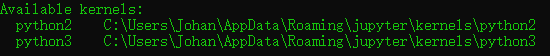

# C.2 Jupyter内核操作

### C.2.1 查看jupyter kernel

使用命令jupyter kernelspec list可以查看当前的kernel

\$ jupyter kernelspec list

输出如下：

### C.2.2 删除Jupyter kernel

使用命令jupyter kernelspec remove kernelname可以删除目标kernel
