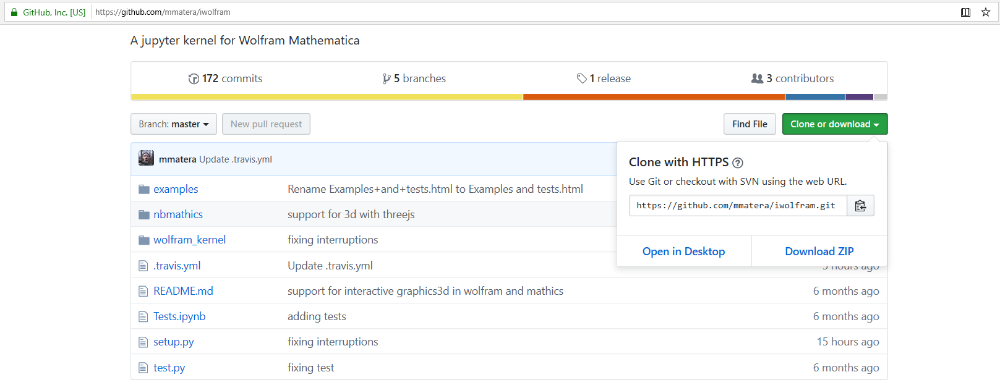
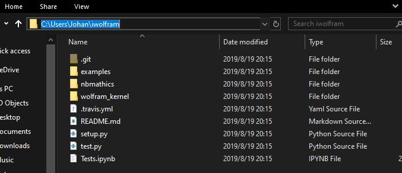
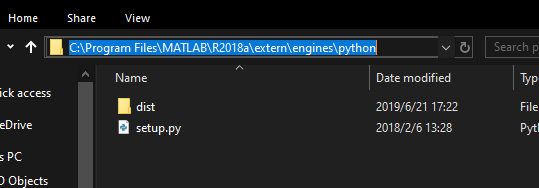

# C.3 安装Jupyter内核

有多种安装Jupyter内核的方式。在这里我们选取最典型的三种Jupyter内核进行安装。它们分别是Python2
Kernel，Wolfram Kernel和Matlab Kernel。

### C.3.1安装Python2内核

这里以在python3环境下的notebook添加python2 kernel为例，

首先，确保python2环境下安装了ipykernel

pip2 install ipykernel

然后在python2的python.exe所在目录下执行 python -m ipykernel install

可以添加命令 –name kernelname 为kernel指定名字

### C.3.2 安装Wolfram Kernel内核

我们使用mamtera编写的wolfram_kernel为Jupyter添加Mathematica内核。不同于后文将要安装的Matlab
Kernel。Wolfram
Kernel无法使用pip直接安装，我们需要访问作者的位于github的iwolfram仓库（https://github.com/mmatera/iwolfram），如图C.1所示。使用git或者其他工具下载iwolfram仓库的文件

图C.1 iwolfram仓库

在这里我们使用git工具获取：

git clone https://github.com/mmatera/iwolfram.git

待clone完毕后，在terminal切换工作路径至此目录下，如图C.2所示。键入：

python setup.py即可完成安装。

图C.2 wolfram kernel安装文件路径

### C.3.3 安装MatLab内核

安装MatLab内核需要两个步骤：

首先，安装matlab的python拓展：进入安装matlab的文件夹，如图C.3所示。

图C.3 matlab安装路径

执行py代码，

python setup.py install

这样就算完成了python拓展的安装

然后，在jupyter装 matlab kernel：

pip install matlab_kernel

这样就成功将Matlab内核嵌入了Jupyter中。
