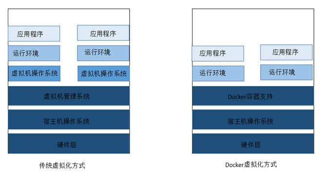

# E.1 Docker初步

### E.1.1 Docker概述

Docker是一种linux容器技术。容器有效的将由单个操作系统挂管理的资源划分到孤立的组中，以便更好的在组之间平衡有冲突的资源使用需求。可简单理解为一种沙盒
。每个容器内运行一个应用，不同的容器之间相互隔离，容器之间也可以建立通信机制。容器的创建和停止都十分快速，资源需求远远低于虚拟机。

Docker具有以下优点：

1.  能高效地构建应用。

    1.  对于运维开发来说，

    2.  能快速的交付和部署

    3.  高效的资源利用

    4.  轻松的迁移扩展

    5.  简单的更新管理

**docker与虚拟化**

虚拟化是一种资源管理技术，是将计算机的各种实体资源，如服务器，网络，内存等抽象、转化后呈现出来，使用户以更好的方式来应用这些资源。虚拟化目标往往是为了在同一个主机上运行多个系统或者应用，从而提高资源的利用率，降低成本，方便管理及容错容灾。

操作系统级的虚拟化：内核通过创建多个虚拟的操作系统实例（内核和库）来隔离不同的进程。docker以及其他容器技术就属于此范畴。

传统虚拟化方式是在硬件层面实现虚拟化，需要有额外的虚拟机管理应用和虚拟机操作系统层。而docker容器是在操作系统层面上实现虚拟化，直接复用本地主机操作系统，更加轻量。

