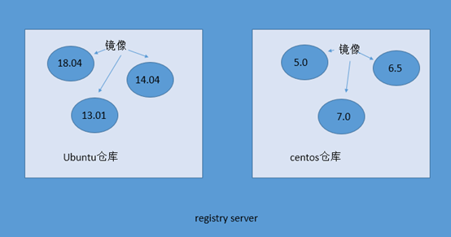

# E.2 Docker概述

### E.3.1 基本概念

镜像（Image）

容器（Container）

仓库（Repository）

镜像：类似虚拟机镜像

容器：类似linux系统环境，运行和隔离应用。容器从镜像启动的时候，docker会在镜像的最上一层创建一个可写层，镜像本身是只读的，保持不变。

仓库：每个仓库存放某一类镜像。

(重新修改)

容器、仓库、镜像运行关系图：

(图需要重新修改)

### E.2.2 镜像操作

####  搜索镜像 

docker search \<image\> \# 在docker index中搜索image

\--automated=false 仅显示自动创建的镜像

\--no-trunc=false 输出信息不截断显示

\-s 0 指定仅显示评价为指定星级的镜像

#### 下载镜像 

docker pull \<image\> \# 从docker registry server 中下拉image

还可通过指定标签下载某镜像

docker pull [:TAG]

docker pull centos:7

#### 查看镜像/删除 

docker images： \# 列出images

docker images -a \# 列出所有的images（包含历史）

docker ps -a \#列出本机所有容器

docker rmi \<image ID\>： \# 删除一个或多个image

#### 存出和载入镜像 

存出本地镜像文件为.tar

docker save -o ubuntu_14.04.tar ubuntu:14.04

导入镜像到本地镜像库

docker load --input ubuntu_14.04.tar或者

docker load \< ubuntu_14.04.tar

#### 上传镜像 

用户在dockerhub网站注册后，即可上传自制的镜像。

docker push NAME[:TAG]

### E.2.3 容器操作

容器是镜像的一个运行实例，不同的是它带有额外的可写层。

可认为docker容器就是独立运行的一个或一组应用，以及它们所运行的必需环境。

#### 创建容器用镜像创建容器）

首先得查看镜像的REPOSITORY和TAG

>   docker run -i -t REPOSITORY:TAG （等价于先执行docker create 再执行docker
>   start 命令）

>   其中-t选项让docker分配一个伪终端并绑定到容器的标准输入上，
>   \-i则让容器的标准输入保持打开。若要在后台以守护态（daemonized）形式运行，可加参数-d

在执行docker run来创建并启动容器时，后台运行的标准包括：

-   检查本地是否存在指定的镜像，不存在就从公有仓库下载

-   利用镜像创建并启动一个容器

-   分配一个文件系统，并在只读的镜像层外面挂载一层可读可写层

-   从宿主机配置的网桥接口中桥接一个虚拟接口到容器

-   从地址池配置一个ip地址给容器

-   执行用户指定的应用程序

-   执行完毕后容器被终止

docker start/stop/restart \<container\> \#：开启/停止/重启container

#### 进入容器

>   docker attach [container_id]
>   \#连接一个正在运行的container实例（即实例须为start状态，可以多个
>   窗口同时attach
>   一个container实例），但当某个窗口因命令阻塞时，其它窗口也无法执行了。

exec可直接在容器内运行的命令。docker exec -ti [container_id] /bin/bash

#### 删除容器

>   docker rm \<container...\> \#：删除一个或多个container

>   docker rm \`docker ps -a -q\` \#：删除所有的container

>   docker ps -a -q \| xargs docker rm \#：同上, 删除所有的container

docker -rm

\-f 强制中止并运行的容器

\-l 删除容器的连接，但保留容器

\-v 删除容器挂载的数据卷

#### 修改容器

>   docker commit \<container\> [repo:tag] \#
>   将一个container固化为一个新的image，后面的repo:tag可选。

#### 导入和导出容器

导出到一个文件，不管是否处于运行状态。

docker export CONTAINER \> test.tar

导入为镜像：

>   cat test.tar \| docker import - centos:latest

#### E.2.4 docker私有仓库的搭建

库是集中存放镜像的地方。每个服务器上可以有多个仓库。

仓库又分为公有仓库（DockerHub、dockerpool）和私有仓库

DockerHub：docker官方维护的一个公共仓库https://hub.docker.com，其中包括了15000多个的镜像，大部分都可以通过dockerhub直接下载镜像。也可通过docker
search和docker pull命令来下载。

DockerPool：国内专业的docker技术社区，http://www.dockerpool.com也提供官方镜像的下载。

>   192.168.2.189 仓库

>   192.168.2.201 客户端

>   1.先拉取registry镜像（用来启动仓库）和busybox镜像（用来上传）

>   docker pull registry

>   docker pull busybox

>   我这里下载的是registry 2

>   2.使用docker tag命令将这个镜像标记为192.168.2.189:5000/busybox

>   docker tag IMAGR[:TAG] NAME[:TAG]

>   docker tag docker.io/busybox 192.168.2.189:5000

>   

>   3.修改docker配置文件，增加参数 --insecure-registry=192.168.2.189:5000

>   此处的参数指定为非安全模式，也就是http而不是https，然后重启docker服务。

>   

>   4.创建registry容器并启动

>   docker run -d -p 5000:5000 --privileged=true -v
>   /myregistry:/var/lib/registry registry

>   –privileged=true
>   ：CentOS7中的安全模块selinux把权限禁掉了，参数给容器加特权，不加上传镜像会报权限错误(OSError:
>   [Errno 13] Permission denied:
>   '/tmp/registry/repositories/liibrary')或者（Received unexpected HTTP status:
>   500 Internal Server Error）错误

>   \-v选项指定将/myregistry/目录挂载给/var/lib/registry/，/tmp/registry是registry版本1的仓库目录。

>   /myregistry为本地创建的目录。

>   5.把本地标记的镜像push到仓库

>   docker push 192.168.2.189:5000/busybox

>   

>   6.查看本地目录/myregistry以及在客户端上pull刚才push的镜像

>   客户端在pull之前也需要修改配置文件指定仓库，也和上面一样添加参数--insecure-registry=192.168.2.189:5000，然后重启docker。

>   

>   

>   7.也可以通过registry v2 api来查看push的镜像是否存在于仓库

>   

>   GET /v2/_catalog检索列出所有存储库(Listing
>   Repositories)，也就是存储在库中的镜像。
