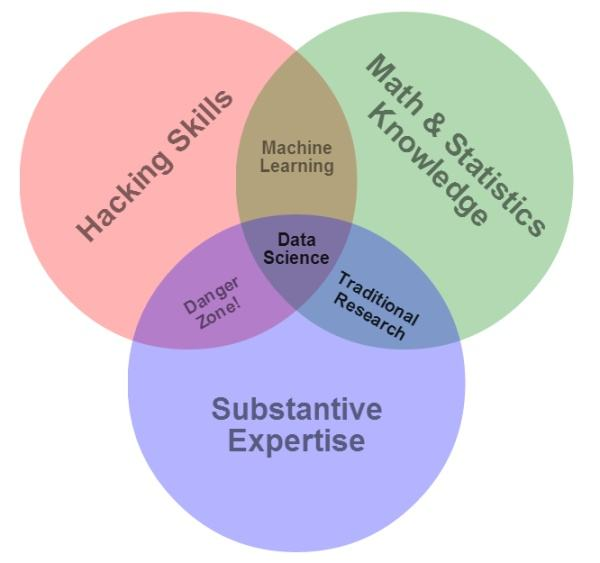

# 1.1 数据科学概述

数据科学，也被称为数据驱动科学，是一个跨学科的领域，研究从各种形式的数据中提取知识或洞见的科学方法、过程和系统，无论是结构化的还是非结构化的，类似于数据库中的知识发现(KDD)。

数据科学是一个“统一统计、数据分析及其相关方法的概念”，目的是用数据“理解和分析实际现象”。它采用了来自数学、统计学、信息科学和计算机科学等广泛领域的技术和理论，特别是来自机器学习、分类、聚类分析、数据挖掘、数据库和可视化等子领域的技术和理论。

>   \---- wikipedia

数据科学是一个跨学科的课题，Drew
Conway于2010年9月在自己的博客上首次发表了数据科学韦恩图:

该图解释了数据科学研究者等所应掌握的三种基本知识：数学与统计知识，黑客知识，领域专家知识。但是如果希望成为一名数据科学家，除了掌握这些基本知识外，还需要具备Jake
VanderPlas在《Python数据科学手册》提出的三种领域能力：统计学家的能力——数据建模、数据集合；计算机科学家的能力——算法设计、数据存储、数据分析与数据可视化；领域专家的能力——在细分的学科领域中经过专业的训练，这样既可以提出正确的问题，又可以做出正确的解答。

我们在进行数据科学实践时，会对不同细分领域所涉及到的分类、回归、聚类等问题进行展开讨论。在学习过程中中，我们重在掌握数据科学中的原理与技术，并不要求您对于这些细分领域所涉及到的专业知识进行深度探索，除非您希望成为该领域的专家。