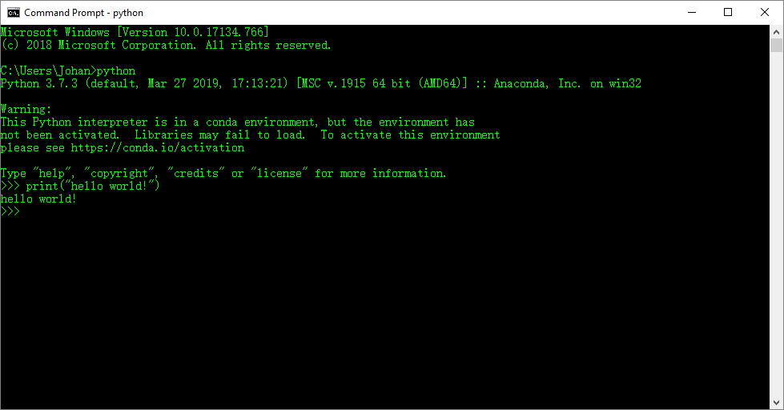

# 1.5 Hello，World!

在安装Python环境后，下面来编写第一个Python程序，用于输出一段文字“Hello，World”。

这个程序非常简单，只有一行代码，如代码清单1-1所示。

代码清单 1-1 helloworld.py

print(“hello world!”)

我们需要打开cmd，然后键入上述代码。对于使用cmd，输出，我们需要先键入python进入Python环境，然后键入代码1.1。而使用IDLE，则可以直接键入代码1.1。如图1-11。

Python的print函数用于将内容输出到屏幕上。执行该代码时会将面双引号中的内容输出。

Python代码可以在Python命令行中直接执行，也可以将代码保存在一个拓展名为“.py”的文件中（也称为Python脚本），然后在cmd或者terminal里，进入“.py”文件所在目录，输入python
文件名“.py”解释执行这一文件。前者称为交互式启动，后者称为文件式启动。

图1-11 输出