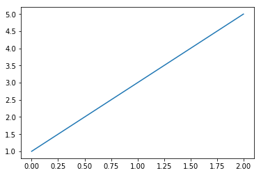
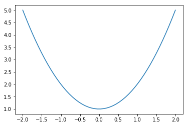

# 11.1 Matplotlib概述

>   **10.1.1 Matplotlib简介**

Matplotlib是目前使用最广泛的Python2D绘图库，它不仅提供了一个非常快捷的用Python可视化数据的方法，而且可以生成多样化输出格式的出版物级别的高质量图形。

Matplotlib最初由John
Huner（1968-2012）撰写，他在神经生物学的博士后研究期间未来可视化癫痫患者的脑电图数据而制作了Matplotlib。

>   **10.1.2 Matplotlib安装**

我们可以使用conda命令或者pip命令对SymPy进行安装：

pip install matplotlib

conda install matplotlib

matplotlib安装完毕后，就可以导入使用了，

我们导入第三方包NumPy和快速绘图模块pyplot，其中科学计算包NumPy是matplotlib库的基础：

[1]: import numpy as np

>   from matplotlib import pyplot as plt \#使用plt作为pyplot的别名  
>   **10.1.3准备数据**

现在我们通过一个简单的例子，来了解一下Matplotlib的基本用法。

例1:画出函数

[2]: x=np.linspace(0,2,50) \#生成[0,2]区间里均匀的50个值

y=2\*x+1

plt.plot(x,y)

plt.show()

修改上述代码，可以绘制一个简单的抛物线。输出的图形如图1.2所示。

[3]: x=np.linspace(-2,2,50)

y=x\*\*2+1

plt.plot(x,y)

plt.show()

图1.1

图1.2 例2

>   **10.2一些重要的图表组成元素**