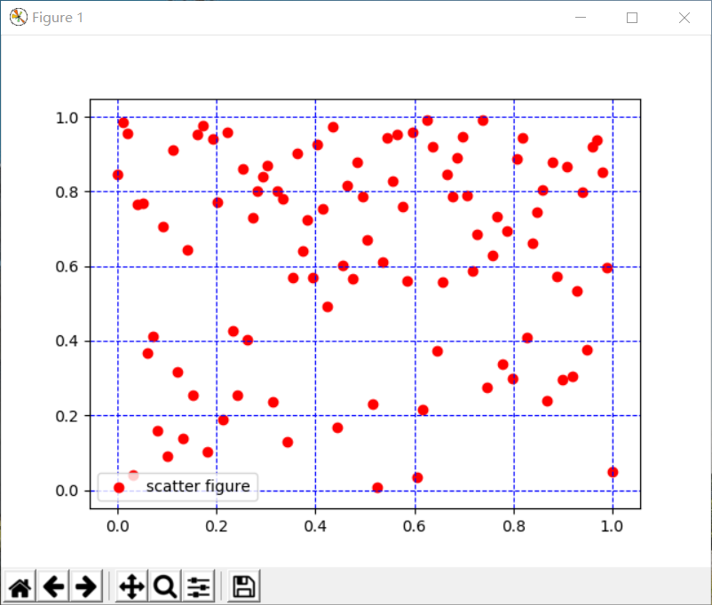

# 11.2 图表元素

**10.2.1核心概念介绍**

用matplotlib.pyplot绘图需要知道以下几个概念：

一个作图的窗口就是一个Figure，
我们通过调用plt.figure（）来创建一个Figure。常用的一个参数： figsize=(width,
height)用来创建指定高度和宽度的Figure。

在Figure上可以有很多个Axes/Subplot(坐标轴/子图),每一个Axes/Subplot为一个单独的绘图区，可以在上面绘图，其中每一个Axes/subplot都可以有XAxis和YAxis，并且可以在上面标出刻度，设置刻度的位置，以及添加xy轴的标签label。

**10.2.2常用函数介绍**

>   一些常用的函数及其用法如下表2.1所示。

表2.1 pypolt模块常用函数表

| 函数调用                                | 函数功能                    | 参数说明                                                                          |
|-----------------------------------------|-----------------------------|-----------------------------------------------------------------------------------|
| plt.plot(x,y)                           | 展现变量的变化趋势          | x:x轴上的数值 y:y轴上的数值                                                       |
| plt.scatter(x,y)                        | 展现变量之间的关系          | x:x轴上的数值 y:y轴上的数值                                                       |
| plt.xlim(xmin,xmax)                     | 设置x轴的数值范围           | xmin:x轴上的最小值 xmax:x轴上的最大值                                             |
| plt.xlabel(str)                         | 设置x轴的标签文本           | str:设置x轴的标签文本                                                             |
| plt.grid(linestyle=”:”)                 | 添加网格刻度线              | linestyle:网格线的线条风格                                                        |
| plt.axhline(y)                          | 添加平行于x轴的水平参考线   | y:水平参考线的出发点                                                              |
| plt.axvspan(xmin,xmax)                  | 添加垂直于x轴的水平参考区域 | xmin:参考区域的起始位置 xmax:参考区域的终止位置                                   |
| plt.annotate(str,xy=(a,b),xytext=(c,d)) | 为图形添加指向性注释文本    | str:图形内容的注释文本 xy:被注释图形内容的位置坐标 xytext:注释文本的位置坐标      |
| plt.text(x,y,string)                    | 为图形添加无指向性注释文本  | x:注释文本内容所在位置的横坐标 y:注释文本内容所在位置的纵坐标 string:注释文本内容 |
| plt.title(str)                          | 为图形添加标题              | str:为图形内容添加的标题                                                          |
| plt.legend(loc=”lower left)             | 标识不同图形的文本标签示例  | loc:图例在图中的位置                                                              |

现在我们根据以上介绍的部分常用函数的用法和功能，通过几个具体的例子，来加深对以上函数学习的印象。

**案例1：折线图绘制（看不出来是折线图）**

**例3：在同一个画布中画出的图像，其中使用虚线“- -”画出**

[3]: x=np.linspace(-3,3,50)

y1=2\*x+1

>   y2=x\*\*2

>   plt.figure()

>   plt.plot(x,y1)

>   plt.plot(x,y2,color='red',linewidth=1.0,linestyle='--')

>   plt.xlim((-1,2))

>   plt.ylim((-2,3))

>   plt.xlabel('I am x')

>   plt.ylabel('I am y')

>   plt.show()

运行结果如图2.1所示。

(plt.plot就是画的折线图，他通过点与点相连成图，但是这个图上采样了50个点，因此，肉眼看出来几乎是连续的，你在这个图上，把y2的图像用了一种新的样式来表示，我想你的意思是绘制这种新样式的图，你可以查下linestyle这个函数,看看他有什么参数，再列个表，同时，案例名称也要改变，可以讲一下pyplot.plot的绘图原理)

图2.1 例3

**例4：绘制散点图**

[4]: x=np.linspace(0,1,100)

y=np.random.rand(100)

plt.scatter(x,y,color="red",label="scatter figure")

plt.grid(linestyle="--",color="blue")

plt.legend(loc="lower left")

plt.show()

不需要代码间空行

运行结果如图2.2所示。

图2.2

