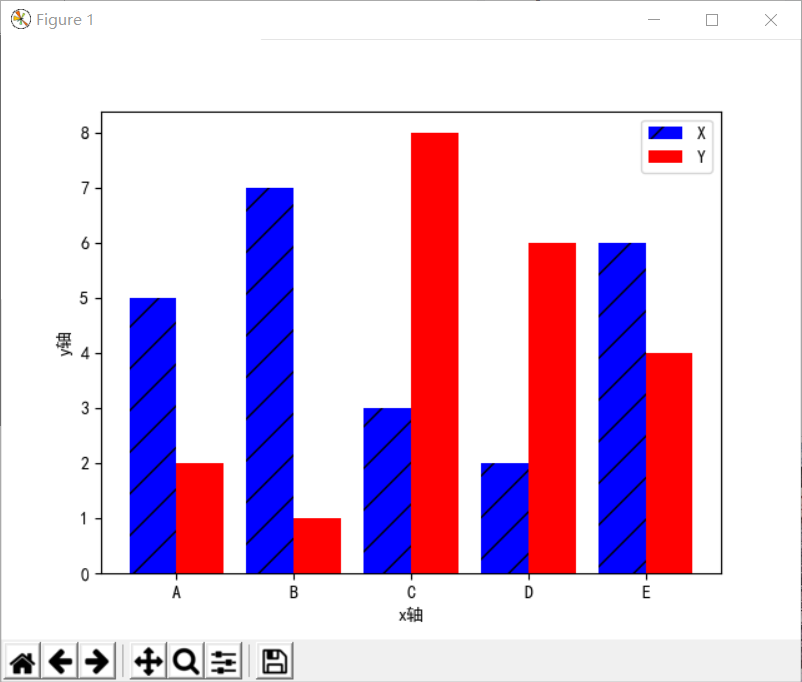

# 11.3 统计图基础

在第二节中我们通过一些函数的学习感受到了用matplotlib绘制图形的强大功能，从本节开始，我们就继续感受用matplotlib将数据可视化的魅力吧。

**10.3.1折线图（与前文重复？？？，建议删除10.2.2众多与的实例，同时把散点图放到这一章）**

折线图是排列在工作表的列或行中的数据可以绘制到折线图中。折线图可以显示随时间(根据常用比例设置)而变化的连续数据，因此非常适用于显示在相等时间间隔下数据的趋势。

**（1）plot()函数**

函数调用：plt.plot(x,y)

参数说明：x:x轴上的数值

y:y轴上的数值

**（2）代码示例**

**案例1：绘制一个平方数的折线图**

[5]: x = [1, 2, 3, 4, 5]

y= [1, 2, 4, 16, 25]

plt.plot(x,y)

plt.title("Square Numbers", fontsize = 15)

plt.xlabel("Value", fontsize = 10)

plt.ylabel("Square of Value", fontsize = 10)

plt.show()

运行结果如图3.1所示。

图3.1

**案例2：在一个figure里同时画出两条折线**

[6]: plt.figure(figsize=(8,4))

plt.plot([1, 2, 3],[3, 5, 10], label="a")

plt.plot([1, 2, 3], [1, 7, 9], label="b")

plt.xlabel("x")

plt.ylabel("y")

plt.legend()

plt.title("two lines")

plt.show()

运行结果如图3.2所示。

图3.2

**10.3.2柱状图**

柱状图(bar
chart)，是一种以长方形的长度为变量的表达图形的统计报告图，由一系列高度不等的纵向条纹表示数据分布的情况，用来比较两个或以上的价值(不同时间或者不同条件)，只有一个变量，通常利用于较小的数据集分析。

**（1）bar()函数**

函数调用：plt.bar(x,y)

参数说明：x:标示在x轴上数据的类别

y:每种数据类别对应的数量

**（2）代码示例**

**案例1：柱状图的绘制**

[6]: mpl.rcParams["font.sans-serif"]=["SimHei"]

mpl.rcParams["axes.unicode_minus"]=False

x=[1,2,3,4,5,6,7,8]

y=[3,5,4,9,6,1,7,2]

plt.bar(x,y,align="center",color="red",tick_label=["a","b","c","d","e","f","g","h"],hatch="/")

plt.xlabel("x轴")

plt.ylabel("y轴")

plt.show()

运行结果如图3.3所示。

图3.3

**10.3.3条形图**

条形图（bar
chart）是用宽度相同的条形的高度或长短来表示数据多少的图形。条形图可以横置或纵置，纵置时也称为柱形图。

**（1）barh()函数**

函数调用：plt.barh(x,y)

参数说明：x:标示在y轴上的数据的类别

y:每种数据类别对应的数量

**（2）代码示例**

**案例1：条形图的绘制**

index = ['A','B','C','D','E']

values = np.random.randint(1,10,5)

plt.barh(index,values)

plt.title('figure')

plt.show()

运行结果如图3.5所示。

图3.4

**10.3.4堆积图**

**（1）堆积柱状图**

如果将bar()函数中的bottom参数的取值进行设定，就会出现堆积柱状图的情形。

**案例1：堆积柱状图的绘制**

mpl.rcParams["font.sans-serif"]=["SimHei"]

mpl.rcParams["axes.unicode_minus"]=False

x=[1,2,3,4,5,6,7,8]

y=[3,5,4,9,6,1,7,2]

y1=[4,2,3,2,2,8,5,3]

plt.bar(x,y,align="center",color="red",tick_label=["a","b","c","d","e","f","g","h"],hatch="/",label="A")

plt.bar(x,y1,align="center",color="blue",bottom=y,hatch="-",label="B")

plt.xlabel("x轴")

plt.ylabel("y轴")

plt.legend()

plt.show()

运行结果如图3.5所示。

图3.5

**（2）堆积条形图**

如果将barh()函数中的left参数的取值进行设定，就会出现堆积条形图的情形。

**案例2：堆积条形图的绘制**

mpl.rcParams["font.sans-serif"]=["SimHei"]

mpl.rcParams["axes.unicode_minus"]=False

x=[1,2,3,4,5,6,7,8]

y=[3,5,4,9,6,1,7,2]

y1=[4,2,3,2,2,8,5,3]

plt.barh(x,y,align="center",color="red",tick_label=["a","b","c","d","e","f","g","h"],hatch="/",label="A")

plt.barh(x,y1,align="center",color="blue",left=y,hatch="-",label="B")

plt.xlabel("x轴")

plt.ylabel("y轴")

plt.legend()

plt.show()

运行结果如图3.6所示。

图3.6

**10.3.5分块图**

我们可以通过分块图来对比多数据的分布差异。

**（1）多数据柱状图**

**案例1：柱状分块图的绘制**

mpl.rcParams["font.sans-serif"]=["SimHei"]

mpl.rcParams["axes.unicode_minus"]=False

x=np.arange(5)

y=[5,7,3,2,6]

y1=[2,1,8,6,4]

bar_width=0.4

tick_label=["A","B","C","D","E"]

plt.bar(x,y,bar_width,align="center",color="blue",hatch="/",label="X")

plt.bar(x+bar_width,y1,bar_width,align="center",color="red",label="Y")

plt.xlabel("x轴")

plt.ylabel("y轴")

plt.xticks(x+bar_width/2,tick_label)

plt.legend()

plt.show()

运行结果如图3.7所示。

图3.7

**（2）多数据条形图**

**案例1：条形分块图的绘制**

mpl.rcParams["font.sans-serif"]=["SimHei"]

mpl.rcParams["axes.unicode_minus"]=False

x=np.arange(5)

y=[5,7,3,2,6]

y1=[2,1,8,6,4]

bar_width=0.4

tick_label=["A","B","C","D","E"]

plt.barh(x,y,bar_width,align="center",color="blue",hatch="/",label="X")

plt.barh(x+bar_width,y1,bar_width,align="center",color="red",label="Y")

plt.xlabel("x轴")

plt.ylabel("y轴")

plt.yticks(x+bar_width/2,tick_label)

plt.legend()

plt.show()

运行结果如图3.8所示。

图3.8

**10.3.6直方图**

直方图，是一种二维统计图表，它的两个坐标分别是统计样本和该样本对应的某个属性的度量。

**（1）hist()函数**

函数调用：plt.hist(x)

参数说明：x:连续性数据输入值

**（2）代码示例**

**案例1：直方图的绘制**

mpl.rcParams["font.sans-serif"]=["SimHei"]

mpl.rcParams["axes.unicode_minus"]=False

boxWeight=np.random.randint(0,10,100)

x=boxWeight

bins=range(0,11,1)

plt.hist(x,bins=bins,color="green",histtype="bar",rwidth=1,alpha=0.5)

plt.xlabel("x轴")

plt.ylabel("y轴")

plt.show()

运行结果如图3.9所示。

图3.9

**（3）直方图和柱状图的关系**

直观来说，直方图和柱状图是类似的，但是他们还是有一定区别的。

其一，在视觉效果上看，直方图的各个柱体之间没有空隙，而柱状图的主体之间存在空隙；其二，直方图描述的对象是连续型的数据，而柱状图描述的却是离散型的数据。

**10.3.7 扇形图**

扇形图，又称扇形统计图，它是用整个圆表示总数，用圆内各个扇形的大小表示各部分数量占总数的百分数。通过扇形统计图可以很清楚地表示出各部分数量同总数之间的关系。

**（1）pie()函数**

函数调用：plt.pie(x)

参数说明：x:数据不同类别所占百分比

**（2）代码示例：扇形图的绘制**

mpl.rcParams["font.sans-serif"] = ["SimHei"]

mpl.rcParams["axes.unicode_minus"] = False

kinds="第一块","第二块","第三块","第四块","第五块"

colors="blue","red","yellow","green","purple"

soldNums=[0.05,0.35,0.15,0.25,0.20]

plt.pie(soldNums,labels=kinds,autopct="%3.1f%%",startangle=90,colors=colors)

plt.title("扇形图示例")

plt.show()

运行结果如图3.10所示。

图3.10

**10.3.8 极线图**

极限图定义

**（1）polar()函数**

函数调用：plt.polar(theta,r)

参数说明：theta:每个标记所在射线与极径的夹角

r:每个标记到原点的距离

**（2）代码示例：极线图的绘制**

barSlices=12

theta=np.linspace(0.0,2\*np.pi,barSlices,endpoint=False)

r=30\*np.random.rand(barSlices)

plt.polar(theta,r,color="chartreuse",linewidth=2,marker="\*",mfc="b",ms=10)

plt.show()

运行结果如图3.11所示。

图3.11

**10.3.9箱线图**

箱形图(Box-plot)又称为盒须图、盒式图或箱线图，是一种用作显示一组数据分散情况资料的统计图。因形状如箱子而得名。在各种领域也经常被使用，常见于品质管理。它主要用于反映原始数据分布的特征，还可以进行多组数据分布特征的比
较。箱线图的绘制方法是:先找出一组数据的最大值、最小值、中位数和两个四分位数;然后，
连接两个四分位数画出箱子;再将最大值和最小值与箱子相连接，中位数在箱子中间。

**（1）boxplot()函数**

函数调用：plt.boxplot(x)

参数说明：x:绘制图形的输入数据

**（2）代码示例：箱线图的绘制**

mpl.rcParams["font.sans-serif"]=["FangSong"]

mpl.rcParams["axes.unicode_minus"]=False

x = np.random.randn(1000)

plt.boxplot(x)

plt.xticks=([1],["string"])

plt.ylabel("y")

plt.title("箱线图")

plt.grid(axis="y",ls=":",lw=1,color="gray",alpha=0.4)

plt.show()

运行结果如图3.12所示。

图3.12

**10.3.10误差棒图**

**（1）errorbar()函数**

函数调用：plt.errorbar(x,y,yerr=a,xerr=b)

参数说明：x:数据点的水平位置

y:数据点的垂直位置

yerr:数据点在y轴方向的误差计算方法

xerr:数据点在x轴方向的误差计算方法

**（2）代码示例：误差棒图的绘制**

x = np.linspace(0.1,0.6,6)

y=np.exp(x)

plt.errorbar(x,y,fmt="bo:",yerr=0.2,xerr=0.02)

plt.xlim(0,0.7)

plt.show()

运行结果如图3.13所示。

图3.13

**10.3.11棉棒图**

**（1）stem()函数**

函数调用：plt.stem(x,y)

参数说明：x:棉棒在x轴基线上的位置

y:棉棒的长度

linfmt:棉棒的样式

marketfmt:棉棒末端的样式

basefmt:基线的样式

**（2）代码示例：棉棒图的绘制**

x = np.linspace(0.1,1,15)

y=np.random.randn(15)

plt.stem(x,y,linefmt="-.",markerfmt="\*",basefmt="-")

plt.show()

运行结果如图3.14所示。

图3.14

**10.3.12气泡图**

**（1）scatter()函数**

函数调用：plt.scatter(x,y)

参数说明：x:x轴上的数值

y:y轴上的数值

s:散点标记的大小

c:散点标记的颜色

cmap:将浮点数映射成颜色的颜色映像表

**（2）代码示例：气泡图的绘制**

a=np.random.randn(100)

b=np.random.randn(100)

plt.scatter(a,b,s=np.power(10\*a+20\*b,2),

c=np.random.rand(100),cmap=mpl.cm.RdYlBu,marker="o")

plt.show()

运行结果如图3.15所示。

图3.15