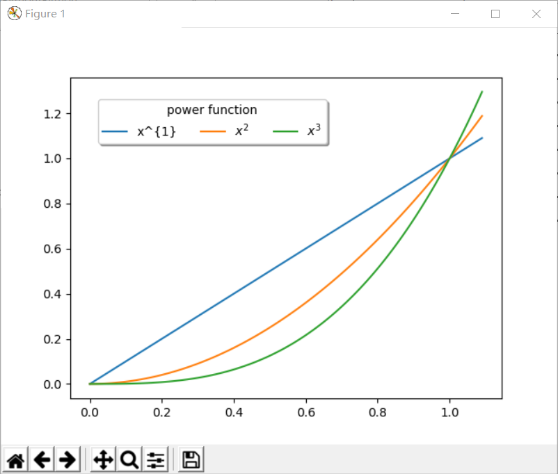
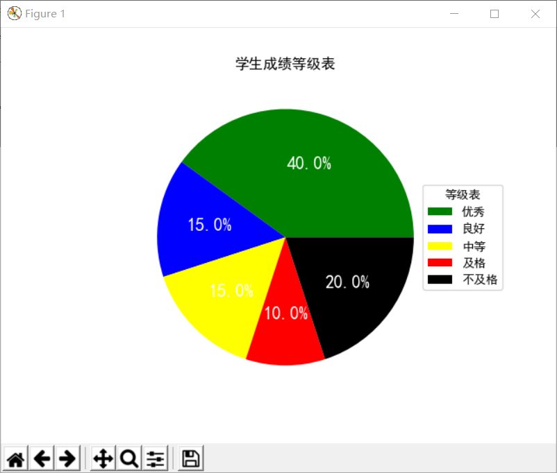
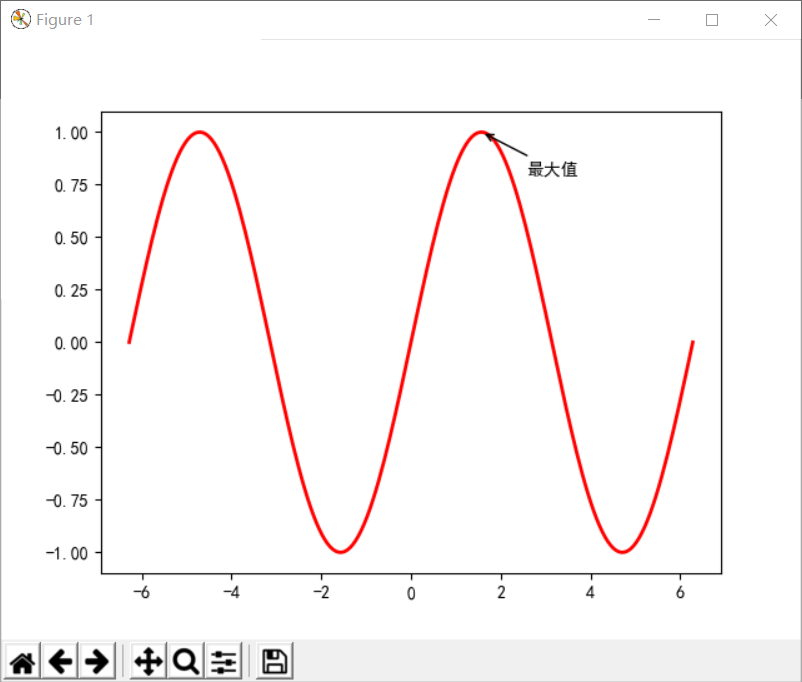
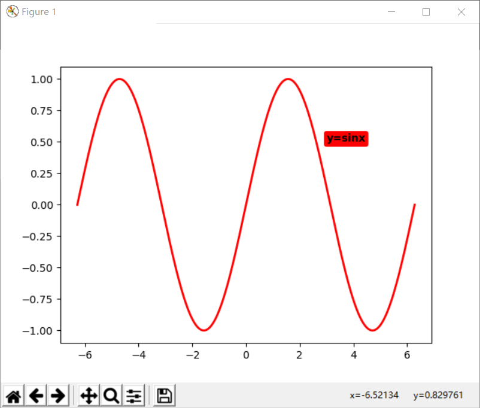
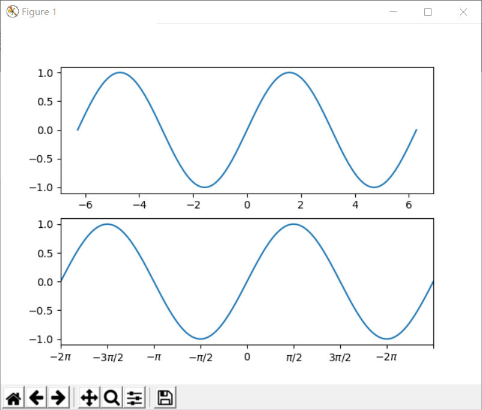
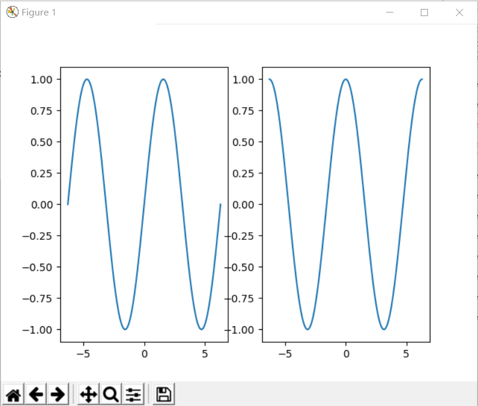
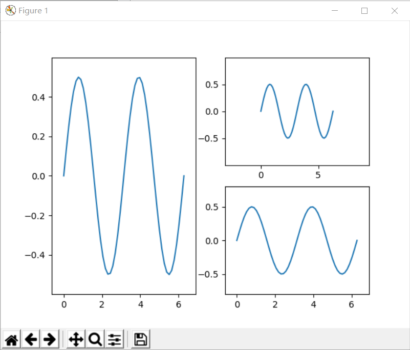
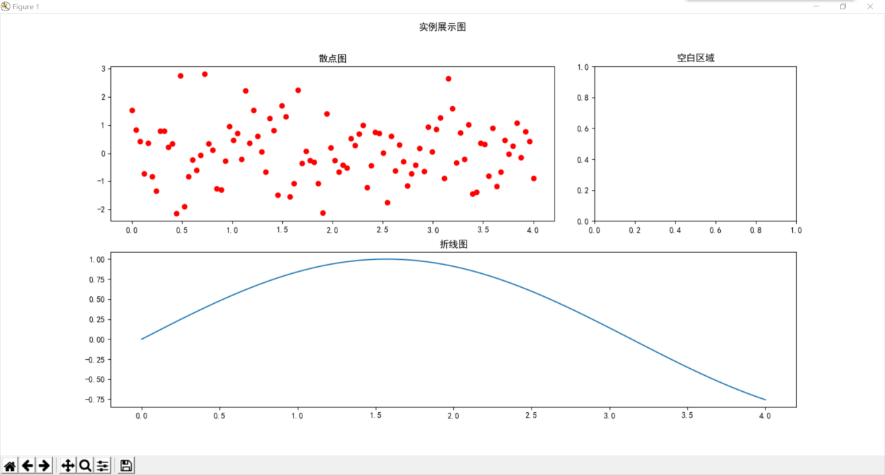
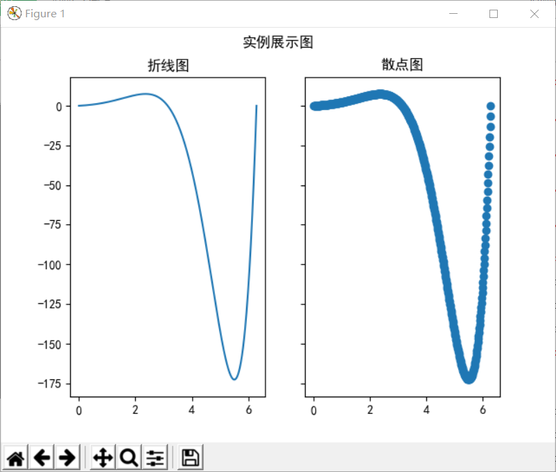

# 11.4 辅助功能

通过前三节的学习，相信大家对于统计图形的绘制已经有了一定的了解，并且已经拥有独立地绘制出一些简单的统计图形的能力了。但更多时候，仅仅只有图形是不够完善的，这还不能将数据的可视化效果发挥到极致。为了给用户提供更好地视觉效果，我们需要为图形添加一些辅助信息，以便观察者能够清楚的了解绘图区域的主要内容。接下来我们学习一些参数，为我们的统计图形进行完善。

**10.4.1图例的设置**

在同一个figure图像中有时需要绘制多个图形，为了方便对这些图形进行辨识，因此我们需要给这些图形添加标识，用以说明每个图形所代表的内容。这些标识就是图例。

在之前几节的内容中，我们已经用到了legend()函数来给图形添加图例。接下来我们就来详细讲解一下如何调整图例的展示样式。

**（1）设置图例位置**

我们可以通过使用loc参数来对图例的位置进行设置，例如：

plt.legend(loc='lower left')

可以使用的位置参数值及对应位置数值如表4.1所示。

表4.1

| 位置参数值   | 位置数值 | 位置参数值   | 位置数值 | 位置参数值   | 位置数值 |
|--------------|----------|--------------|----------|--------------|----------|
| upper right  | 1        | upper left   | 2        | lower left   | 3        |
| lower right  | 4        | center left  | 6        | center right | 7        |
| lower center | 8        | upper center | 9        | center       | 10       |

**（2）设置图例字体**

我们通过使用fontsize参数来对图例的字体进行设置，例如：

plt.legend(fontsize="small")

可以使用的参数值有int ，float ，xx-small, x-small, small, medium, large,
x-large, xx-large。

**（3）设置图例标题**

我们还通过使用title参数来对图例的标题进行设置，例如：

plt.legend(title='legend')

**（4）设置图例位置**

我们可以通过使用关键字参数bbox_to_anchor来控制图例的位置，关键字参数bbox_to_anchorbbox_to_anchor被赋予的二元组中，第一个数值用于控制legend的左右移动，值越大越向右边移动，第二个数值用于控制legend的上下移动，值越大，越向上移动。例如：

plt.legend(loc="upper left",bbox_to_anchor=(0.05,0.95))

**案例1：设置图例的展示效果**

x=np.arange(0,1.1,0.01)

y1=np.power(x,1)

y2=np.power(x,2)

y3=np.power(x,3)

plt.plot(x,y1,ls="-",label="\$x\^{1}\$")

plt.plot(x,y2,ls="-",label="\$x\^{2}\$")

plt.plot(x,y3,ls="-",label="\$x\^{3}\$")

plt.legend(loc="upper left",bbox_to_anchor=(0.05,0.95),ncol=3,

title="power function",shadow=True,fancybox=True)

plt.show()

运行结果如图4.1所示。

图4.1

**注释：**

（1）ncol:表示图例呈三列显示

（2）shadow:控制图例线框是否进行阴影处理

（3）fancybox：控制图例线框是否进行圆角处理

**案例2：学生成绩等级表**

在上一节中，我们已经学习了用pie()函数绘制饼图的方法，这里我们结合图例的相关内容，通过一个具体的实例来为大家讲解如何给饼图增加图例，以便给读者提供一个良好的视觉效果。

mpl.rcParams["font.sans-serif"] = ["SimHei"]

mpl.rcParams["axes.unicode_minus"] = False

elements = ["优秀","良好","中等","及格","不及格"]

weight = [40,15,15,10,20]

colors = ["green","blue","yellow","red","black"]

wedges,texts,autotexts=plt.pie(weight,autopct="%3.1f%%",textprops=dict(color="w"),colors=colors)

plt.legend(wedges,elements,fontsize=10,title="等级表",loc="center
left",bbox_to_anchor=(0.91,0,0.3,1))

plt.setp(autotexts,size=15,weight="bold")

plt.setp(texts,size=12)

plt.title("学生成绩等级表")

plt.show()

运行结果如图4.2所示。

图4.2

**注释：**

1.  参数wedges表示饼片实例列表，参数elements表示文本标签列表。通过调用图例函数plt.legend(wedges,elements),我们可以将饼片外部的文本标签放在图例中，而饼片的数值标签仍然放在饼片内部。

2.  autopct:规定数值标签中的百分比保留一位有效数字

3.  textprops:以字典形式进行传递，设置字体的颜色

**10.4.2注释文本的添加**

这里我们回忆一下在前面的小节中已经讲过的添加注释所用到的方法。注释主要分为两大类，一类是指向性注释，另一类是无指向性注释。添加这两类注释所用到的函数也不同，我们通过函数annotate()为图形添加指向性注释，通过函数text()来为图形添加无指向性注释。接下来我们通过实例进行详细讲解。

**（1）指向性注释文本的添加**

**案例1：为图形添加注释**

mpl.rcParams["font.sans-serif"] = ["SimHei"]

mpl.rcParams["axes.unicode_minus"] = False

x=np.linspace(-2\*np.pi,2\*np.pi,200)

y=np.sin(x)

plt.plot(x,y,lw=2,color="red")

plt.annotate("最大值",xy=(np.pi/2,1.0),xytext=((np.pi/2)+1.0,0.8),

color="black",
arrowprops=dict(arrowstyle="-\>",connectionstyle="arc3",color="black"))

plt.show()

运行结果如图4.3所示。

图4.3

**注释：**

1.  arrowprops:对指示箭头的风格以及颜色进行设置。

**（2）无指向性注释文本的添加**

**案例2：为图形添加注释**

x=np.linspace(-2\*np.pi,2\*np.pi,1000)

y=np.sin(x)

plt.plot(x,y,lw=2,color="red")

plt.text(3,0.5,"y=sinx",weight="bold",color="black",

bbox=dict(boxstyle="round",ec="white",fc="red"))

plt.show()

运行结果如图4.4所示。

图4.4

**注释：**

1.  weight:对注释文本字体的粗细进行设置

2.  boxstyle:对文本框进行圆角设置

3.  ec:对文本框的线框颜色进行设置

4.  fc:对文本框的填充颜色进行设置

**10.4.3刻度的设置**

作为统计图形的一部分，刻度是由刻度标签和刻度线组成的。刻度的选择直接关系着图形的展示效果。因此我们需要具体问题具体分析，根据不同的数据选择合适的刻度范围以及刻度便签样式，这样才可以将可视化效果最优化。

我们可以通过调用xlim()函数来改变x轴的刻度范围，使得图形变得更加疏散或者更加紧凑；通过调用xticks()函数来改变刻度标签。

在matplotlib下,一个figure对象可以包含多个子图(axes),这时我们需要使用subplot()快速绘制统计图形。接下来我们先来讲一个函数——subplot()子区函数。子区，顾名思义，就是区域的子集，即将绘图区域分成若干个子区域，然后分别在这些子区域上绘制统计图形。

**（1）subplot()函数**

函数调用：plt.subplot(numRows,numCols,plotNum)

参数说明：numRows:整个绘图区域被分成的行数

numCols:整个绘图区域被分成的列数

plotNum:指定创建的子图所在区域

**（2）代码示例：对刻度范围及刻度标签的设置**

x=np.linspace(-2\*np.pi,2\*np.pi,200)

y=np.sin(x)

plt.subplot(211)

plt.plot(x,y)

plt.subplot(212)

plt.xlim(-2\*np.pi,2\*np.pi)

plt.xticks([-2\*np.pi,-3\*np.pi/2,-1\*np.pi,-1\*(np.pi)/2,0,(np.pi)/2,np.pi,3\*np.pi/2,2\*np.pi],

[r"\$-2\\pi\$",r"\$-3\\pi/2\$",r"\$-\\pi\$",r"\$-\\pi/2\$",r"\$0\$",r"\$\\pi/2\$",r"\$3\\pi/2\$",r"\$-2\\pi\$"])

plt.plot(x,y)

plt.show()

运行结果如图4.3所示。

图4.3

**注释：**

（1）如果numRows,numCols和plotNum这三个数都小于10的话，可以把它们缩写为一个整数，比如上例中的subplot(211)和subplot(2,1,1)是相同的。

**10.4.4 画布的布局**

**（1）利用subplot()函数等分画布**

在前面的小节中，我们已经讲解了subplot()函数的使用方法，现在我们通过一个例子，再学习一下subplot()函数是如何等分画布区域的。

x=np.linspace(-2\*np.pi,2\*np.pi,200)

y1=np.sin(x)

y2=np.cos(x)

plt.subplot(121)

plt.plot(x,y1)

plt.subplot(122)

plt.plot(x,y2)

plt.show()

运行结果如图4.4所示。

图4.4

**（2）利用subplot()函数不等分画布**

有时我们需要对绘图区域进行不等分时，可以通过多次调用subplot()函数来实现此功能。

fig=plt.figure()

x=np.linspace(0.0,2\*np.pi)

y=np.cos(x)\*np.sin(x)

ax1=fig.add_subplot(121)

ax1.margins(0.03)

ax1.plot(x,y)

ax2=fig.add_subplot(222)

ax2.margins(0.7,0.7)

ax2.plot(x,y)

ax3=fig.add_subplot(224)

ax3.margins(x=0.1,y=0.3)

ax3.plot(x,y)

plt.show()

运行结果如图4.5所示。

图4.5

**注释：**

1.  ax.margins()是用来设置子图之间的内边距的，当只传入一个值时，表示同时修改水平方向和垂直方向的内边距。

**（3）利用subplot2grid()函数不等分画布**

在上一小节中，我们讲解了通过多次调用subplot()函数来实现对画布的不等分，这显然是一个比较麻烦的办法，在这一小节中，我们通过subplot2grid(shape,loc)函数来实现此功能。

mpl.rcParams["font.sans-serif"] = ["SimHei"]

mpl.rcParams["axes.unicode_minus"] = False

plt.subplot2grid((2,3),(0,0),colspan=2)

x=np.linspace(0,4,100)

y=np.random.randn(100)

plt.scatter(x,y,color="red")

plt.title("散点图")

plt.subplot2grid((2,3),(0,2))

plt.title("空白区域")

plt.subplot2grid((2,3),(1,0),colspan=3)

x=np.linspace(0,4,100)

y1=np.sin(x)

plt.plot(x,y1)

plt.title("折线图")

plt.suptitle("实例展示图")

plt.show()

运行结果如图4.6所示。

图4.6

**注释：**

1.  shape=(2,3)表示设置了一个2行3列的网格布局。

2.  loc=(0,0)表示该图形以第一行和第一列作为起点位置；

loc=(0,2)表示该图形以第一行和第三列作为起点位置。

（图形位置的索引起点从0开始）

1.  suptitle用于添加Figure的标题文本；

    而title用于添加Axes的标题文本。

**（4）利用subplots()函数创建带有多个子区的画布**

mpl.rcParams["font.sans-serif"] = ["SimHei"]

mpl.rcParams["axes.unicode_minus"] = False

font_style=dict(fonsize=18,weight="black")

x=np.linspace(0,2\*np.pi,500)

y=np.sin(x)\*np.exp(x)

fig,ax=plt.subplots(1,2,sharey=True)

ax1=ax[0]

ax1.plot(x,y)

ax1.set_title('折线图')

ax2=ax[1]

ax2.scatter(x,y)

ax2.set_title('散点图')

plt.suptitle("实例展示图")

plt.show()

运行结果如图4.7所示。

图4.7

**注释：**

1.  sharey=True表示两个绘图区域共享坐标轴y轴。
