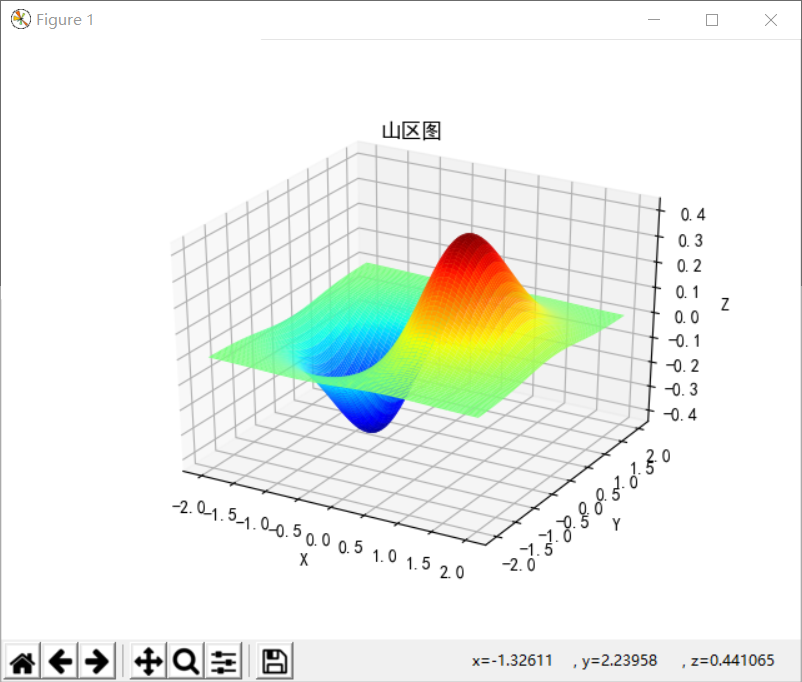

# 11.5 三维图形绘制

**10.5.1三维螺旋图的绘制**

fig = plt.figure(figsize = ((8,6)))

ax = fig.add_subplot(1,1,1,projection='3d')

theta = np.linspace(-4 \* np.pi, 4 \* np.pi, 500)

z = np.linspace(-2, 2, 500)

r = 2\*z

x = r \* np.sin(theta)

y = r \* np.cos(theta)

ax.plot(x, y, z, label='curve')

ax.legend()

plt.show()

运行结果如图5.1所示。

图5.1

**注释：**

1.  theta是对旋转角度进行设置

2.  r是对旋转半径的大小进行设置

**10.5.2三维散点图的绘制**

def randrange(n, vmin, vmax):

return (vmax - vmin)\*np.random.rand(n) + vmin

fig = plt.figure()

ax = fig.add_subplot(111, projection='3d')

n = 100

for c, m, zlow, zhigh in [('r', 'o', -50, -25), ('b', '\^', -30, -5)]:

xs = randrange(n, 23, 32)

ys = randrange(n, 0, 100)

zs = randrange(n, zlow, zhigh)

ax.scatter(xs, ys, zs, c=c, marker=m)

ax.set_xlabel('X Label')

ax.set_ylabel('Y Label')

ax.set_zlabel('Z Label')

plt.show()

运行结果如图5.2所示。

图5.2

**注释：**

1.  xs,ys,zs：输入数据。

2.  （2）s:scatter点的尺寸。

（3）c:颜色，如c = 'r'就是红色。

（4）depthshase:透明化，True为透明，默认为True，False为不透明。

（5）\*args等为扩展变量，如maker = 'o'，则scatter结果为'o'的形状。

**10.5.3三维柱状图的绘制**

plt.rcParams['font.sans-serif'] = ['SimHei']

plt.rcParams['axes.unicode_minus'] = False

mpl.rcParams['font.size'] = 10

fig = plt.figure(figsize=((8,6)))

ax = fig.add_subplot(111, projection='3d')

for z in [2016, 2017, 2018, 2019]:

xs = range(1,13)

ys = 1000 \* np.random.rand(12)

color = plt.cm.Set2(random.choice(range(plt.cm.Set2.N)))

ax.bar(xs, ys, zs=z, zdir='y', color=color, alpha=0.8)

ax.xaxis.set_major_locator(mpl.ticker.FixedLocator(xs))

ax.yaxis.set_major_locator(mpl.ticker.FixedLocator(ys))

ax.set_xlabel('月份')

ax.set_ylabel('年份')

ax.set_zlabel('销售额 ')

plt.show()

运行结果如图5.3所示。

图5.3

**注释：**

（1）zdir:条形图平面化的方向，具体可以对应代码理解。

**10.5.4三维曲面图的绘制**

n_angles = 1000

n_radii = 20

fig = plt.figure(figsize=((10,10)))

radii = np.linspace(0.125, 1.0, n_radii)

angles = np.linspace(0, 2 \* np.pi, n_angles, endpoint=False)

angles = np.repeat(angles[..., np.newaxis], n_radii, axis=1)

x = np.append(0, (radii \* np.cos(angles)).flatten())

y = np.append(0, (radii \* np.sin(angles)).flatten())

z = np.sin(-x \* y)

fig = plt.figure()

ax = fig.gca(projection='3d')

ax.plot_trisurf(x, y, z,

cmap=cm.jet,

linewidth=0.2)

plt.show()

运行结果如图5.4所示。

图5.4

**注释：**

1.  n_angles表示对曲面的衔接角度（平滑度）进行设置。

2.  n_radii表示对鞍部半径进行设置（1：锐角，20：平滑角）。

3.  cmap表示对曲面的颜色进行设置。

**10.5.5山区图的绘制**

plt.rcParams['font.sans-serif'] = ['SimHei']

plt.rcParams['axes.unicode_minus'] = False

x,y = np.mgrid[-2:2:100j,-2:2:100j]

z=x\*np.exp(-x\*\*2-y\*\*2)

ax = plt.subplot(111, projection='3d')

ax.set_title('山区图');

ax.plot_surface(x,y,z,rstride=2, cstride=1, cmap=cm.jet)

ax.set_xlabel('X') \#设置坐标轴标签

ax.set_ylabel('Y')

ax.set_zlabel('Z')

plt.show()

运行结果如图5.5所示。

图5.5

**注释：**

（1）100j为设置曲面平滑度