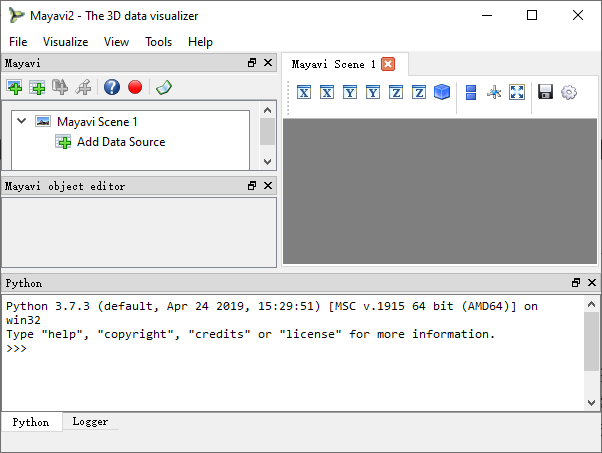
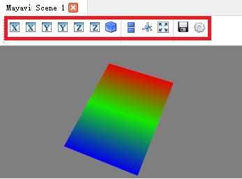

# 12.2 Mayavi应用程序

本节主要对mayavi应用程序的交互使用进行讲解。这里提到的一些内容也适用于使用Mayavi编写脚本。如果您只对快速开始使用Mayavi作为一个简单的、类似于matlab的绘图库感兴趣，那么您可以直接跳到第三章mlab绘图部分，稍后再回来进一步了解

### 12.2.1 初识Mayavi应用程序

在终端中输入mayavi2，打开mayavi交互式应用程序，如图12.2.1所示。

图12.2.1 Mayavi应用程序

Mayavi2程序主要包含五大部分，自上至下，自左至右分别为引擎树视图、对象编辑器、Mayavi布景、Python交互式Shell、日志视图（Python选项右侧）。下面我们对这些些窗口组件进行介绍：

引擎树视图：这是Mayavi管道的树视图。右击树节点可重命名、删除和复制对象。在树下的对象编辑器中，左键单击节点以编辑其属性。可以在树上拖动节点。例如，可以将模块从一组模块拖拽到另一组模块，或者将可视化从一个场景移动到另一个场景。

对象编辑器：当单击管道上的对象时，可以在这里更改Mayavi管道对象的属性。

Mayavi布景：这就是数据可视化发生的地方。人们可以通过鼠标和键盘与这个场景交互。更多细节将在下面的部分中介绍。

Python交互式Shell：内置的Python解释器，可以用来编写Mayavi脚本和做其他事情。您可以从Mayavi树中拖拽节点并将它们放到解释器中，然后编写由节点表示的对象的脚本!如果您已经安装了0.9.1以上版本的IPython，那么这个Python解释器将使用IPython。

日志视图（Python选项右侧）：这里可以看到应用程序日志消息。

### 12.2.2 可视化原理

Mayavi中的数据可视化是通过加载一些数据作为数据源来执行的，并将可视化模块应用于这些数据源来可视化数据。
在使用模块或过滤器之前，需要加载一些数据或另一些数据。Mayavi支持多种数据文件格式，尤其是VTK数据文件格式。或者，可以使用mlab从numpy数组加载数据。一旦加载了数据，就可以选择使用各种过滤器以某种方式过滤或修改数据，然后使用几个模块可视化数据。

模块是执行可视化本身的对象:它们使用数据在场景中创建可视化元素。下面是Mayavi模块的列表和简要描述。

表12.1 Mayavi模块

| **模块**                    | 描述                                                                                                                                                                 |
|-----------------------------|----------------------------------------------------------------------------------------------------------------------------------------------------------------------|
| **Axes:**                   | 绘制简单轴                                                                                                                                                           |
|  **ContourGridPlane:**      | 轮廓网格平面模块。此模块允许您对输入网格数据进行切片，并查看数据的轮廓。                                                                                             |
|  **CustomGridPlane:**       | 一个比网格平面模块灵活得多的自定义网格平面。                                                                                                                         |
| **Glyph:**                  | 显示不同类型的glyph，根据输入点的标量或矢量数据定向和着色。                                                                                                          |
| **GridPlane:**              | 一个简单的网格平面模块。                                                                                                                                             |
|  **HyperStreamline:**       | 通过张量场集成生成超流线的模块。积分沿最大特征向量进行，超流线的横截面由另外两个特征向量定义。因此，超流线的形状是“管状”，横截面是椭圆形的。超流线用于可视化张量场。 |
| **ImageActor:**             | 有效查看图像数据的简单模块。                                                                                                                                         |
|  **ImagePlaneWidget:**      | 一个沿切割查看图像数据的简单模块。                                                                                                                                   |
| **IsoSurface:**             | 一个允许用户生成输入体积数据轮廓的模块。                                                                                                                             |
| **Labels:**                 | 允许用户标记当前数据集或活动模块的当前参与者。                                                                                                                       |
|  **OrientationAxes:**       | 在侧面创建小轴，指示坐标轴的位置，从而标记场景的方向。需要VTK-4.5及以上版本。                                                                                        |
| **Outline:**                | 为给定数据绘制大纲的模块                                                                                                                                             |
| **ScalarCutPlane:**         | 沿着隐式平面获取任何输入数据集的剖切面，并使用可选轮廓和标量扭曲绘制数据。                                                                                           |
|  **SliceUnstructuredGrid:** | 此模块获取非结构化网格数据的一个切片，并显示与切片相交或接触的单元格。                                                                                               |
| **Streamline:**             | 允许用户为给定的矢量数据绘制流线型。它支持各种类型的种子对象（直线、球体、平面和点种子）。它还允许用户绘制带或管，并进一步支持计算流线的不同类型的交互模式。         |
|  **StructuredGridOutline:** | 为结构网格绘制符合网格轮廓的网格。                                                                                                                                   |
| **Surface:**                | 为任何具有可选轮廓的输入数据集绘制表面。                                                                                                                             |
| **TensorGlyph:**            | 显示张量图示符，根据输入点的标量或矢量                                                                                                                               |
| **Text:**                   | 此模块允许用户在屏幕上放置文本。                                                                                                                                     |
| **VectorCutPlane:**         | 沿着隐式剖切平面对输入数据进行任意切片，并根据矢量字段数据放置图示符。字形可以使用矢量大小或标量属性着色。                                                           |
| **Vectors:**                | 根据输入点的矢量数据显示不同类型的字形。这只是一个完全基于glyph模块的方便模块。                                                                                      |
| **Volume:**                 | 体积模块使用体积可视化技术可视化标量字段。                                                                                                                           |
|  **WarpVectorCutPlane:**    | 使用隐式剖切平面提取输入数据的任意切片，并根据矢量场数据对其进行翘曲。缩放比例显示在扭曲的曲面上，显示为颜色。                                                       |

过滤器转换数据，但不显示它。它们被用作数据源和模块之间的中间体。表12.2是Mayavi过滤器的列表。

表12.2 Mayavi过滤器

| **过滤器**                    | **描述**                                                                                                                                                                         |
|-------------------------------|----------------------------------------------------------------------------------------------------------------------------------------------------------------------------------|
|  **CellDerivatives:**         | 从输入点标量和矢量数据计算导数，并在渐变上生成单元数据。例如，可以用来近似计算涡度。                                                                                             |
|  **CellToPointData:**         | 将单元属性数据转换为点数据，方法是对点上的单元数据进行平均。                                                                                                                     |
| **Contour:**                  | 环绕轮廓组件以在任何输入数据集上生成ISO曲面的轮廓过滤器。                                                                                                                        |
| **CutPlane:**                 | 此筛选器表示一个剖切平面，可用于切片任何数据集。它还提供了一个三维小部件接口，以交互方式定位和移动切片。                                                                         |
| **DataSetClipper:**           | 此筛选器将数据集剪辑到一个区域中。该区域可以交互定义为一个方框、一个球体。                                                                                                       |
| **DecimatePro:**              | 通过近似原始网格来减少三角形网格中的三角形数。                                                                                                                                   |
| **Delaunay2D:**               | 执行二维Delaunay三角测量。                                                                                                                                                       |
| **Delaunay3D:**               | 执行三维Delaunay三角测量。                                                                                                                                                       |
|  **ElevationFilter:**         | 创建与直线上点的高程相对应的标量数据。                                                                                                                                           |
| **ExtractEdges:**             | 此过滤器从任何输入数据中提取单元边缘。                                                                                                                                           |
| **ExtractGrid:**              | 允许用户选择结构化网格的一部分。                                                                                                                                                 |
|  **ExtractTensorComponents:** | 包装tvtk extractTensorComponents筛选器以从张量字段提取组件。                                                                                                                     |
|  **ExtractUnstructuredGrid:** | 允许用户选择非结构化网格的一部分。                                                                                                                                               |
|  **ExtractVectorNorm:**       | 计算输入向量数据的范数（欧几里得法）（可选缩放范围在[0，1]之间）。当输入数据有矢量输入，但没有矢量大小的标量数据时，这很有用。                                                   |
|  **ExtractVectorComponents:** | 包装tvtk extract vector components过滤器以提取向量的组件。这对于分析矢量数据的各个分量很有用。                                                                                   |
|  **GaussianSplatter:**        | 该滤波器将点展开成具有椭圆高斯分布的体积。这对于从一组散射点估计密度场很有用。                                                                                                   |
|  **GreedyTerrainDecimation:** | 使用三角形网格近似高度字段（二维图像数据），使三角形数保持最小。                                                                                                                 |
|  **ImageChangeInformation:**  | 一种滤波器，可用于在不改变数据本身的情况下改变输入图像数据集的原点、间距和范围。                                                                                                 |
| **ImageDataProbe:**           | 可用于使用结构化点数据集探测任何数据集的筛选器。该过滤器还允许将标量数据转换为无符号短数组，以便将标量用于卷可视化。                                                             |
| **MaskPoints:**               | 有选择地向下游传递输入点。这可用于对输入点进行次采样。注意，这不会传递几何数据，这意味着所有网格信息都将丢失。                                                                   |
|  **PointToCellData:**         | CellTopointData过滤器的逆变换：将点上的数据转换为单元上的数据。                                                                                                                  |
|  **PolyDataNormals:**         | 从输入数据计算法线。这使网格的外观更平滑。这应该适用于任何输入数据集。注意：这个过滤器在mayavi2 gui（可视化/过滤器/计算法线）中称为“计算法线”。                                  |
|  **QuadricDecimation:**       | 减少网格中的三角形，形成原始网格的良好近似。                                                                                                                                     |
| **SelectOutput:**             | 一种允许用户在给定输入的若干输出中选择一个输出的滤波器。这对于多块数据源通常非常有用。                                                                                           |
|  **SetActiveAttribute:**      | 此过滤器允许用户在VTK数据集上设置活动数据属性（标量、向量和张量）。如果需要执行类似于在另一个标量的等值线上计算一个标量的等值线的操作，那么这一点尤其有用。                      |
| **Stripper:**                 | 创建三角形条带和/或多段线。用于调整破碎表面，如管过滤器创建的表面。                                                                                                              |
| **Threshold:**                | 对输入数据进行阈值的简单过滤器。                                                                                                                                                 |
| **TransformData:**            | 对输入数据执行线性转换。                                                                                                                                                         |
| **Tube:**                     | 把线转换为管子。                                                                                                                                                                 |
| **UserDefined:**              | 此筛选器允许用户动态/交互地定义自己的筛选器。                                                                                                                                    |
| **Vorticity:**                | 该滤波器计算输入向量场的涡度。为了方便起见，该过滤器允许一个可选地通过给定的输入向量字段。该过滤器还允许用户显示沿特定笛卡尔坐标轴的涡度分量。它在输出上生成准备可视化的点数据。 |
| **WarpScalar:**               | 使用本地标量值指定的比例沿特定方向（normalis或指定方向）扭曲输入数据。用于绘制地毯图。例如，数据集的标量值可以转换为高程。                                                       |
| **WarpVector:**               | 沿按比例因子缩放的点向量属性扭曲输入数据。用于显示流量剖面或位移。                                                                                                               |

### 12.2.3 交互式场景

用户界面上的Mayavi场景可以通过单击选项卡上的小“x”图标来关闭。每个场景都有一个支持各种功能的工具栏，如图14.2红色方框内容所示。

图14.2 Mayavi场景工具栏

按钮将视图设置为沿X、Y和Z轴的正或负视图，或获取等角视图。

一个按钮来打开平行投影而不是默认的透视投影。这在查看2D图时特别有用。

一个按钮，用来打开一个轴来表示x轴、y轴和z轴。

一个按钮打开全屏查看。注意，一旦进入全屏模式，必须按“q”或“e”才能返回正常窗口。

一个按钮将场景保存为多种图像格式。要使用的图像格式由文件提供的扩展名决定。

一个按钮提供用于配置场景属性的UI的按钮。

与场景交互的主要方法是使用鼠标和键盘。

#### 使用鼠标交互

鼠标交互有两种模式:

相机模式:默认情况下，鼠标移动相机。按下“c”键可激活此模式。

Actor模式:在此模式下，鼠标操作当前鼠标所在的Actor。按下“a”键可激活此模式。

可以通过使用各种鼠标操作来更改场景视图。通常这些都是通过按住鼠标按钮并拖动来完成的。

按住鼠标左键并拖动将使相机/演员按移动的方向旋转。

按住SHIFT键可以平移场景，就像中间的按钮一样。

按住“CONTROL”键将会绕着相机的轴(滚轴)旋转。

按住“SHIFT”和“CONTROL”键，向上拖动会放大，向下拖动会缩小。这是右边的按钮。

按住鼠标右键向上拖动会放大(或增加角色的比例)，向下拖动会缩小(或缩小比例)。

按住鼠标中键并拖动将平移场景或平移对象。

向上旋转鼠标滚轮会放大，向下旋转鼠标滚轮会缩小。

#### 使用键盘交互

表12.3列举了常用快捷键及其功能描述。

表12.3 常用快捷键

| **快捷键**         | 描述                                                                                                                 |
|--------------------|----------------------------------------------------------------------------------------------------------------------|
| **‘3’:**           | 打开/关闭立体渲染。如果“Stereo”首选项未设置为true。                                                                  |
| **‘a’:**           | 使用actor模式进行鼠标交互，而不是使用相机模式。                                                                      |
| **‘c’:**           | 使用相机模式进行鼠标交互，而不是使用演员模式。                                                                       |
| **‘e’/’q’/’Esc’:** | 退出全屏模式。                                                                                                       |
| **‘f’:**           | 将相机的焦点移动到当前鼠标位置。这将移动相机焦点，使视图在当前鼠标位置居中。                                         |
| **‘j’:**           | 使用操纵杆模式进行鼠标交互。在操纵杆模式下，鼠标有点像操纵杆。例如，在远离中心时按住鼠标左键将旋转场景。             |
| **‘l’:**           | 配置照亮场景的灯光。这将弹出一个窗口来更改灯光配置。                                                                 |
| **‘p’:**           | 在当前鼠标点选取数据。这将弹出一个窗口，显示当前拾取的信息。用户界面还允许更改选取器的行为以选取单元格、点或任意点。 |
| **‘r’:**           | 重置相机焦点和位置。这很方便。                                                                                       |
| **‘s’:**           | 将场景保存到图像中，这将首先弹出一个文件选择对话框，以便您可以选择文件名，文件名的扩展名决定图像类型。               |
| **‘t’:**           | 使用轨迹球模式进行鼠标交互。这是鼠标交互的默认模式。                                                                 |
| **‘=’/’+’:**       | 放大                                                                                                                 |
| **‘-‘:**           | 缩小                                                                                                                 |
|                    | 按左、右、上、下箭头可以让相机在这些方向旋转。当“SHIFT”修改器也被按住时，相机被平移。                                |

### 12.2.6 从交互式使用到脚本编写

在使用交互式应用程序时，学习如何编写Mayavi脚本是很容易的。在这一小节中，我们给出了一些技巧。

嵌入式Python解释器

嵌入式Python解释器提供了非常强大的可能性。解释器的功能包括命令完成、自动文档、工具提示和一些多行编辑。此外，它还支持以下功能:

名称mayavi自动绑定到mayavi.script。脚本实例。这可以用来方便地编写Mayavi脚本。

名称应用程序绑定到envisage应用程序。

如果一个Python文件是通过文件打开的-\>打开文件…菜单项可以用支持颜色语法的编辑器编辑。要在嵌入式Python解释器中执行此脚本，用户可以在编辑器窗口上键入Control-r。要保存文件，请按Control-s。在开发简单的Mayavi脚本时，这是一个非常方便的特性。还可以使用Control-n和Control-s来增加和减少字体大小。

如前所述，可以将节点从Mayavi管道树视图拖放到Python
shell中。然后可以像通常一样编写对象脚本。当这样做时，一个常用的模式是:

**\>\>\>** tvtk_scene_1

\<mayavi.core.scene.Scene object at 0x9f4cbe3c\>

**\>\>\>** s = \_

在本例中，名称s绑定到已删除的tvtk_scene对象。变量存储最后一个被求值的表达式，也就是被删除的对象。使用tvtk_scene_1也可以，但是有点拗口。

将Mayavi操作记录到脚本中

Mayavi提供了一个非常方便和强大的脚本记录工具。这可以用来:

将在Mayavi
UI上执行的所有操作记录为人类可读的Python脚本，该脚本应该能够重新创建您的可视化。

学习如何结合mlab编写Mayavi对象的脚本。

你可以这样使用这个功能:

当您启动mayavi2应用程序时，在管道树视图工具栏上，您将在问号图标旁边发现一个红色记录图标。点击它。注意，在Mayavi管道窗口工具栏上的独立mlab会话中也可以这样做。

您将看到一个带有几行样板代码的窗口弹出，这样您就可以使用mayavi2 -x script.py
'或' python script.py '独立运行您的脚本。保持此窗口打开并暂时忽略Save
script按钮，该按钮将在您完成时使用。

现在在UI上做任何你想做的事情。在执行这些操作时，执行这些操作所需的代码将添加到代码清单中，并显示在弹出窗口中。例如，创建一个新源(通过adder节点对话框/视图、文件菜单或右键单击，即任何普通选项)，然后添加模块/过滤器等。修改树视图中的对象。

移动UI上的相机，旋转相机，缩放，平移。所有这些都将生成合适的Python代码。对于相机，只存储结束位置(否则您将看到数百万行无用的代码)。场景中的主要键盘动作被记录下来(除了“c”/“t”/“j”/“a”键)。这意味着它将记录任何左/右/上/下箭头的'
\+ ' / ' - '键等。

由于代码会随着操作的执行而更新，所以这是学习Mayavi API的好方法。

完成后，再次单击record图标将停止录制:在弹出窗口中，录制框将被勾选，不再显示与新操作对应的代码。如果希望将录制的脚本保存到Python文件中，请单击窗口底部的save
script按钮。将脚本保存到某个文件中，比如script.py。如果您只对代码感兴趣，而不保存文件，此时您可以单击cancel。

关闭录音机窗口。如果你愿意，你可以离开玛雅维。

现在从壳层做:

\$ mayavi2 -x script.py

甚至:

python script.py美元

这些应该运行所有代码，以使您回到原来的位置。您可以随意编辑这个生成的脚本——事实上，这就是自动生成脚本的全部意义!

重要的是要了解，也可以编写Mayavi的现有会话的脚本。因此，如果在启动Mayavi之后，您执行了一些操作或运行了一个Mayavi脚本，然后想要记录任何进一步的操作，那么这当然是可能的。按照和以前一样的程序。在这种情况下，您必须记住的惟一问题是脚本记录器不会创建您已经在会话上设置的对象。

注意，您还应该能够在Mayavi树视图上删除/拖放对象。然而，您可能不希望在自动脚本中执行这些操作。

如前所述，脚本记录将适用于mlab会话或任何其他使用Mayavi的地方。它不会生成任何特定于mlab的代码，而是使用OO
Mayavi API编写通用的Mayavi代码。

警告的局限性

脚本记录器用于一些重要的操作。目前，它不支持下列行动:

在现场，“c”/“t”/“j”/“a”/“p”键没有记录

这是正确的，因为实现起来要复杂得多，而且通常不需要基本的脚本。

接口的任意脚本显然是行不通的

如你所料。

类中只显式记录特征更改和特定调用

代码。因此，在任意Mayavi对象上调用任意方法通常不会记录任何内容。
