# 12.3 mlab绘图

本节我们将对mayavi中的mlab模块（Mayavi.mlab）进行讲解。mlab是Mayavi中的绘图模块。mlab既可以写入脚本来对数据进行可视化展示，又可以使用交互式shell对数据进行可视化。如果您之前已经接触过Matlab绘图，那么您将很容易掌握它。

下面，让我们运行基于mlab的球面谐波可视化代码来感受一下Mayavi的魅力：

\# 创建数据

from numpy import pi, sin, cos, mgrid

dphi, dtheta = pi/250.0, pi/250.0

[phi,theta] = mgrid[0:pi+dphi\*1.5:dphi,0:2\*pi+dtheta\*1.5:dtheta]

m0 = 4; m1 = 3; m2 = 2; m3 = 3; m4 = 6; m5 = 2; m6 = 6; m7 = 4;

r = sin(m0\*phi)\*\*m1 + cos(m2\*phi)\*\*m3 + sin(m4\*theta)\*\*m5 +
cos(m6\*theta)\*\*m7

x = r\*sin(phi)\*cos(theta)

y = r\*cos(phi)

z = r\*sin(phi)\*sin(theta)

\# 可视化球面谐波

from mayavi import mlab

s = mlab.mesh(x, y, z)

mlab.show()

运行结果如下：

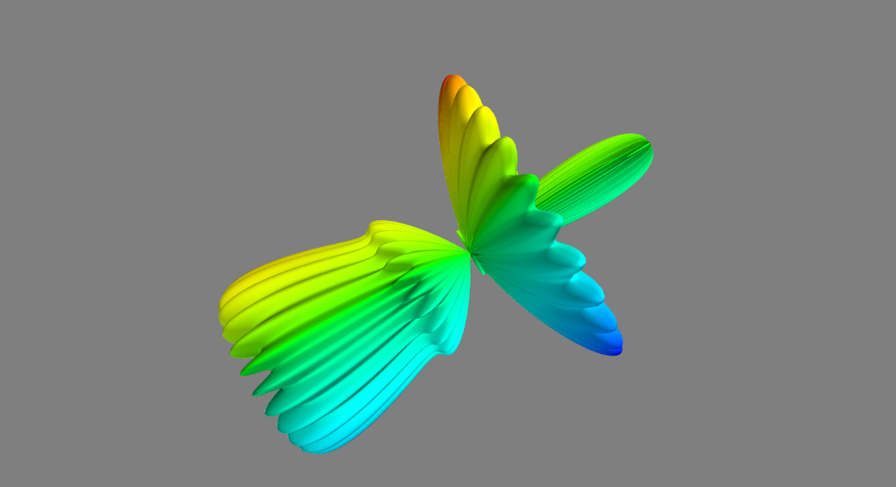

上述球面谐波可视化通过将三个二维数据（X，Y，Z）传入mlab.mesh()函数中完成三维图形的创建，通过调用mlab.show()函数来对球面谐波进行展示。传入mlab.mash()的数据位于图形网格上。mesh()函数可以隐式地从输入数组的形状中提取连接性信息:连接二维输入数组中的相邻数据点。

### 12.3.1 3维绘图函数

在mlab中，可以通过一组在numpy数组上操作的函数来创建可视化。

mlab绘图函数以numpy数组作为输入来描述数据的x、y和z坐标，还可以对其添加可视化模块。此外，可以通过更改该模块的属性来修改可视化效果。

Mayavi中的三维图形根据数据源形状不同，可以分为由0维与1维数据创建的3维图形，由2维数据创建的三维图形，由3维数据创建的三维图形。因为mlab绘图函数的用法与我们前面所讲的sympy以及matplotlib用法相似，因此我们不会对mlab中的函数进行过多讲解。只要读者具备了matplotli或者matlab绘图基础，仅需要数小时，就能熟练掌握mlab绘图技巧。如果需要详细学习特定函数，可以使用Python魔法命令“？”查阅文档进行学习。下面我们主要以表格形式对mlab中主要的绘图函数进行简要介绍。

#### 0维与1维数据

表12.3列举了接受0维和1维数据输入的mlab绘图函数。

表12.3 mlab绘图函数（0维与1维数据）

| **函数**                                                                                                        | **描述**                                                              |  **示例**                                                |
|-----------------------------------------------------------------------------------------------------------------|-----------------------------------------------------------------------|----------------------------------------------------------|
| [**points3d()**](http://docs.enthought.com/mayavi/mayavi/auto/mlab_helper_functions.html#mayavi.mlab.points3d)  | 用相同形状的x、y、z numpy数组描述所提供数据位置的绘图符号(类似于点)。 | 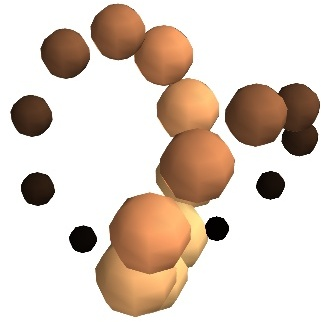 |
| [**plot3d()**](http://docs.enthought.com/mayavi/mayavi/auto/mlab_helper_functions.html#mayavi.mlab.plot3d)      | 绘制空间线，由相同长度的x、y、z1D numpy数组描述。                     | 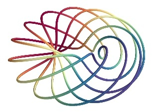   |

#### 2维数据

表12.4列举了接受2维数据输入的mlab绘图函数。

表12.4 mlab绘图函数（2维数据）

| **函数**                                                                                                                       | **描述**                                                                                                                                             |  **示例**                                                       |
|--------------------------------------------------------------------------------------------------------------------------------|------------------------------------------------------------------------------------------------------------------------------------------------------|-----------------------------------------------------------------|
| [**imshow()**](http://docs.enthought.com/mayavi/mayavi/auto/mlab_helper_functions.html#mayavi.mlab.imshow)                     | 使用二维数组创建图像                                                                                                                                 | 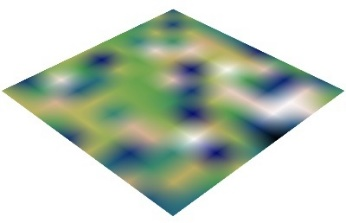          |
| [**surf()**](http://docs.enthought.com/mayavi/mayavi/auto/mlab_helper_functions.html#mayavi.mlab.surf)                         | 以地毯图的形式查看二维阵列，Z轴表示通过阵列点的高程值。                                                                                              | 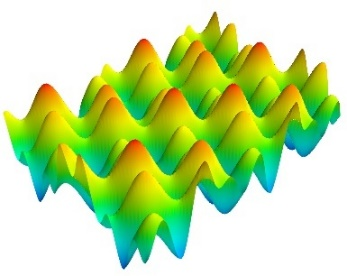            |
| [**contour\_surf()**](http://docs.enthought.com/mayavi/mayavi/auto/mlab_helper_functions.html#mayavi.mlab.contour_surf)        | 将二维数组视为线轮廓，根据数组点的值升高。                                                                                                           | 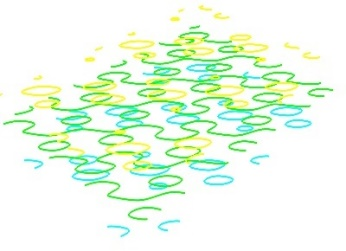    |
| [**mesh()**](http://docs.enthought.com/mayavi/mayavi/auto/mlab_helper_functions.html#mayavi.mlab.mesh)                         | 绘制由三个二维数组x、y、z描述的曲面，给出数据点的坐标作为网格。 与surf()不同，曲面是由它的x、y和z 坐标定义的，没有特殊的方向。可以创建更复杂的表面。 | 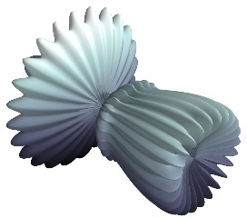            |
| [**barchart()**](http://docs.enthought.com/mayavi/mayavi/auto/mlab_helper_functions.html#mayavi.mlab.barchart)                 | 用显式坐标数组x、y和z绘制一个数组s或一组点，如柱状图。此函数非常通用，可以接受二维或三维数组，也可以接受点云来定位条形图。                           | 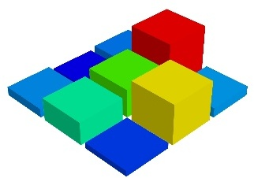        |
| [**triangular\_mesh()**](http://docs.enthought.com/mayavi/mayavi/auto/mlab_helper_functions.html#mayavi.mlab.triangular_mesh)  | 绘制一个三角形网格，完全由顶点的x、y和z坐标以及三角形索引的(n, 3)数组指定。                                                                          | 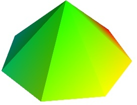 |

#### 3维数据

表12.5列举了接受3维数据输入的mlab绘图函数。

表12.5 mlab绘图函数（31维数据）

|  **函数**                                                                                                                | **描述**                                                                      |  **示例**                                                 |
|--------------------------------------------------------------------------------------------------------------------------|-------------------------------------------------------------------------------|-----------------------------------------------------------|
| [**contour3d()**](http://docs.enthought.com/mayavi/mayavi/auto/mlab_helper_functions.html#mayavi.mlab.contour3d)         | 将三维数组数据绘制为等值面。                                                  |  |
| [**quiver3d()**](http://docs.enthought.com/mayavi/mayavi/auto/mlab_helper_functions.html#mayavi.mlab.quiver3d)           | 绘制箭头表示数据点处的向量。x、y、z位置由numpy数组以及向量的u、v、w分量指定。 | 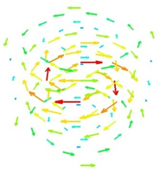  |
| [**flow()**](http://docs.enthought.com/mayavi/mayavi/auto/mlab_helper_functions.html#mayavi.mlab.flow)                   | 在网格上绘制由三个三维数组描述的粒子沿着向量场的轨迹，给出u、v、w分量。       | 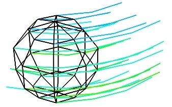      |
| [**volume\_slice()**](http://docs.enthought.com/mayavi/mayavi/auto/mlab_helper_functions.html#mayavi.mlab.volume_slice)  | 绘制一个交互式图像平面，该平面在体数据中切片。                                | 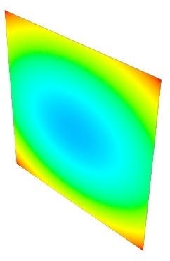     |

### 12.3.2 更改创建的可视对象的外观

##### 添加颜色或大小变化

绘图函数创建的对象的颜色可以使用函数的“color”关键字参数显式指定。如果希望在可视化中改变颜色，需要为每个数据点指定颜色标量信息。使用colormap(也称为LUT)将这个标量信息转换为颜色，用于查找表。常用颜色标量如表12.6所示。

表12.6 常用颜色函数映射表

| ccent       | flag          | hot      | pubu     | set2      |
|-------------|---------------|----------|----------|-----------|
| autumn      |  gist_earth   |  hsv     |  pubugn  |  set3     |
| black-white |  gist_gray    |  jet     |  puor    |  spectral |
| blue-red    |  gist_heat    |  oranges |  purd    |  spring   |
| blues       |  gist_ncar    |  orrd    |  purples |  summer   |
| bone        |  gist_rainbow |  paired  |  rdbu    |  winter   |
| brbg        |  gist_stern   |  pastel1 |  rdgy    |  ylgnbu   |
| bugn        |  gist_yarg    |  pastel2 |  rdpu    |  ylgn     |
| bupu        |  gnbu         |  pink    |  rdylbu  |  ylorbr   |
| cool        |  gray         |  piyg    |  rdylgn  |  ylorrd   |
| copper      |  greens       |  prgn    |  reds    | set2      |
| dark2       |  greys        |  prism   |  set1    |  set3     |

选择最适合您的可视化的colormap的最简单方法是使用GUI(如下一段所述)。设置颜色映射的对话框可以在Colors和legends节点中找到。

要使用自定义的颜色映射，目前需要编写特定的代码，如自定义颜色映射示例所示。

##### 改变图形大小

标量信息还可以以许多不同的方式显示。例如，它可以用来调整位于数据点的字形的大小。

注意:夹紧:相对或绝对缩放给定六个点的位置在一条线与点间距1:

x = [1, 2, 3, 4, 5, 6]

y = [0, 0, 0, 0, 0, 0]

z = y

如果我们在这个数据基上表示一个从0.5到1的标量:

s = [.5, .6, .7, .8, .9, 1]

我们使用points3d()将数据集表示为球体，将标量映射到球体的直径:

from mayavi import mlab

pts = mlab.points3d(x, y, z, s)

在默认情况下，球体的直径不是“夹紧”的，也就是说，标量数据的最小值表示为空直径，最大值与点间距离成正比。比例只是相对的，从结果图中可以看出:

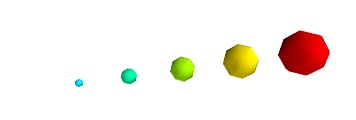

此行为为所有数据集提供可见点，但如果标量表示与指定位置相同单元中的符号大小，则可能不需要此行为。

在这种情况下，您应该通过指定所需的缩放因子来关闭自动缩放功能:

pts = mlab.points3d(x, y, z, s, scale_factor=1)

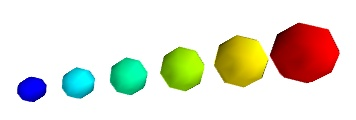

### 12.3.3 画布，图装饰与相机

为了与matlab和pylab兼容，所有mlab函数都在当前场景中运行，我们也将其称为画布（由figure()函数调用）。不同的画布按键索引，键可以是整数，也可以是字符串。对figure()函数的调用给出一个键，如果它存在，则返回对应的figure，或者创建一个新的figure。可以使用gcf()函数检索当前图。它可以使用draw()函数刷新，使用savefig()保存到图片文件中，使用clf()清除。

##### 图装饰

表12.7列举了常用的图装饰函数，这些图装饰函数与matplotlib和matlab中的同名函数用法与功能相同。

表12.7 mayavi中常用的图装饰

| 函数                | 描述                                                   |
|---------------------|--------------------------------------------------------|
| axis()              | 在可视化对象周围添加坐标轴                             |
| xlabel()            | 设置x轴标签                                            |
| ylabel()            | 设置y轴标签                                            |
| zlabel()            | 设置z轴标签                                            |
| outline()           | 围绕对象创建一个大纲                                   |
| title()             | 设置标题                                               |
| colorbar()          | 为最后创建的对象创建一个颜色条用于反映显示值的颜色映射 |
| orientation\_axes() | 将一个小型xyz三元组添加到图中                          |

##### 移动相机

可以使用view()函数设置相机的位置和方向。它是用欧拉角和到焦点的距离来描述的。view()函数尝试猜测相机的正确滚动角度以获得令人满意的视图，但有时会失败。roll()显式设置摄像机的滚动角度(可以在场景中交互实现，按下control键，同时拖动鼠标，查看与场景的交互)。

view()和roll()函数返回作为参数的不同角度和距离的当前值。因此，交互获取的视图可以使用以下方法进行存储和复位:

\# 存储信息

view = mlab.view()

roll = mlab.roll()

\# 复位相机

mlab.view(\*view)

mlab.roll(roll)

您还可以使用相机对象的滚动、偏航和俯仰方法来旋转相机本身。这移动了焦点:

f = mlab.gcf()

camera = f.scene.camera

camera.yaw(45)

与view()和roll()函数不同，角度是递增的，而不是绝对的。

修改缩放和视角

相机完全由它的位置、焦点和视角定义(属性为“position”、“focal_point”、“view_angle”)。相机方法“zoom”按指定的比例递增地改变视角，当“dolly”方法在保持焦点不变的情况下沿轴平移相机时，“zoom”会改变视角。move()函数在这些方面也很有用。

相机平行比例尺

除了由mlab返回和设置的信息之外。视图和mlab。滚动，需要最后一个参数来完全定义视点:相机的平行比例，控制其视角。可通过以下代码读取(或设置):

f = mlab.gcf()

camera = f.scene.camera

cam.parallel\_scale = 9

### 12.3.4 使用mlab组装管道

Mlab提供了一个子模块管道，其中包含可以从脚本轻松填充管道的函数。此模块可在mlab.pipeline中访问，也可以从mayavi.tools.pipeline导入。

当使用mlab绘图函数时，管道就被自动创建了。在管道创建的过程中，首先从numpy数组创建一个源，然后添加需要的模块以及有过滤器。可以使用mlab查看生成的管道。show_pipeline命令。

#### 数据源

mlab.pipeline模块包含从数组创建各种数据源的函数。我们根据这些数据是否有连接来对其进行分类介绍。

**无连接数据**

| 函数                                                                                                                                                        | 描述                         | 示例                                             |
|-------------------------------------------------------------------------------------------------------------------------------------------------------------|------------------------------|--------------------------------------------------|
| [**scalar\_scatter()**](http://docs.enthought.com/mayavi/mayavi/auto/mlab_pipeline_sources.html#mayavi.tools.pipeline.scalar_scatter) (creates a PolyData)  | 从无连接数据源创建散点图     |  |
| [**vector\_scatter()**](http://docs.enthought.com/mayavi/mayavi/auto/mlab_pipeline_sources.html#mayavi.tools.pipeline.vector_scatter) (creates an PolyData) | 从无连接数据源创建矢量散射图 | 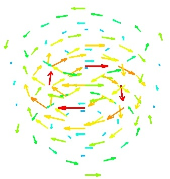 |

|   |   |
|---|---|

**隐连接数据**

| **函数**                                                                                                                                                      | **描述**                       | **示例**                                                                                                                      |
|---------------------------------------------------------------------------------------------------------------------------------------------------------------|--------------------------------|-------------------------------------------------------------------------------------------------------------------------------|
| [**scalar\_field()**](http://docs.enthought.com/mayavi/mayavi/auto/mlab_pipeline_sources.html#mayavi.tools.pipeline.scalar_field) (creates an ImageData)      | **从隐连接数据创建三维等值面** |       |
| [**array2d\_source()**](http://docs.enthought.com/mayavi/mayavi/auto/mlab_pipeline_sources.html#mayavi.tools.pipeline.array2d_source) (creates an ImageData)  | **从隐连接数据源创建图像**     |                     |
| [**vector\_field()**](http://docs.enthought.com/mayavi/mayavi/auto/mlab_pipeline_sources.html#mayavi.tools.pipeline.vector_field) (creates an ImageData)      | **从隐连接数据源创建矢量场**   | 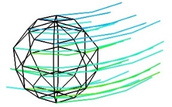 |

|   |   |
|---|---|

**连接数据**

| **函数**                                                                                                                                                                     | **描述**                 | **示例**                                                                                                                                 |
|------------------------------------------------------------------------------------------------------------------------------------------------------------------------------|--------------------------|------------------------------------------------------------------------------------------------------------------------------------------|
| [**line\_source()**](http://docs.enthought.com/mayavi/mayavi/auto/mlab_pipeline_sources.html#mayavi.tools.pipeline.line_source) (creates an PolyData)                        | 从连接数据源创建空间线   |                                                                                          |
| [**triangular_mesh\_source()**](http://docs.enthought.com/mayavi/mayavi/auto/mlab_pipeline_sources.html#mayavi.tools.pipeline.triangular_mesh_source) (creates an PolyData)  | 从连接数据源创建三角网线 | 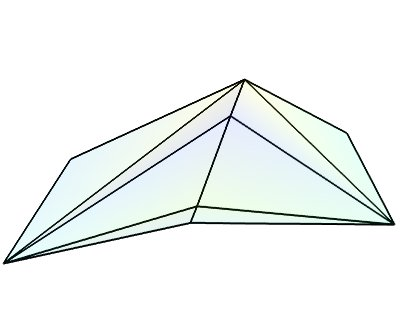 |

下面我们通过分析几个使用mlab实现可视化的案例，来进一步探究mlab的使用方法。

#### 三维标量场可视化

主要有三种途径实现三维标量场的可视化，分别是等值面法，剖切面法和组合法。下面我们对以下给定的三维数组,
s进行可视化。

import numpy as np

x, y, z = np.ogrid[-10:10:20j, -10:10:20j, -10:10:20j]

s = np.sin(x\*y\*z)/(x\*y\*z)

等值面法是最简单的三维标量场可视化方法，即直接使用contour3d()函数对三维标量场进行可视化，

mlab.contour3d(s)

运行结果如下：

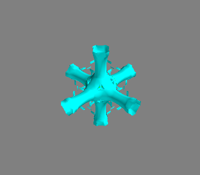

这种方法的问题在于，外部等值面面倾向于隐藏内部等值面面。因此，通常只能看到一个ISO表面。我们可以使用体积渲染技术，对每个体素赋予一种透明的颜色。

mlab.pipeline.volume(mlab.pipeline.scalar_field(s))

运行结果如下：

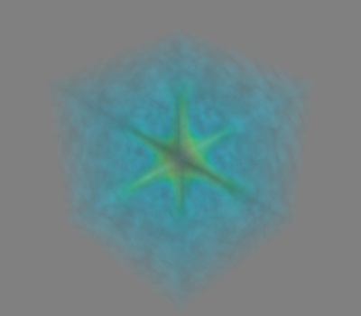

上述代码使用到了pipline.volume模块以及scalar\_field()函数。对于这种可视化，调整不透明度传递函数对于获得良好效果至关重要。通常，将下限值和上限值限制在数据的20%和80%是有用的，以便使卷的合理部分透明：

mlab.pipeline.volume(mlab.pipeline.scalar_field(s), vmin=0, vmax=0.8)

运行结果如下：

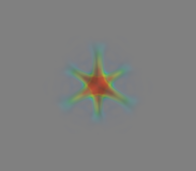

体积渲染的局限性在于，虽然它通常非常漂亮，但很难用它分析代码的细节。

剖切面是一种非常有用的可视化标量场细节的方法。我们通过mlab.pipeline.image\_plane_widget模块以及scalar_field()函数来创建一个剖切面图。

mlab.pipeline.image_plane_widget(mlab.pipeline.scalar_field(s),

plane_orientation='x_axes',

slice_index=10,

)

mlab.pipeline.image_plane_widget(mlab.pipeline.scalar_field(s),

plane_orientation='y_axes',

slice_index=10,

)

mlab.outline()

也可以使用mlabvolume_slice（）函数从numpy数组创建图像平面小部件：

mlab.volume\_slice(s, plane_orientation='x_axes', slice_index=10)

“图像平面”小部件只能用于由mlab.pipeline.scalar\_字段创建的常规间隔数据，但速度非常快。因此，在可能的情况下，它应该优先于标量剖切面。

最后，将切割平面与等值面和阈值组合在一起, 使用等值面来查看峰值区域：

src = mlab.pipeline.scalar_field(s)

mlab.pipeline.iso\_surface(src, contours=[s.min()+0.1\*s.ptp(), ], opacity=0.1)

mlab.pipeline.iso\_surface(src, contours=[s.max()-0.1\*s.ptp(), ],)

mlab.pipeline.image_plane_widget(src,

plane_orientation='z_axes',

slice_index=10,

)

运行结果如下：

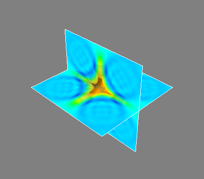

在上面的示例中，我们使用了mayavi的管线语法，而不是使用contour3d（）和volume_slice（）来使用单个标量字段作为数据源。

#### 向量场可视化

向量场，即连续定义在一个卷中的向量，可能难以可视化，因为它包含很多信息。下面我们对以下给定的三维数组u,
v, w进行可视化：

import numpy as np

x, y, z = np.mgrid[0:1:20j, 0:1:20j, 0:1:20j]

u = np.sin(np.pi\*x) \* np.cos(np.pi\*z)

v = -2\*np.sin(np.pi\*y) \* np.cos(2\*np.pi\*z)

w = np.cos(np.pi\*x)\*np.sin(np.pi\*z) + np.cos(np.pi\*y)\*np.sin(2\*np.pi\*z)

一组向量的最简单可视化是使用mlab函数quiver3d：

mlab.quiver3d(u, v, w)

mlab.outline()

运行结果如下

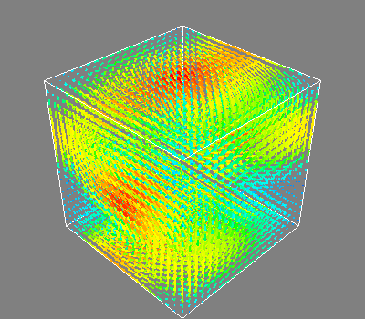

这种可视化的主要局限性在于，它为网格上的每个采样点定位一个箭头。因此，可视化效率较低。

我们可以利用我们正在可视化一个向量场的事实，而不仅仅是一组向量，来减少显示的箭头数量。为此，我们需要构建一个矢量场源，并将矢量模块应用于它，并使用一些掩蔽参数（这里我们只保留20个点中的一个点）：

src = mlab.pipeline.vector_field(u, v, w)

mlab.pipeline.vectors(src, mask_points=20, scale_factor=3.)

运行结果如下：

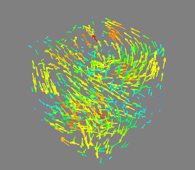

如果我们有兴趣显示沿切割的向量，我们可以使用切割平面：

mlab.pipeline.vector_cut_plane(src, mask_points=2, scale_factor=3)

运行结果如下：

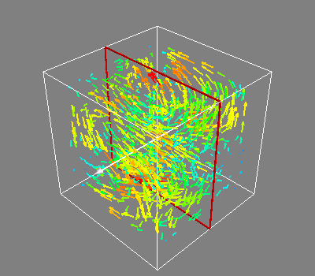

矢量场的一个重要参数是它的大小。显示向量法向的等参曲面可能很有趣。为此，我们可以使用ExtractVectororm过滤器从向量场创建一个标量场，并在其上使用iso曲面模块。交互工作时，通过更改对象属性对话框中的轮廓值，可以很好地了解场的大小。

magnitude = mlab.pipeline.extract_vector_norm(src)

mlab.pipeline.iso\_surface(magnitude, contours=[1.9, 0.5])

运行结果如下：

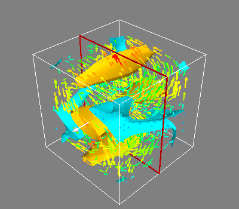

对于某些矢量场，沿场流动的线可能有一个有趣的意义。例如，这可以解释为流体动力学中的轨迹，或电磁中的场线。我们可以使用流线模块或MLAB
Flow（）功能显示特定种子表面的流线，该功能依赖于流线内部：

flow = mlab.flow(u, v, w, seed_scale=1,

seed_resolution=5,

integration_direction='both')

运行结果如下：

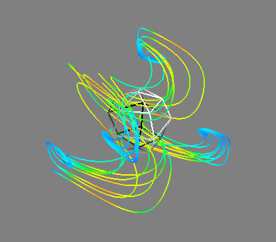

在实际使用中，因为通常不可能事先为可视化选择最佳参数，例如颜色、轮廓值、颜色图、视角等，因此我们常常使用交互方式来确定图形的最佳属性。这也是mayavi的优势所在。