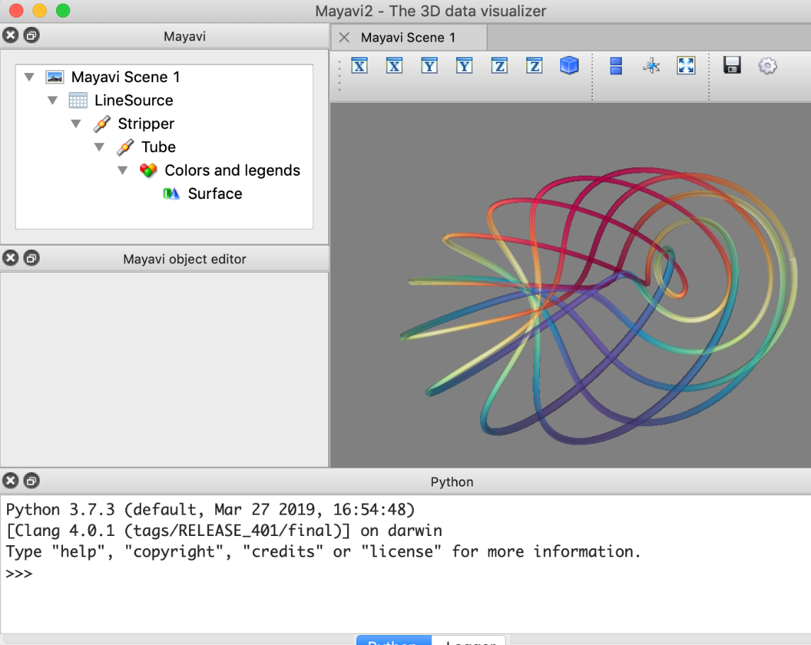

# 12.4 MayaVi高级应用

### 12.4.1 Mayavi管线

Mayavi使用VTK实现所有可视化需求。管线是VTK可视化的基础。然而，
这并不意味着Mayavi中的管线等同于VTK中的管线。Mayavi与VTK中的管线布局不同，对象不同，且VTK管线中有更多的节点。本节，我们只关注Mayavi中的管线。

在Mayavi中，管线具有以下特征：

1.  Mayavi管线的顶部节点称为引擎。它负责场景的创建和删除。它不会显示在pipeline视图中。

2.  引擎中组织了多个Mayavi场景。每个场景都有一组数据源:它们将数据公开给Mayavi进行可视化。可

3.  以对源应用过滤器来转换它们封装的数据。

4.  模块管理器控制用于表示标量或向量数据的颜色。它在管线视图中表示为名为Colors和legends的节点。

5.  可视化模块最终显示场景中数据的再现，如表面或线。

管线中的每个对象都有一个父属性(指向管线中的父对象)和一个子属性(给出子对象的列表)。对象的name属性在管线视图中显示节点的名称。通过调用此对象的edit_traits()方法，可以显示编辑对话框来图形化地修改对象的属性。

此外，Mayavi管线对象只能在一个场景中，它们的.scene属性指向这个场景

让我们通过一个实例，来对管线概念进行了解。plot3d()函数表示直线:

import numpy as np

phi = np.linspace(0., 2\*np.pi, 1000)

x = np.cos(6\*phi)\*(1 + .5\*np.cos(11\*phi))

y = np.sin(6\*phi)\*(1 + .5\*np.cos(11\*phi))

z = .5\*np.sin(11\*phi)

from mayavi import mlab

surface = mlab.plot3d(x, y, z, np.sin(6\*phi), tube_radius=0.025,
colormap='Spectral', opacity=.5)

mlab.plot3d()函数首先创建一个由线连接的点组成的源。然后，它应用剥离过滤器，它转换这一系列的线在一个“带”。其次，管过滤器的应用:从'条'它创建一个给定半径的管。最后，利用表面模块对管的表面进行显示。mlab返回的表面对象。plot3d()函数是最后一个曲面模块。

### 12.4.2 Mayavi与TVTK

在涉及一般需求时，使用mayavi数据源或者mlab就可以轻松完成图形的构建。
但是，如果希望创建具有特定结构的数据以实现更高效的可视化，或者如果希望从mayavi管线中提取数据，那么就不可避免地要与VTK或者TVTK数据结构打交道了。

VTK是一套使用C++编写的三维的数据可视化工具，它内置近千个了用于数据可视化的类。可以使用conda或pip命令安装vtk库。但是由于其API和C++相同，因此不能完全发挥Python作为动态语言的优势。幸运的是，enthought.com开发了一套TVTK库对标准的VTK库进行包装。TVTK不仅提供了Python风格的API，且支持Trait属性和numpy的多维数组

本节我们对TVTK进行介绍。

#### TVTK数据集概述

mayavi通过tvtk（traited
vtk）使用vtk库来满足其所有可视化需求。数据在内部、由源或在过滤器的输出处公开，如下面描述的VTK数据集。了解这些结构不仅有助于操作它们，而且有助于了解在使用过滤器转换管线中的数据时会发生什么。

TVTK数据集可以根据其不同的特性分为以下几类：

第一类：空间三维点。

第二类：根据数据集中的数据是否有连接，可以将数据集分为无连接数据集，隐连接数据集，连接数据集。

第三类：根据数据集中数据的类型，可以将数据集分为向量，标量，在点上的数据与在单元格内的数据。

图12.4.1 反映了不同数据集类型的空间特征。

图12.4.1 数据集类型

所有VTK数组，无论是用于记录数据还是位置，都表现为用于3D组件的形状为的numpy数组或用于一维组件的一维numpy数组。索引的顺序与numpy:z（先是y，然后是x）的顺序相反。因此，要从3d
numpy数组转到相应的flatten vtk数组。需要执行ndarray.ravel()方法。

vtk_array = numpy_array.T.ravel()

#### 数据流

如前所述，mayavi通过组装管线来构建可视化，其中数据由160个数据源加载到mayavi中，并且可以通过160个过滤器进行转换，并由160个模块进行可视化。

要检索mayavi显示的数据，通过python代码对其进行修改，或者从mayavi过滤器执行的数据处理步骤中获益，打开mayavi管线并了解其中的数据流是很有用的。

在mayavi管线中，源过滤器和模块之间的三维数据流存储在vtk数据集中。每个源或筛选器都有一个输出属性，该属性是描述对象输出数据的vtk数据集列表。

例如:

data = np.random.random((10, 10, 10))

iso = mlab.contour3d(data)

运行结果如下：

iso的父节点是其“颜色和图例”节点，“颜色与图例”节点的父节点是输入
iso的数据源。接下来让我们查看“颜色与图例”节点的父节点的输入对象。

iso.parent.parent.outputs

[\<tvtk\_classes.image\_data.ImageData object at 0xf08220c\>]

通过上述结果，我们可以看到由mlab.surf创建的mayavi源公开了imagedata vtk数据集。

#### TVTK数据实例

TVTK数据结构及其描述如表12.8所示：

| **VTK名称** | **连通性** | **适用于** | **必要信息**                       |
|-------------|------------|------------|------------------------------------|
| 图像数据    | 隐性的     | 体积和表面 | 三维数据阵列和沿每个轴的间距       |
| 直线网格    | 隐性的     | 体积和表面 | 每个轴的三维数据阵列和一维间距阵列 |
| 结构网格    | 隐性的     | 体积和表面 | 每个轴的三维数据阵列和三维位置阵列 |
| 多数据      | 明确的     | 点、线和面 | x，y，z，顶点位置和面元数组        |
| 非结构网格  | 明确的     | 体积和表面 | 体积单元顶点和数组的X、Y、Z位置    |

接下来，我们通过两个例子就创建TVTK数据进行讲解。

##### 图像数据

此数据集由位于正交网格上的数据点组成，每个轴的间距都是恒定的。数据点的位置是根据其在数据数组上的位置（隐式定位）、原点和沿每个轴的两个切片之间的间距推断出来的。在二维图像中，这可以理解为光栅图像。

下面我们从numpy数组创建tvtk.imagedata对象：

from tvtk.api import tvtk

from numpy import random

data = random.random((3, 3, 3))

i = tvtk.ImageData(spacing=(1, 1, 1), origin=(0, 0, 0))

i.point\_data.scalars = data.ravel()

i.point_data.scalars.name = 'scalars'

i.dimensions = data.shape

该imagedata对象的图形如下：

##### 直线网格

该数据集由位于正交网格上的数据点组成，数据点沿各轴具有任意间距。数据点的位置是根据它们在数据数组上的位置、原点和每个轴的间距列表推断出来的。

下面我们从numpy数组创建tvtk.RectilinearGrid对象：

from tvtk.api import tvtk

from numpy import random, array

data = random.random((3, 3, 3))

r = tvtk.RectilinearGrid()

r.point\_data.scalars = data.ravel()

r.point_data.scalars.name = 'scalars'

r.dimensions = data.shape

r.x_coordinates = array((0, 0.7, 1.4))

r.y_coordinates = array((0, 1, 3))

r.z_coordinates = array((0, .5, 2))

该imagedata对象的图形如下：

#### 在TVTK数据可视化

可视化TVTK数据的最简单方法是使用mlab.pipeline来应用过滤器和模块到目标数据。实际上，这些创建过滤器和模块的函数接受VTK数据集并自动将它们插入管线。surface模块可以用来可视化上面创建的ImageData数据集，如下所示:

from enthgouth.mayavi import mlab

mlab.pipeline.surface(i)

此外，还可以通过VTKDataSource在直接控制引擎的Mayavi管线上插入该数据集：

from mayavi.sources.api import VTKDataSource

src = VTKDataSource(data=i)

from mayavi.api import Engine

e = Engine()

e.start()

s = e.new\_scene()

e.add_source(src)

### 12.4.3 填充Mayavi管线的对象

本节，我们主要介绍Mayavi管线中的主要对象。

#### Mayavi对象的层次结构

下图显示了所涉及的各种对象的类层次结构：

此结构描述了基对象、“场景”、“管线”和“模块化”。

此结构描述了
“管线”、“资源”、“过滤器”、“模块”和“组件”。注意，给定一个Mayavi对象，这是查看什么是重要属性的简单方法，显示它并调用它的print_traits()。

#### Mayavi对象

##### 场景(Scene)

| **关键属性** |  **描述**                                                              |
|--------------|------------------------------------------------------------------------|
| scene        | 一个tvtk scene（tvtk.pyface.tvtk_scene）对象，它是所有渲染发生的地方。 |
| children     | 源\_对象列表。                                                         |

scene\_类在mayavi.core.scene\_模块中定义。

| **关键属性** | **描述**                                                               |
|--------------|------------------------------------------------------------------------|
| scene        | 一个tvtk scene（tvtk.pyface.tvtk_scene）对象，它是所有渲染发生的地方。 |
| children     | 源\_对象列表。                                                         |

##### 资源类

所有数据源、文件读取器、参数曲面等都是源类的子类。

| **关键属性** | **描述**                                                                   |
|--------------|----------------------------------------------------------------------------|
| children     | 模块\_或过滤器列表                                                         |
| outputs      | 源产生的输出列表。这些是TVTK数据集，在Mayavi的“数据表示”一节中进行了解释。 |

source\_类在mayavi.core.source模块中定义。

##### 过滤器类

filters一节中描述的所有\_filters都是此类的子类。

| **属性** | **描述**                                                                       |
|----------|--------------------------------------------------------------------------------|
| children | 模块\_或其他\_过滤器列表。                                                     |
| inputs   | 一个列表的输入Tvtk数据集对象馈入过滤器。                                       |
| outputs  | 滤波器产生的输出列表。这些是TVTK数据集，在Mayavi的“数据表示”一节中进行了解释。 |

| **方法**           | **描述**                                                                                   |
|--------------------|--------------------------------------------------------------------------------------------|
| setup\_pipeline()  | 如果需要，用于创建底层TVTK管线对象。                                                       |
| update\_pipeline() | 当上游管线已更改时调用，即上游对象触发管线已更改事件。                                     |
| update\_data()     | 当上游管线未已更改但管线中的数据已更改时调用。当上游对象触发数据更改事件时会发生这种情况。 |

fileter类在mayavi.core.filter模块中定义。

##### 模块管理器类

模块管理器：颜色和图例节点

这个对象在用户界面的树视图中被称为“颜色和图例”。此对象的主要目的是控制它管理的模块中的数据如何以颜色转换。所有模块通常都将使用查找表（LUT）来生成有意义的可视化效果。此查阅表格由模块管理器管理。

| **关键属性**       |  **描述**                                                                                                                                                                                                                                                                                                                                    |
|--------------------|----------------------------------------------------------------------------------------------------------------------------------------------------------------------------------------------------------------------------------------------------------------------------------------------------------------------------------------------|
| source             | 作为此对象输入的源或筛选器对象。                                                                                                                                                                                                                                                                                                             |
| children           | 它管理的模块列表。                                                                                                                                                                                                                                                                                                                           |
| scalar_lut_manager | lutmanager\_的一个实例，它基本上管理从标量值到可视化效果上颜色的颜色映射。这基本上是从标量到颜色的映射。                                                                                                                                                                                                                                     |
| vector_lut_manager | utmanager\_的一个实例，它管理从矢量值到可视化效果上颜色的颜色映射。                                                                                                                                                                                                                                                                          |
| lut_data_mode      | ‘auto’, ‘point data’ and ‘cell data’. 具体说明数据类型，以便用于LUTS。这可以在内部改变。改变这一设置将改变数据范围和看台/传奇酒吧的名称。如果设置为\`自动'（The default），它自动地寻找细胞和点数据，并将点数据预先放置在细胞数据上，并选择一个可用的数据。如果设置为点数据，则使用输入点数据给LUT，如果设置为单元格数据，则使用输入点数据。 |

模型类在mayavi.core.module\_manage中定义。

##### 模块类

这些对象通常在场景中产生可视化效果。模块部分中定义的所有模块都是此子类。

| **属性**       |  **描述**                                                                                                                                                                                                                                                                                                |
|----------------|----------------------------------------------------------------------------------------------------------------------------------------------------------------------------------------------------------------------------------------------------------------------------------------------------------|
| module_manager | 模块管理器实例，用于控制该模块的颜色映射和图例。                                                                                                                                                                                                                                                         |
| actor          | 模块的tvtk参与者，换句话说就是场景中显示的对象。这是您将具有缩放或GL材质属性等属性的地方。                                                                                                                                                                                                               |
| components     | 模块使用的各种可重用组件的列表。这些通常不会被用户直接使用。但是，它们在创建新模块时非常有用。组件基本上是一个可重用的代码块，由各种其他对象使用。例如，几乎每个模块都使用tvtk actor、mapper和属性。这些都被“组件化”成模块使用的可重用的“参与者”组件。因此，组件是促进mayavi管线对象之间重用的一种手段。 |

| **方法**           |  **描述**                                                                                  |
|--------------------|--------------------------------------------------------------------------------------------|
| setup\_pipeline()  | 如果需要，用于创建底层TVTK管线对象。                                                       |
| update\_pipeline() | 当上游管线已更改时调用，即上游对象触发管线已更改事件。                                     |
| update\_data()     | 当上游管线未已更改但管线中的数据已更改时调用。当上游对象触发数据更改事件时会发生这种情况。 |

模块类在mayavi.core.module 模块中定义。

##### 引擎类

mayavi引擎是处理可视化对象和场景生命周期以及连接和更新管线的中心对象。它位于管线的根目录，不显示在管线视图中。

对于上下文操作，该引擎具有“当前对象”和“当前场景”的概念，并具有多个方法，允许向其中添加筛选器/源/模块实例。上下文操作在菜单驱动的图形用户界面中非常重要。

它允许创建新场景并删除它们。还具有加载和保存整个可视化的方法。

使用MLAB时，可以使用gmlab.get_engine（）检索MLAB使用的引擎。

| **属性**          | **描述**                             |
|-------------------|--------------------------------------|
| scenes            | 场景对象列表。                       |
| current_object    | 应用上下文操作（如添加模块）的对象。 |
| current_scene     | 默认情况下将在其中添加数据源的场景。 |
| current_selection | 在管线视图中选择的对象。             |

| **方法**     |  **描述**                                    |
|--------------|----------------------------------------------|
| new\_scene() | 这是创建新场景所调用的方法。子类重写此方法。 |

| **子类**        |  **描述**                                                                                                                                          |
|-----------------|----------------------------------------------------------------------------------------------------------------------------------------------------|
| EnvisageEngine  | 在mayavi.plugins.prevate模块中定义。它是mayavi2应用程序中使用的子类。                                                                              |
| OffScreenEngine | 定义在mayavi.core.off\_屏幕引擎模块中。它创建默认情况下不显示在屏幕上的场景。                                                                      |
| NullEngine      | 在mayavi.core.null\_引擎模块中定义。使用此引擎，可视化对象不会添加到场景中，因此无法渲染。这个引擎对于测试和纯数据处理使用mayavi的数据结构很有用。 |

引擎基类在mayavi.engine模块中定义。

##### 管线基类

基类：PipelineBase

PipelineBase\_是mayavi管线中除场景和引擎以外的所有对象的基类（实际上不是在管线中，但包含管线）。mayavi.core.pipeline_base模块中定义。源于base，它只是抽象出通用功能。

| **属性**         | **描述**                                                                                                                                                                                                 |
|------------------|----------------------------------------------------------------------------------------------------------------------------------------------------------------------------------------------------------|
| pipeline_changed | 这是一个事件特征：它只能分配给并确定管线何时更改。因此，如果这样做：object.pipeline\_changed = True 然后管线已更改事件被激发。管线中对象下游的对象将自动设置为监听上游对象的事件，并调用其更新管线方法。 |
| data_changed     | 同样，如果触发数据更改事件，则下游对象将自动调用其更新数据方法。                                                                                                                                         |
| outputs          | 对象生成的输出列表。                                                                                                                                                                                     |
| scene            | 对象附加到的场景。                                                                                                                                                                                       |
| visible          | 切换对象及其下游管线的隐藏/显示状态的布尔值。                                                                                                                                                            |

| **方法** |                                              |
|----------|----------------------------------------------|
| remove() | 可用于从mayavi管线中删除对象（如果已添加）。 |
