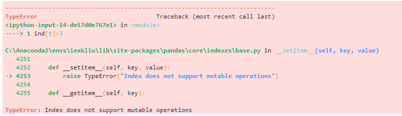

# 13.2 Pandas数据类型

熊猫的两个主要数据结构Series(一维)和DataFrame(二维)处理金融、统计、社会科学和许多工程领域的绝大多数典型用例。Series是一维数组对象类型，它包含了一个值序列，并且包含了数据标签，称为索引（index）。对于R用户，DataFrame提供了R的data.frame提供的所有内容，甚至更多。panda构建在NumPy之上，旨在与许多其他第三方库很好地集成在科学计算环境中。除了Series还有一种特殊的数据类型——Index类型，可以被看作是一个不可变数组或有序集合。

下面我们对Series、DataFrame以及Index类型进行讲解。

### 14.2.1 Index类型

#### Index基本用法

一般情况下，我们并不会主动创建Index对象，但是当多个Pandas数组对象之间进行索引共享时，我们需要使用到Index对象类型。Index对象类型，可以被看做一个不可变数组或有序集合。我们将从这两个角度对Index进行介绍。

首先让我们使用pd.Index()函数创建一个Index对象，以便开始后边的讲解：

[]:ind=pd.Index([1, 2, 3, 4, 5])

ind

[]:Int64Index([1, 2, 3, 4, 5], dtype='int64')

#### 不可变数组

当Pandas对象被视作一个不可变数组时，Pandas对象支持Python标准库中的一般数组操作：

数组索引：

[]:ind[1]

[]:2

数组切片：

[]:ind[-4:-2]

[]:Int64Index([2, 3], dtype='int64')

Index对象的不可变性使得数组间的索引共享更安全，避免了Index对象修改后
造成的错误索引问题。如果强行对Index对象中的元素进行赋值，会提示操作错误:

[]:ind[1]=3

[]:

#### 有序集合

当Pandas对象被视作一个有序集合时，Pandas对象支持Python标准库中的一般集合操作（交、并、异或）：

[]:ind\_=pd.Index([2, 4, 6, 8])

ind&ind\_

[]:Int64Index([2, 4], dtype='int64')

[]:ind\|ind\_

[]:Int64Index([1, 2, 3, 4, 5, 6, 8], dtype='int64')

[]:ind\&ind\_

[]:Int64Index([2, 4], dtype='int64')

### 14.2.2 Series类型

#### Series基本用法

Series对象是Pandas中一个带索引数据的一维数组。可以使用Series()函数创建Series对象。Series()函数的用法如下：

pd.Series(data, index=index)

下面让我们创建一个简单的Series对象：

[]:pd\_series_1=pd.Series([1, 2, 3, 4])

pd_series_1

[]:

上面结果中，第一列为一维数组的索引，第二列为一维数组的值。我们可以通过Series的values和index属性获得Series数组的索引与值：

[]:pd\_series_1.index

[]:RangeIndex(start=0, stop=4, step=1)

[]:pd\_series_1.values

[]:array([1, 2, 3, 4], dtype=int64)

我们还可以给此series数组进行命名：

[]:pd_series_1.name='demo'

pd_series_1

[]:

和Index对象一样，我们也可以从两种角度出发，将Series视为两种不同的数据对象：一维数组和特殊的字典。

#### 一维数组

当Pandas对象被视作一个
数组时，它与NumPy数组最本质的区别是索引：NumPy通过隐式定义的整数索引来获取数值，而Pandas的Series对象可以显示地定义索引。基于此，我们可以说Series是一种更加灵活、通用的”NumPy数组”。

可以在创建Series对象时，就指定索引， 索引可以是想要的任何类型：

[]:pd\_series_2=pd.Series(['郑州大学', '华中科技大学', '北京大学', '清华大学'],

index=['zzu', 'hust', 'pku', 'thu'])

pd_series_2

[]:

#### 特殊字典

当Pandas对象被视作一个
数组时，它与Python标准库中的字典数据结构最本质的区别是索引：Python标准库中的字典是一种将任意键映射到一组任意值的数据结构，而Pandas的Series对象则是一种将类型键映射到一组固定类型值的数据结构。因为Series的类型信息在创建时就已经确定，因此它在某些操作比标准库中的字典类型更加高效。

除了向Series()函数中传递列表来创建Series对象外，我们还可以使用字典来创建Series对象：

[]:dic\_1={'zzu': '郑州大学', 'hust': '华中科技大学', 'pku':'北京大学',
'thu':'清华大学' }

pd_series_3=pd.Series(dic_1)

pd_series_3

[]:

获取pd_series_3中键’zzu’对应的值：

[]:pd\_series_3['zzu']

[]:'郑州大学'

### 14.2.3 DataFrame类型

#### DataFrame基本用法

DataFrame是一个以命名列方式组织的分布式数据集。与关系关系数据库中的二维表类似。可以使用DataFrame()函数创建DataFrame对象。DataFrame()函数的用法如下：

pd.DataFrame(data, columns=[])

下面让我们创建一个简单的DataFrame对象：

[]:pd\_dataframe_1=pd.DataFrame(pd_series_2,columns=['Chinese University'])

pd_dataframe_1

[]:

与我们之前介绍的Pandas数据类型一样，我们可以从两个方面对DataFrame类型进行分析。DataFrame有些方面像二维或结构化数组。有些方面又像一个共享索引的若干Series对象构成的字典。下面我们从数组与字典两个角度出发，对DataFrame类型进行介绍。

#### 二维数组

DataFrame类型可以看作一个既有行索引名，又有列索引名的由若干有序排列的拥有共同索引的一维Series数组合并成的二维数组。

下边让我们创建两个Series对象（employee_age与employee_sex），并使用DataFrame()函数，将他们与另外两个标准库中的列表对象合并为一个DataFrame对象（emplyee\_info）:

[]:name=['刘一', '陈二', '张三', '李四','王五']

name=['刘一', '陈二', '张三', '李四','王五']

age=[21, 34, 32, 16, 40]

sex=['male','female','male','female','female']

salary=[9000, 10000, 6000, 20000, 13000]

department=['测试', '开发', '销售', '产品', '开发']

employee_age=pd.Series(age, index=name)

employee_age

[]:刘一 21

陈二 34

张三 32

李四 16

王五 40

dtype: int64

[]:employee\_sex=pd.Series(sex, index=name)

employee_sex

[]:刘一 male

陈二 female

张三 male

李四 female

王五 female

dtype: object

[]:employee\_info=pd.DataFrame({'sex':employee_sex, 'age':employee_age,
'salary':salary,

'department':department})

employee_info

[]:

我们可以通过DataFrame的index和columns属性获得DataFrame对象的行索引与列索引：

[]:employee\_info.index

[]:Index(['刘一', '陈二', '张三', '李四', '王五'], dtype='object')

[]:employee\_info.columns

[]:Index(['sex', 'age', 'salary', 'department'], dtype='object')

#### 特殊字典

还可以将DataFrame类型看作一个特殊的字典。Series对象的字典观点和标准库中的字典观点都是将一个索引映射到一个数据，而DataFrame则是将一个列索引映射到这个列所对用的Series对象。

下面我们获取employee_info对象中sex列所对应的Series对象：

[]:employee\_info['sex']

[]:刘一 male

陈二 female

张三 male

李四 female

王五 female

Name: sex, dtype: object