# 13.3 Pandas基础操作

本节我们介绍针对Pandas数据对象的基础操作：数据选择、数值运算、缺值处理与层级索引。

### 14.3.1 数据选择

Pandas的Series和DataFrame数据对象主要包含三种数据选择方法——字典法、数组法和索引器法。字典法，即通过键值对的映射，选择
目标数据。数组法，即使用和NumPy一样的数组索引操作，完成对数据的选择。索引器法，即通过索引器属性来对数据进行选择。下面我们来对这三种数据方法进行讲解。

####  字典法

我们可以将Series和DataFrame看作字典，就像标准库中字典的选择法一样，通过键值索引，选择需要的数据。在Pandas数据类型一节中，我们已经此方法进行过展示，在此不再熬述。

####  数组法

Series还具备NumPy数组一样的数组数据选择功能，包**括索引、掩码、花哨的索引**。而DataFrame可以看成一个由多个Series组成的二维数组。

我们在第七章已经介绍过NumPy数组数据的选择方法，Series与DataFrame的数组法与之类似，因此我们只举使用例子，而不对Series与DataFrame对象的数组选择法不进行详细的讲解。具体示例如下：

[]:\#将显示索引作为切片

employee_age['陈二':'李四']

[]:陈二 34

张三 32

李四 16

dtype: int64

[]:employee\_info['陈二':'李四']

[]: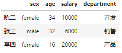

[]:\#将整数索引作为切片

employee\_age[1:3]

[]:陈二 34

张三 32

dtype: int64

[]:employee\_info[1:3]

[]: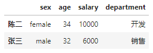

[]:\#掩码

employee_age[(employee_age\>25)]

[]:陈二 34

张三 32

王五 40

dtype: int64

[]:employee\_info[(employee_info.sex=='male')&(employee_info.age\>25)]

[]: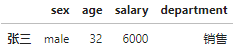

[]:\#花哨的索引

employee\_age[['张三', '陈二']]

[]:张三 32

陈二 34

dtype: int64

[]:employee\_info[['age']]

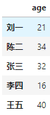[]:

[]:\#按行查看数据

employee\_info.values

[]:array([['male', 21, 9000, '测试'],

['female', 34, 10000, '开发'],

['male', 32, 6000, '销售'],

['female', 16, 20000, '产品'],

['female', 40, 13000, '开发']], dtype=object)

[]:\# 将employee_info转置

employee\_info.T

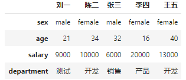[]:

####  索引器法

Pandas提供了三种索引器(indexer)属性来作为取值的方法。分别为loc，iloc属性。关于这两种属性的描述，详见表14.2。

表14.2 索引器

| 索引器 | 描述               |
|--------|--------------------|
| loc    | 通过行标签索引数据 |
| iloc   | 通过行号索引行数据 |

具体示例如下：

[]:employee_age.loc['张三']

[]:32

[]:employee\_info.iloc[3:5]

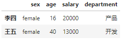[]:

[]:employee\_info.iloc[3:5, 1]

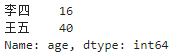[]:

### 14.3.2 数值运算

Pandas是建立在NumPy的基础上的。快速对数组元素进行运算是NumPy的基本能力。在Pandas中，针对带索引的一维或多维数据，Pandas实现了一套基于NumPy快速运算的方法：保留索引，索引对齐，数据运算规则与NumPy相同。下面我们对这些方法进行介绍。

#### 保留索引

保留索引，即将Pandas数据对象传入NumPy函数中，运算结果将保留索引。下面让我们就Series和DataFrame对象类型进行展示：

首先让我们分别创建一个的Series对象与的DataFrame对象

[]:rng=np.random.RandomState(0)

ser_rng=pd.Series(rng.randint(0, 10, 4))

ser_rng

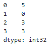[]:

[]:df_rng=pd.DataFrame(rng.randint(0, 10, (4, 4)), columns=['A', 'B', 'C', 'D'])

df_rng

[]: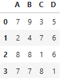

接下来我们分别对Series和DataFrame对象进行NumPy的Sin与Cos运算。

[]:np.sin(ser_rng)

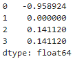[]:

[]:np.cos(df_rng)

[]: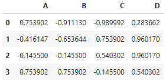

运算结果表明，将Pandas数据对象传入NumPy函数中，运算结果将保留索引。

#### 索引对齐 

索引对齐即，挡在两个Series或dataFrame对象上进行二元运算时，Pandas会对齐两个对象的索引，然后开始运算。下面让我们就Series和DataFrame对象类型进行展示：

首先，让我们创建两个部分索引相同的Series对象：

[]:ser\_1=pd.Series({'A':rng.randint(0, 100), 'B':rng.randint(0, 100),
'C':rng.randint(0, 100)})

ser_1

[]: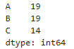

[]:ser\_2=pd.Series({'A':rng.randint(0, 100), 'C':rng.randint(0, 100),
'D':rng.randint(0, 100)})

ser_2

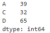[]:

当我们对ser_1和ser_2进行运算时，会自动将索引对其，然后进行计算。如果，其中一个对象的索引不包含在另一个对象中时，就会在运算结果对应索引位置填充NaN。下边让我们计算ser_1+ser_2的值。

[]:ser\_1+ser_2

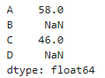[]:

多个DataFrame对象进行运算，遵循与多个Series对象相同的运算规则。

接下来，让我们创建两个部分行列索引相同的DataFrame对象：

[]:df_1=pd.DataFrame(rng.randint(0, 100, (4, 4)), columns=list('ABCD'))

df_1

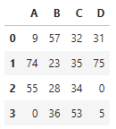[]:

[]:df_1=pd.DataFrame(rng.randint(0, 100, (3, 3)), columns=list('CDE'), index=[2,
3, 4])

df_1

[]: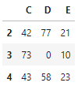

接下来，让我们执行df_1/df_2运算：

[]:df_1/df_2

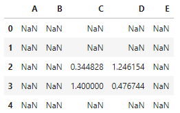[]:

可以看到，df_1和df_2在运算时进行了行列索引对齐，只有行列索引匹配时，才会执行运算，否则会在原位置上填充NaN。

#### Pandas运算

DataFrame对象类型和Series对象类型再进行计算时，其运算规则与NumPy中二维数组与一维数组的运算规则是相同的。
下面让我们就Series和DataFrame对象类型进行展示：

首先，让我们将df_1减去其第四行数据：

[]:df_1-df\_1.iloc[3]

[]: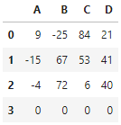

我们可以看到，Pandas数据对象进行运算时，遵循了NumPy的广播规则。

### 14.3.3 缺值处理

Pandas使用标签方法表示缺失数据，我们称这些数据类型为缺失数据类型。缺失对象类型包括两种Python原有的缺失值：浮点数据缺失类型NaN值以及Python的对象类型None。

因为None是对象类型，因此，不能作为NumPy和Pandas数组类型中的缺失元素，而只能用于对象数组类型。表14.3
列举了常用于缺失值处理的方法。

表14.3 缺失值处理方法

| **方法** | **描述**         |
|----------|------------------|
| dropna   | 丢弃缺失数据     |
| fillna   | 替换缺失数据     |
| isnull   | 判断数据是否缺失 |
| notnull  | isnull的否定式   |

首先，让我们分别创建带有缺失值的Series和DataFrame对象。

#### 缺失数据检测

使用isnull方法，可以判定数据是否缺失。

[]:data\_series.isnull()

[]:0 False

1 True

2 False

3 True

4 True

5 True

dtype: bool

#### 丢弃缺失数据

使用pd,dropna()函数可以丢弃Pandas对象类型中带有NAN的数据项。

dropna()函数的使用方法如下：

dropna(axis=0,how='any',thresh=None,subset=None,inplace=False)

axis接受0或1输入。默认为0，表示丢弃包含nan值的行，若为1，表示丢弃包含nan值得列。

how接受来自集合{‘any’, ‘all’}中的元素的输入，默认为’any’。
当至少有一个NA或所有NA时，确定是否从DataFrame中删除了行或列。’any’表示如果存在任何NA值，则删除该行或列。’all’表示如果所有值都是NA，则删除该行或列。

thresh接受int输入,表示保留有限个非NAN值得行。

subset接受类数组型数据的输入。沿着其他轴的标记要考虑。例如，如果要删除行，则这些列将包含要包含的列。

inplace控制是否修改原始数据。接受bool类型输入。默认为False。如果为真，则修改原始数据。

丢弃带有所有带有NAN的项

[]:data\_series.dropna()

[]:0 2.0

2 3.0

dtype: float64

[]:data\_dataframe.dropna()

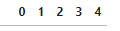[]:

丢弃所有元素都是NAN的行

[]:data\_dataframe.dropna(how='all')

[]: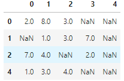

丢弃所有元素都是NAN的列

[]:data\_dataframe.dropna(axis=1,how='all')

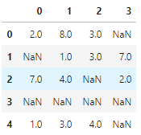[]:

保留有限个非NAN值的行

[]:data\_dataframe.dropna(thresh=3)

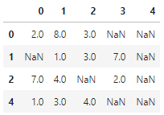[]:

#### 替换缺失数据

使用pd.fillna()函数可以替换Pandas对象类型中带有NAN的数据项。

fillna()函数的使用方法如下：

fillna(value=None,method=None, axis=None, inplace=False,
limit=None,downcast=None,

\*\*kwargs,)

value为需要待替换缺失值的原始数据，可以为标量，字典，Series和DataFrame类型。

method接受来自集合{'backfill', 'bfill', 'pad', 'ffill',
None}中得元素的输入，默认为None。None可以填充重新索引的Series对象；pad/ffill将最后一个有效的观察值转发到下一个有效的观察值；backfill/bifll使用下一个有效的观察值来填补空白

inplace控制是否修改原始数据。接受bool类型输入。默认为False。如果为真，则修改原始数据。

axis接受0或1输入。默认为0，表示逐行替换，若为1，表示逐列替换。

limit接受int或None输入，默认为None，这是要向前/向后填充的连续NaN值的最大数目。换句话说，如果有一个缺口与超过这个数字的连续Nan值，它将只被部分填补。如果没有指定方法，这是将填充NaN分布在整个轴上的最大条目数。如果不是零，则必须大于0。

具体示例如下：

常数替换

[]:data\_dataframe.fillna(0)

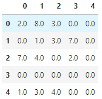[]:

后向填充

[]:data\_dataframe.fillna(method='ffill')

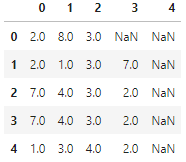[]:

[]:a\_dataframe.fillna(method='ffill',limit=1)

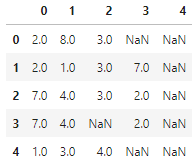

### 14.3.4 层级索引

我们已经学习了具有一维数据特性的Series数据类型与具有二维数据特性的DataFrame数据类型。这两种数据类型可以满足实践中的大部分需求。但是，我们也可能面对需要存储多维数据的困难：数据的主键包含两个或两个以上的键（主属性）。反映在Pandas中的数据对象上，即是Series和DataFrame对象的索引包含两个或两个以上的键。在实践中，我们可以创建**层级索引**（hierachical
indexing，也被称为**多级索引**multi-indexing）来解决这个问题，通过配合使用多个不同**等级**(level)的一级索引，这样就可以将高维数据转换为类似于一维Series和二维DataFrame对象的形式。

#### 索引创建

为 Series 或 DataFrame 创建多级索引最直接的办法就是将 index
参数设置为至少二维的索 引数组，如下所示：

In[12]: df = pd.DataFrame(np.random.rand(4, 2), index=[['a', 'a', 'b', 'b'], [1,
2, 1, 2]], columns=['data1', 'data2']) df

Out[12]: data1 data2 a 1 0.554233 0.356072 2 0.925244 0.219474 b 1 0.441759
0.610054 2 0.171495 0.886688

MultiIndex 的创建工作将在后台完成。

Pandas数据处理 ｜ 117

同理，如果你把将元组作为键的字典传递给 Pandas， Pandas 也会默认转换为
MultiIndex：

In[13]: data = {('California', 2000): 33871648, ('California', 2010): 37253956,
('Texas', 2000): 20851820, ('Texas', 2010): 25145561, ('New York', 2000):
18976457, ('New York', 2010): 19378102} pd.Series(data)

Out[13]: California 2000 33871648 2010 37253956 New York 2000 18976457 2010
19378102 Texas 2000 20851820 2010 25145561 dtype: int64

但是有时候显式地创建 MultiIndex 也是很有用的，下面来介绍一些创建方法。

1\. 显式地创建多级索引 你可以用 pd.MultiIndex
中的类方法更加灵活地构建多级索引。例如，就像前面介绍的，
你可以通过一个有不同等级的若干简单数组组成的列表来构建 MultiIndex：

In[14]: pd.MultiIndex.from_arrays([['a', 'a', 'b', 'b'], [1, 2, 1, 2]])

Out[14]: MultiIndex(levels=[['a', 'b'], [1, 2]], labels=[[0, 0, 1, 1], [0, 1, 0,
1]])

也可以通过包含多个索引值的元组构成的列表创建 MultiIndex：

In[15]: pd.MultiIndex.from_tuples([('a', 1), ('a', 2), ('b', 1), ('b', 2)])

Out[15]: MultiIndex(levels=[['a', 'b'], [1, 2]], labels=[[0, 0, 1, 1], [0, 1, 0,
1]])

还可以用两个索引的笛卡尔积（Cartesian product）创建 MultiIndex：

In[16]: pd.MultiIndex.from_product([['a', 'b'], [1, 2]])

Out[16]: MultiIndex(levels=[['a', 'b'], [1, 2]], labels=[[0, 0, 1, 1], [0, 1, 0,
1]])

更可以直接提供 levels（包含每个等级的索引值列表的列表）和 labels（包含每个索引值
标签列表的列表）创建 MultiIndex：

In[17]: pd.MultiIndex(levels=[['a', 'b'], [1, 2]], labels=[[0, 0, 1, 1], [0, 1,
0, 1]])

Out[17]: MultiIndex(levels=[['a', 'b'], [1, 2]], labels=[[0, 0, 1, 1], [0, 1, 0,
1]])

在创建 Series 或 DataFrame 时，可以将这些对象作为 index 参数，或者通过 reindex
方法 更新 Series 或 DataFrame 的索引。

2\. 多级索引的等级名称 给 MultiIndex
的等级加上名称会为一些操作提供便利。你可以在前面任何一个 MultiIndex 构造器中通过
names 参数设置等级名称，也可以在创建之后通过索引的 names 属性来修改 名称：

In[18]: pop.index.names = ['state', 'year'] pop

Out[18]: state year California 2000 33871648 2010 37253956 New York 2000
18976457 2010 19378102 Texas 2000 20851820 2010 25145561 dtype: int64

在处理复杂的数据时，为等级设置名称是管理多个索引值的好办法。

3\. 多级列索引 每个 DataFrame
的行与列都是对称的，也就是说既然有多级行索引，那么同样可以有多级
列索引。让我们通过一份医学报告的模拟数据来演示：

In[19]: \# 多级行列索引 index = pd.MultiIndex.from_product([[2013, 2014], [1,
2]], names=['year', 'visit']) columns = pd.MultiIndex.from_product([['Bob',
'Guido', 'Sue'], ['HR', 'Temp']], names=['subject', 'type'])

\# 模拟数据 data = np.round(np.random.randn(4, 6), 1) data[:, ::2] \*= 10 data
\+= 37

\# 创建DataFrame health_data = pd.DataFrame(data, index=index, columns=columns)
health_data

Out[19]: subject Bob Guido Sue type HR Temp HR Temp HR Temp year visit 2013 1
31.0 38.7 32.0 36.7 35.0 37.2 2 44.0 37.7 50.0 35.0 29.0 36.7 2014 1 30.0 37.4
39.0 37.8 61.0 36.9 2 47.0 37.8 48.0 37.3 51.0 36.5

多级行列索引的创建非常简单。上面创建了一个简易的四维数据，四个维度分别为被检查
人的姓名、检查项目、检查年份和检查次数。可以在列索引的第一级查询姓名，从而获取
包含一个人（例如 Guido）全部检查信息的 DataFrame：

In[20]: health_data['Guido']

Out[20]: type HR Temp

year visit 2013 1 32.0 36.7 2 50.0 35.0 2014 1 39.0 37.8 2 48.0 37.3

如果想获取包含多种标签的数据，需要通过对多个维度（姓名、国家、城市等标签）的多
次查询才能实现，这时使用多级行列索引进行查询会非常方便。

#### 数据切片

对 MultiIndex 的取值和切片操作很直观，你可以直接把索引看成额外增加的维度。我们先
来介绍 Series 多级索引的取值与切片方法，再介绍 DataFrame 的用法。

1\. Series多级索引 看看下面由各州历年人口数量创建的多级索引 Series：

In[21]: pop

Out[21]: state year California 2000 33871648 2010 37253956 New York 2000
18976457 2010 19378102 Texas 2000 20851820 2010 25145561 dtype: int64

可以通过对多个级别索引值获取单个元素：

In[22]: pop['California', 2000]

Out[22]: 33871648

MultiIndex 也支持局部取值（partial
indexing），即只取索引的某一个层级。假如只取最高 级的索引，获得的结果是一个新的
Series，未被选中的低层索引值会被保留：

In[23]: pop['California']

Out[23]: year 2000 33871648 2010 37253956 dtype: int64

类似的还有局部切片，不过要求 MultiIndex 是按顺序排列的（就像将在 3.6.4 节介绍的
那样）：

In[24]: pop.loc['California':'New York']

Out[24]: state year California 2000 33871648 2010 37253956 New York 2000
18976457 2010 19378102 dtype: int64

图灵社区会员 felix123(490049061@qq.com) 专享 尊重版权

120 ｜ 第 3 章

如果索引已经排序，那么可以用较低层级的索引取值，第一层级的索引可以用空切片：

In[25]: pop[:, 2000]

Out[25]: state California 33871648 New York 18976457 Texas 20851820 dtype: int64

其他取值与数据选择的方法（详情请参见 3.3 节）也都起作用。下面的例子是通过布尔掩
码选择数据：

In[26]: pop[pop \> 22000000]

Out[26]: state year California 2000 33871648 2010 37253956 Texas 2010 25145561
dtype: int64

也可以用花哨的索引选择数据：

In[27]: pop[['California', 'Texas']]

Out[27]: state year California 2000 33871648 2010 37253956 Texas 2000 20851820
2010 25145561 dtype: int64

2\. DataFrame多级索引 DataFrame 多级索引的用法与 Series
类似。还用之前的体检报告数据来演示：

In[28]: health_data

Out[28]: subject Bob Guido Sue type HR Temp HR Temp HR Temp year visit 2013 1
31.0 38.7 32.0 36.7 35.0 37.2 2 44.0 37.7 50.0 35.0 29.0 36.7 2014 1 30.0 37.4
39.0 37.8 61.0 36.9 2 47.0 37.8 48.0 37.3 51.0 36.5

由于 DataFrame 的基本索引是列索引，因此 Series 中多级索引的用法到了 DataFrame
中就 应用在列上了。例如，可以通过简单的操作获取 Guido 的心率数据：

In[29]: health_data['Guido', 'HR']

Out[29]: year visit 2013 1 32.0 2 50.0 2014 1 39.0 2 48.0 Name: (Guido, HR),
dtype: float64

Pandas数据处理 ｜ 121

与单索引类似，在 3.3 节介绍的 loc、iloc 和 ix 索引器都可以使用，例如：

In[30]: health_data.iloc[:2, :2]

Out[30]: subject Bob type HR Temp year visit 2013 1 31.0 38.7 2 44.0 37.7

虽然这些索引器将多维数据当作二维数据处理，但是在 loc 和 iloc
中可以传递多个层级的 索引元组，例如：

In[31]: health_data.loc[:, ('Bob', 'HR')]

Out[31]: year visit 2013 1 31.0 2 44.0 2014 1 30.0 2 47.0 Name: (Bob, HR),
dtype: float64

这种索引元组的用法不是很方便，如果在元组中使用切片还会导致语法错误：

In[32]: health_data.loc[(:, 1), (:, 'HR')]

File "\<ipython-input-32-8e3cc151e316\>", line 1 health_data.loc[(:, 1), (:,
'HR')] \^ SyntaxError: invalid syntax

虽然你可以用 Python 内置的 slice()
函数获取想要的切片，但是还有一种更好的办法，就 是使用 IndexSlice 对象。Pandas
专门用它解决这类问题，例如：

In[33]: idx = pd.IndexSlice health_data.loc[idx[:, 1], idx[:, 'HR']]

Out[33]: subject Bob Guido Sue type HR HR HR year visit 2013 1 31.0 32.0 35.0
2014 1 30.0 39.0 61.0

和带多级索引的 Series 和 DataFrame
进行数据交互的方法有很多，但就像本书中的诸多工
具一样，若想掌握它们，最好的办法就是使用它们！

#### 行列转换

使用多级索引的关键是掌握有效数据转换的方法。Pandas 提供了许多操作，可以让数
据在内容保持不变的同时，按照需要进行行列转换。之前我们用一个简短的例子演示过
stack() 和 unstack()
的用法，但其实还有许多合理控制层级行列索引的方法，让我们来一 探究竟。

1\. 有序的索引和无序的索引
在前面的内容里，我们曾经简单提过多级索引排序，这里需要详细介绍一下。如果
MultiIndex 不是有序的索引，那么大多数切片操作都会失败。让我们演示一下。
首先创建一个不按字典顺序（lexographically）排列的多级索引 Series：

In[34]: index = pd.MultiIndex.from_product([['a', 'c', 'b'], [1, 2]]) data =
pd.Series(np.random.rand(6), index=index) data.index.names = ['char', 'int']
data

Out[34]: char int a 1 0.003001 2 0.164974 c 1 0.741650 2 0.569264 b 1 0.001693 2
0.526226 dtype: float64

如果想对索引使用局部切片，那么错误就会出现：

In[35]: try: data['a':'b'] except KeyError as e: print(type(e)) print(e)

\<class 'KeyError'\> 'Key length (1) was greater than MultiIndex lexsort depth
(0)'

尽管从错误信息里面看不出具体的细节，但问题是出在 MultiIndex 无序排列上。局部切片
和许多其他相似的操作都要求 MultiIndex 的各级索引是有序的（即按照字典顺序由 A 至
Z）。为此，Pandas 提供了许多便捷的操作完成排序，如 sort_index() 和 sortlevel()
方 法。我们用最简单的 sort_index() 方法来演示：

In[36]: data = data.sort_index() data

Out[36]: char int a 1 0.003001 2 0.164974 b 1 0.001693 2 0.526226 c 1 0.741650 2
0.569264 dtype: float64

索引排序之后，局部切片就可以正常使用了：

In[37]: data['a':'b']

Out[37]: char int a 1 0.003001

2 0.164974 b 1 0.001693 2 0.526226 dtype: float64

2\. 索引stack与unstack
前文曾提过，我们可以将一个多级索引数据集转换成简单的二维形式，可以通过 level 参
数设置转换的索引层级：

In[38]: pop.unstack(level=0)

Out[38]: state California New York Texas year 2000 33871648 18976457 20851820
2010 37253956 19378102 25145561

In[39]: pop.unstack(level=1)

Out[39]: year 2000 2010 state California 33871648 37253956 New York 18976457
19378102 Texas 20851820 25145561

unstack() 是 stack() 的逆操作，同时使用这两种方法让数据保持不变：

In[40]: pop.unstack().stack()

Out[40]: state year California 2000 33871648 2010 37253956 New York 2000
18976457 2010 19378102 Texas 2000 20851820 2010 25145561 dtype: int64

3\. 索引的设置与重置 层级数据维度转换的另一种方法是行列标签转换，可以通过
reset_index 方法实现。如 果在上面的人口数据 Series
中使用该方法，则会生成一个列标签中包含之前行索引标签 state 和 year 的
DataFrame。也可以用数据的 name 属性为列设置名称：

In[41]: pop_flat = pop.reset_index(name='population') pop_flat

Out[41]: state year population 0 California 2000 33871648 1 California 2010
37253956 2 New York 2000 18976457 3 New York 2010 19378102 4 Texas 2000 20851820
5 Texas 2010 25145561

在解决实际问题的时候，如果能将类似这样的原始输入数据的列直接转换成 MultiIndex，

124 ｜ 第 3 章

通常将大有裨益。其实可以通过 DataFrame 的 set_index 方法实现，返回结果就会是一个
带多级索引的 DataFrame：

In[42]: pop_flat.set_index(['state', 'year'])

Out[42]: population state year California 2000 33871648 2010 37253956 New York
2000 18976457 2010 19378102 Texas 2000 20851820 2010 25145561

在实践中，我发现用这种重建索引的方法处理数据集非常好用。

#### 数据累计

前面我们已经介绍过一些 Pandas 自带的数据累计方法，比如 mean()、sum() 和
max()。而 对于层级索引数据，可以设置参数 level 实现对数据子集的累计操作。

再一次以体检数据为例：

In[43]: health_data

Out[43]: subject Bob Guido Sue type HR Temp HR Temp HR Temp year visit 2013 1
31.0 38.7 32.0 36.7 35.0 37.2 2 44.0 37.7 50.0 35.0 29.0 36.7 2014 1 30.0 37.4
39.0 37.8 61.0 36.9 2 47.0 37.8 48.0 37.3 51.0 36.5

如果你需要计算每一年各项指标的平均值，那么可以将参数 level 设置为索引 year：

In[44]: data_mean = health_data.mean(level='year') data_mean

Out[44]: subject Bob Guido Sue type HR Temp HR Temp HR Temp year 2013 37.5 38.2
41.0 35.85 32.0 36.95 2014 38.5 37.6 43.5 37.55 56.0 36.70

如果再设置 axis 参数，就可以对列索引进行类似的累计操作了：

In[45]: data_mean.mean(axis=1, level='type')

Out[45]: type HR Temp year 2013 36.833333 37.000000 2014 46.000000 37.283333

通过这两行数据，我们就可以获取每一年所有人的平均心率和体温了。这种语法其实就是

图灵社区会员 felix123(490049061@qq.com) 专享 尊重版权

Pandas数据处理 ｜ 125

GroupBy 功能的快捷方式，我们将在 3.9
节详细介绍。尽管这只是一个简单的示例，但是其 原理和实际工作中遇到的情况类似。