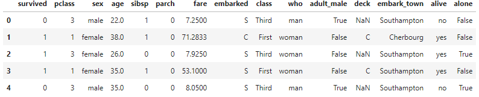

# 13.4 Pandas高级操作

### 14.4.1 向量化字符串

Python在处理处理字符串方面十分便利。基于此创建的Pandas提供了一系列向量化字符串操作（vectorized
string operation）。掌握这些操作可以使数据清理事半功倍。

#### 通用Python字符串方法

#### Pandas字符串方法

| 方法             | 描述                                                                            |
|------------------|---------------------------------------------------------------------------------|
| get()            | 获取数据对象对应位置上的上的值                                                  |
| slice()          | 切片取值                                                                        |
| slice\_replace() | 切片替换                                                                        |
| cat()            | 字符串连接                                                                      |
| joint()          | 使用分隔符连接Series对象中的元素                                                |
| normalize()      | 字符串转换为Unicode编码                                                         |
| repeat()         | 重复元素                                                                        |
| get\_dummies()   | 安装分隔符提取每个元素的dummy变量，以DataFrame格式返回转换为One-Hot编码后的数据 |
| wrap             | 将字符串按照指定宽度换行                                                        |
| pad()            | 在字符串两端加入空格                                                            |

### 14.4.2 数据透视表

数据透视表（Pivot
Table）是一种交互式数据表。使用数据透视表可以轻松对指定数据进行计算，并可以动态更改其版面布置方式。每次布置方式发生变化时，数据透视表会按照新的版式依据已定义的运算公式重新计算数据，并对数据透视表进行更新。

#### 数据透视表概述

[]:import seaborn as sns

titanic=sns.load\_dataset('titanic')

[]:

#### 数据透视表语法

### 14.4.3 时间序列

时间序列（动态数列）是将同一统计指标的数值按照时间发展的先后顺序排列而成的数值序列。时间序列分析通过分析已有的历史数据对未来进行预测，在金融数据中有着广泛的应用。因为Pandas最初为金融模型而建立的，因此Pandas在处理时间序列数据方面十分强大。

#### 时间序列概述

首先，我们对日期与时间类型进行更深一步讲解：

日期与时间数据主要包含以下三类：

**时间戳**表示某个具体的时间点(例如 2019 年 8 月 4 日上午 12 点)。

**时间间隔与周期表示**开始时间点与结束时间点之间的时间长度，例如 2019 年(指的是
2019年 1 月 1 日至 2015 年 12 月 31 日这段时间间隔)。

**时间增量(time
delta)或持续时间(duration)**表示精确的时间长度(例如，某程序运行持续时间 22.56
ms)。

在Python标准库中内置了日期与时间工具datetimemo与dateutil。在NumPy库中内置了日期与时间工具dadatetime64。详情请参考拓展阅读部分Pandas在线文档与NumPy在线文档。

#### Pandas日期与时间对象

Pandas 所有关于日期与时间的处理方法全部都是通过Timestamp 对象实现的，它利用
numpy.datetime64 的有效存储和向量化接口将 datetime 和 dateutil
的易用性有机结合起 来。Pandas 通过一组 Timestamp 对象就可以创建一个可以作为
Series 或 DataFrame 索引的 DatetimeIndex，我们将在后面介绍许多类似的例子。

例如，可以用 Pandas 的方式演示前面介绍的日期与时间功能。我们可以灵活处理不同格式
的日期与时间字符串，获取某一天是星期几：

In[9]:

date = pd.to\_datetime("4th of July, 2015")

date

Out[9]: Timestamp('2015-07-04 00:00:00')

In[10]: date.strftime('%A')

Out[10]: 'Saturday'

另外，也可以直接进行 NumPy 类型的向量化运算：

In[11]: date + pd.to_timedelta(np.arange(12), 'D')

Out[11]: DatetimeIndex(['2015-07-04', '2015-07-05', '2015-07-06', '2015-07-07',
'2015-07-08', '2015-07-09', '2015-07-10', '2015-07-11', '2015-07-12',
'2015-07-13', '2015-07-14', '2015-07-15'], dtype='datetime64[ns]', freq=None)

#### Pandas时间序列数据类型

本节将介绍 Pandas 用来处理时间序列的基础数据类型。

• 针对时间戳数据，Pandas 提供了Timestamp 类型。与前面介绍的一样，它本质上是
Python 的原生 datetime 类型的替代品，但是在性能更好的 numpy.datetime64 类型的基
础上创建。对应的索引数据结构是 DatetimeIndex。 • 针对时间周期数据，Pandas 提供了
Period 类型。这是利用 numpy.datetime64 类型将固
定频率的时间间隔进行编码。对应的索引数据结构是 PeriodIndex。 •
针对时间增量或持续时间，Pandas 提供了 Timedelta 类型。Timedelta 是一种代替
Python 原生 datetime.timedelta 类型的高性能数据结构，同样是基于
numpy.timedelta64 类型。 对应的索引数据结构是 TimedeltaIndex。

最基础的日期 / 时间对象是 Timestamp 和
DatetimeIndex。这两种对象可以直接使用，最常用 的方法是 pd.to\_datetime()
函数，它可以解析许多日期与时间格式。对 pd.to_datetime() 传 递一个日期会返回一个
Timestamp 类型，传递一个时间序列会返回一个 DatetimeIndex 类型：

Pandas数据处理 ｜ 171

In[15]: dates = pd.to_datetime([datetime(2015, 7, 3), '4th of July, 2015',
'2015-Jul-6', '07-07-2015', '20150708']) dates

Out[15]: DatetimeIndex(['2015-07-03', '2015-07-04', '2015-07-06', '2015-07-07',
'2015-07-08'], dtype='datetime64[ns]', freq=None)

任何 DatetimeIndex 类型都可以通过 to_period() 方法和一个频率代码转换成
PeriodIndex 类型。下面用 'D' 将数据转换成单日的时间序列：

In[16]: dates.to_period('D')

Out[16]: PeriodIndex(['2015-07-03', '2015-07-04', '2015-07-06', '2015-07-07',
'2015-07-08'], dtype='int64', freq='D')

当用一个日期减去另一个日期时，返回的结果是 TimedeltaIndex 类型：

In[17]: dates - dates[0]

Out[17]: TimedeltaIndex(['0 days', '1 days', '3 days', '4 days', '5 days'],
dtype='timedelta64[ns]', freq=None)

有规律的时间序列：pd.date\_range() 为了能更简便地创建有规律的时间序列，Pandas
提供了一些方法：pd.date_range() 可以 处理时间戳、pd.period_range()
可以处理周期、pd.timedelta_range() 可以处理时间间 隔。我们已经介绍过，Python 的
range() 和 NumPy 的 np.arange() 可以用起点、终点和步
长（可选的）创建一个序列。pd.date_range() 与之类似，通过开始日期、结束日期和频率
代码（同样是可选的）创建一个有规律的日期序列，默认的频率是天：

In[18]: pd.date_range('2015-07-03', '2015-07-10')

Out[18]: DatetimeIndex(['2015-07-03', '2015-07-04', '2015-07-05', '2015-07-06',
'2015-07-07', '2015-07-08', '2015-07-09', '2015-07-10'], dtype='datetime64[ns]',
freq='D')

此外，日期范围不一定非是开始时间与结束时间，也可以是开始时间与周期数 periods：

In[19]: pd.date_range('2015-07-03', periods=8)

Out[19]: DatetimeIndex(['2015-07-03', '2015-07-04', '2015-07-05', '2015-07-06',
'2015-07-07', '2015-07-08', '2015-07-09', '2015-07-10'], dtype='datetime64[ns]',
freq='D')

你可以通过 freq 参数改变时间间隔，默认值是
D。例如，可以创建一个按小时变化的时间戳：

In[20]: pd.date_range('2015-07-03', periods=8, freq='H')

Out[20]: DatetimeIndex(['2015-07-03 00:00:00', '2015-07-03 01:00:00',
'2015-07-03 02:00:00', '2015-07-03 03:00:00', '2015-07-03 04:00:00', '2015-07-03
05:00:00', '2015-07-03 06:00:00', '2015-07-03 07:00:00'],
dtype='datetime64[ns]', freq='H')

如果要创建一个有规律的周期或时间间隔序列，有类似的函数pd.period\_range() 和
pd.timedelta_range()。下面是一个以月为周期的示例：

In[21]: pd.period_range('2015-07', periods=8, freq='M')

Out[21]: PeriodIndex(['2015-07', '2015-08', '2015-09', '2015-10', '2015-11',
'2015-12', '2016-01', '2016-02'], dtype='int64', freq='M')

以及一个以小时递增的序列：

In[22]: pd.timedelta_range(0, periods=10, freq='H')

Out[22]: TimedeltaIndex(['00:00:00', '01:00:00', '02:00:00', '03:00:00',
'04:00:00', '05:00:00', '06:00:00', '07:00:00', '08:00:00', '09:00:00'],
dtype='timedelta64[ns]', freq='H')

掌握 Pandas 频率代码是使用所有这些时间序列创建方法的必要条件。接下来，我们将总结
这些代码。

#### Pandas时间序列 

Pandas 时间序列工具非常适合用来处理带时间戳的索引数据。例如，我们可以通过一个时
间索引数据创建一个 Series 对象:

[]:index = pd.DatetimeIndex(['2018-08-04', '2018-08-05','2018-08-06',
'2019-08-07'])

data = pd.Series(np.arange(4), index=index)

data

[]:2018-08-04 0

2018-08-05 1

2019-08-03 2

2019-08-07 3

dtype: int32

我们使用Series对象创建了一个时间序列，它支持Series对象的各种操作。例如分片选取介于2018年8月4日至2019年8月5日之间的数据：

[]:data['2018-08-04':'2019-08-05']

[]:2018-08-04 0

2018-08-05 1

2019-08-03 2

dtype: int32

直接通过年份切片选取该年的数据:

[]:data['2018']

[]:2018-08-04 0

时间频率或偏移量(offset)代码时Pandas时间序列工具的基础。表列举了常用的频率代码。

表 Pandas频率代码

| 代码 | 描述                                       |
|------|--------------------------------------------|
| S    | 秒（seconds）                              |
| L    | 毫秒（milliseconds）                       |
| U    | 微秒（microseconds）                       |
| N    | 纳秒（nanoseconds）                        |
| T    | 分钟（minutes）                            |
| H    | 小时（hours）                              |
| BH   | 小时（bussiness hours，工作时间）          |
| D    | 天（calendar day， 按日历算，包含双休日）  |
| B    | 天（Business day，工作日）                 |
| W    | 周（weekly）                               |
| MS   | 月初（month start）                        |
| BMS  | 月初（bussiness month start，仅含工作日）  |
| QS   | 季初（quarter start）                      |
| BQS  | 季初（bussiness quater start，仅含工作日） |
| AS   | 年初（year start）                         |
| BAS  | 年初（bussiness year start，仅含工作日）   |
| M    | 月末（month end）                          |
| BM   | 月末（bussiness month end，仅含工作日）    |
| Q    | 季末（quarter end）                        |
| BQ   | 季末（bussiness quater end，仅含工作日）   |
| A    | 年末（year end）                           |
| BA   | 年末（bussiness year end，仅含工作日）     |

Pandas的频率代码还可以与月份的缩写字母组合使用来改变季、年频率的开始时间：

A-SEP BMS-MAR AS-OCT BAS-APR

除此之外，还可以在频率代码后加入星期的缩写来改变一周的开始时间。

W-MON W-TUE W-THE W-WES

让我们使用频率代码的组合来创建新的周期。

[]:pd.timedelta_range(0, periods=9, freq="2H30T")

[]:TimedeltaIndex(['00:00:00', '01:30:00', '03:00:00', '04:30:00', '06:00:00',

'07:30:00', '09:00:00', '10:30:00', '12:00:00'],

dtype='timedelta64[ns]', freq='90T')

上述代码的作用是，以1小时(H)30分钟(T)为间隔，创建9个相邻时间序列。