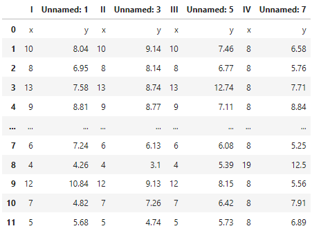

# 13.5 Pandas数据读写

我们在基础部分已经讲过使用Python标准库读写文件。本节我们介绍基于Pandas库读写工具。Pandas库为数据分析而生，为数据读写提供了更加强大的工具。

### 14.5.1 Pandas数据读写概述

通常，我们会把表格数据读入DataFrame对象。表14.5.x总结了Pandas中常用的读写函数。

14.5.x Pandas常用读写函数

| 读函数         | 写函数       | 描述                                                                 |
|----------------|--------------|----------------------------------------------------------------------|
| read_csv       | to_csv       | 从文件、URL或文件型对象读取分隔号的数据，默认分隔符是逗号（‘，’）    |
| read_table     | to_table     | 从文件、URL或文件型对象读取分隔号的数据，默认分割符是制表符（‘\\t’） |
| read_clipboard | to_clipboard | 以read_table方式从剪切板读取内容                                     |
| read_excel     | to_excel     | 读取XLS或XLSX文件内容                                                |
| read_hdf       | to_hdf       | 读取用pandas存储的HDF5文件                                           |
| read_html      | to_html      | 从HTML文件中读取所有表格内容                                         |
| read_json      | to_json      | 从JSON字符串中读取数据                                               |
| read_msgpack   | to_msgpack   | 读取MessagePack二进制格式的pandas数据                                |
| read_pickle    | to_pickle    | 读取Ppickle格式存储的数据对象                                        |
| read_sas       | to_sas       | 读取SAS数据集                                                        |
| read_sql       | to_sql       | 读取SQL查询结果                                                      |
| read_stata     | to_stata     | 读取Stata格式数据集                                                  |
| read_feather   | to_feather   | 读取Feather二进制数据                                                |

这些函数中包含一些通用参数，这些参数在大部分函数中都可以使用。

### 14.5.2 CSV数据处理

Pandas提供了四种函数与方法pd.read\_csv()/pd.read\_table()与pd.to_csv()/pd.to_table()来读写CSV文件。值得注意的是，read_csv()和read_table()都是是加载带分隔符的数据，每一个分隔符作为一个数据的标志，但二者读出来的数据格式还是不一样的，read_table是以制表符
\\t 作为数据的标志，也就是以行为单位进行存储。

表 read_csv()/read_table()函数参数

| 参数           | 描述                                                                             |
|----------------|----------------------------------------------------------------------------------|
| path           | 文件位置字符串、URL或文件对象                                                    |
| sep或delimiter | 分隔字段的序列或正则表达式。                                                     |
| header         | 用作列ing的行号，默认为0（第一行），默认为None                                   |
| index_col      | 作为结果中行索引的列号或列名                                                     |
| names          | 结果的列名列表，和header=None一起用                                              |
| skiprows       | 从文件头开始要调过的行数或行号列表                                               |
| comment        | 在行结尾处分隔注释的字符                                                         |
| keep_data_col  | 如果被连接导解析日期上，保留被连接的列，默认为False                              |
| converters     | 包含列明映射到函数的字典（例如{‘age’, np.square}会把把函数np.square()作用到age列 |
| parse_dates    | 尝试将数据解析为datatime，默认为False                                            |
| dayfirst       | 以国际格式（如8/4/2019-\>Augest 4，2019）解析非明确的日期                        |
| date_parser    | 解析日期的函数                                                                   |
| nrows          | 从文件开头读入行数。                                                             |
| iterator       | 迭代器，返回一个TextParser对象，用于零散地读取文件。                             |
| chunksize      | 迭代的块大小                                                                     |
| skip_footer    | 忽略文件尾部的行数                                                               |
| verbose        | 罗嗦模式，打印各种解释器输出的信息                                               |
| encoding       | Unicode文本编码（例如’utf-8’表示UTF-8编码的文本）                                |
| thousands      | 千分位分隔符                                                                     |
| squeeze        | 如果解析数据只包含一列，返回一个Series                                           |

### 14.5.3 JSON数据处理

Pandas可以使用pd.read\_json/pd.to_json函数来读写JSON文件。

下面我们使用pd.read_json读取https://raw.githubusercontent.com/prust/wikipedia-movie-data/master/movies.json中的json数据:

[]:jsn=pd.read_json('https://raw.githubusercontent.com/prust/wikipedia-movie-data/master/movies.json').head(20)

jsn

[]:

将保存到DataFrame数组里的数据写入导../temp目录下的JSON文件中。

[]:jsn.to\_json('../temp/movies.json')

### 14.5.4 XML与HTML数据处理

### 14.5.5 Excel数据处理

Pandas可以使用pd.read_excel/pd.to_excel函数或ExcelFile类来读写MS
Excel文件。这些工具都是基于xlrd和openpyxl包来分别读取XLS和XLSX文件的。因此需要使用pip或conda来手动安装依赖：

conda install xlrd openpyxl

pip install xlrd openpyxl

#### read_excel()与to_excel()

使用pd.read\_excel()函数读取./anscombe.xlsx文件：

[]:xlsx=pd.read\_excel('./anscombe.xlsx')

我们可以在读取excel文件的同时指定需要读取的表单：

[]:pd.read_excel('./anscombe.xlsx', 'Sheet1')

将保存到DataFrame数组里的数据写入导../temp目录下的EXCEL文件中。

[]:xlsx.to\_excel('../temp/anscomble_out.xlsx')

#### ExcelFile

如果需要读取含有多个表的文件，则使用ExcelFile更快。

使用pd.read\_excel()函数读取./anscombe.xlsx文件：

[]:xlsx=pd.ExcelFile('./anscombe.xlsx')

查看xlsx对象包含的表单名称：

[]:xlsx.sheet\_names

[]:['Sheet1']

使用parse()方法查看xlsx对象中第一个表单数据：

[]:table1 = xlsx.parse(sheet_name=xlsx.sheet_names[0])

table1

[]:

如果要将pandas数据导出到Excel格式中，必须先创建一个ExcelWriter对象，然后使用pd.to\_excel()方法写数据：

### 14.5.6 HDF5数据处理

HDF(Hierarchical Data File)是美国国家高级计算应用中心(National Center for
Supercomputing
Application,NCSA)为了满足各种领域研究需求而研制的一种能高效存储和分发科学数据的新型数据格式
。HDF可以表示出科学数据存储和分布的许多必要条件。

HDF5用于大数据存储。每个HDF5文件可以存储不止一个数据集，并且支持元数据。除此之外，HDF5还可以使用多种压缩模式进行即时数据压缩，从而使得数据存储更高效。但是随着压缩率的增高，查询效率也随之降低。使用HDF5格式可以高效读取大型数组的一小块。
