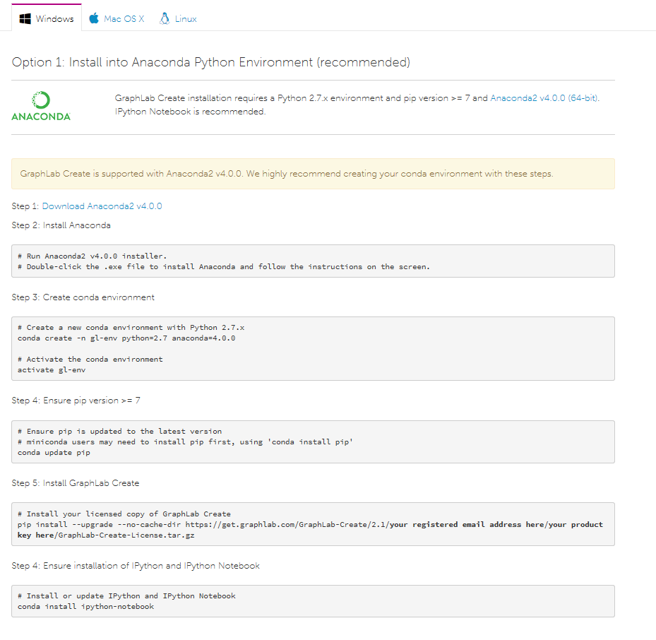
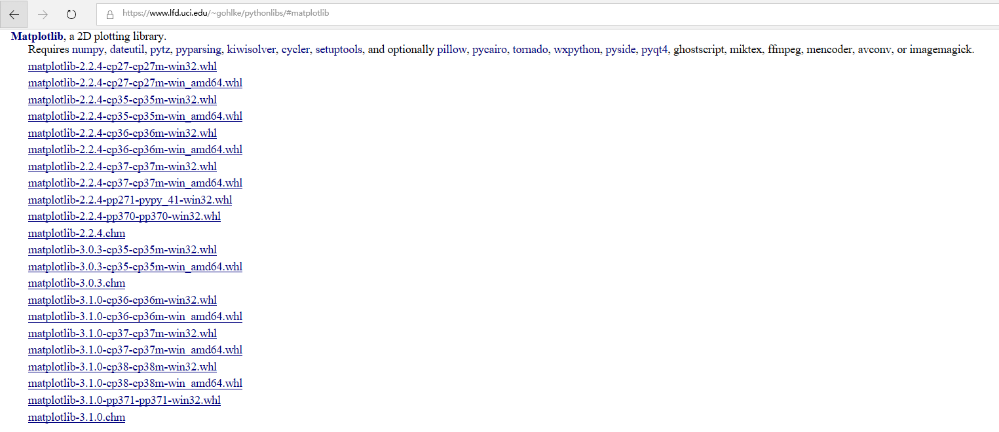

# 2.1 Python类库

Python语言之所以能成为世界上最受欢迎的语言（至少现在看是这样），其中一个重要的原因，就是Python拥有规模庞大的第三方库，如科学计算中常用的Numpy和SciPy，以及机器学习中常用到的Scikit-Learn和Tensorflow。这些第三方库为Python的流行，做出了决定性的贡献。

然而，在Python发展的早期，第三方库却曾一度成为Python语言发展的绊脚石。之所以会出现这种情况，主要是因为，Python在版本更迭的过程中，由于第三方库由全球开发者分布式维护，缺乏统一管理，进而造成用户缺乏方便快捷的包管理工具，来使其获得第三方库所带来的便利。而随着Python核心团队推出pip包管理工具，这些曾经极大地制约Python发展与推广的困难，都得到了解决。

为了理解类库，首先我们需要了解一些相关概念。

变量（variable）：变量来源于数学，是计算机语言中能储存计算结果或能表示值抽象概念。

函数（Function）：函数是组织好的，可重复使用的，用来实现单一，或相关联功能的代码段。

类（Class）：用来描述具有相同的属性和方法的对象的集合。它定义了该集合中每个对象所共有的属性和方法

>   模块（Module）：Python 模块(Module)，是一个 Python 文件，以 .py 结尾，包含了
>   Python 对象定义和Python语句。

>   包（Package）：含有\__init__.py文件的目录我们称之为包。可以使用import导入包，或者from
>   \+ import来导入包中的部分模块。包目录下为首的一个文件便是
>   \__init__.py。然后是一些模块文件和子目录，假如子目录中也有 \__init__.py
>   那么它就是这个包的子包了。

库（Library）：多个为处理某一类问题的\*.py文件

图2.x描述了，上述术语的从属关系。

在后续讲解中，我们不再详细区分函数库（Library）和模块（Module），对于所有使用import导入的代码，我们都统称为“模块“。

### 2.1.1 常用Python类库

Python类库分为两种，一种为Python语言内置类库，也即标准库，另一种为第三方库。表2.1和表2.2分别列举了常用的标准库和常用的第三方数据科学类库。

表2.1 Python常用标准库

| 库类别     | 库名称   | 简介                                                                                                                                                                                                                                                                                                                                                                                                                                   |
|------------|----------|----------------------------------------------------------------------------------------------------------------------------------------------------------------------------------------------------------------------------------------------------------------------------------------------------------------------------------------------------------------------------------------------------------------------------------------|
| 系统       | os       | os模块可以令使用操作系统相关功能变得更加方便。该模块提供了读取，写入文件，操作路径等方法。                                                                                                                                                                                                                                                                                                                                             |
|            | shutil   | shutil提供高级文件和目录处理方法                                                                                                                                                                                                                                                                                                                                                                                                       |
|            | sys      | sys模块提供对某些由解释器使用或维护的变量的访问，以及对与解释器强交互的函数的访问。                                                                                                                                                                                                                                                                                                                                                    |
| 文件通配符 | glob     |  glob 文件名模式匹配，不用遍历整个目录判断每个文件是不是符合。                                                                                                                                                                                                                                                                                                                                                                         |
| 字符串处理 | re       | re提供了类似于Perl的正则表达式匹配操作。要匹配的模式和字符串可以是Unicode字符串以及8位字符串。                                                                                                                                                                                                                                                                                                                                         |
| 数学       | math     | 数学库，包含基本数学函数如开方(sqrt)，平方(square)                                                                                                                                                                                                                                                                                                                                                                                     |
| 互联网     | urlib    | urllib 是一个收集了多个使用URL的模块的软件包：                                                                                                                                                                                                                                                                                                                                                                                         |
|            | smtplib  | smtplib模块定义一个smtp客户机会话对象，该对象可用于使用smtp或esmtp侦听器守护程序向任何Internet计算机发送邮件。有关SMTP和ESMTP操作的详细信息，请参阅RFC821（简单邮件传输协议）和RFC1869（SMTP服务扩展）。                                                                                                                                                                                                                               |
| 日期和时间 | datetime | [datetime](https://docs.python.org/zh-cn/3.7/library/datetime.html#module-datetime) 模块提供了用于以简单和复杂的方式操作日期和时间的类。在支持日期时间数学运算的同时，实现的关注点更着重于如何能够更有效地解析其属性用于格式化输出和数据操作。相关功能还可以参阅 [time](https://docs.python.org/zh-cn/3.7/library/time.html#module-time) 和 [calendar](https://docs.python.org/zh-cn/3.7/library/calendar.html#module-calendar) 模块。 |
| 数据压缩   | zlib     | 此模块为需要数据压缩的程序提供了一系列函数，用于压缩和解压缩。                                                                                                                                                                                                                                                                                                                                                                         |
| 测试       | doctest  | doctest模块搜索看起来像交互式python会话的文本片段，然后执行这些会话以验证它们是否如图所示工作。                                                                                                                                                                                                                                                                                                                                        |

表2.2 数据科学常用类库

| 库类别     | 库名称       | 简介                                                                                                                                                                                                                                         |
|------------|--------------|----------------------------------------------------------------------------------------------------------------------------------------------------------------------------------------------------------------------------------------------|
| 科学计算   | Numpy        | Numpy（Numeric Python）是Python一个开源的科学计算扩展库。NumPy（Numeric Python）提供了许多高级的数值编程工具，如：矩阵数据类型、矢量处理，以及精密的运算库。专为进行严格的数字处理而产生。                                                   |
|            | SciPy        | Scipy是一个用于数学、科学、工程领域的常用软件包，可以处理插值、积分、优化、图像处理、常微分方程数值解的求解、信号处理等问题。它用于有效计算Numpy矩阵，使Numpy和Scipy协同工作，高效解决问题。                                                 |
|            | SymPy        | Sympy是一个用于符号数学运算的Python库。                                                                                                                                                                                                      |
|            | Pandas       | Python Data Analysis Library 或 pandas 是基于NumPy 的一种工具，该工具是为了解决数据分析任务而创建的。Pandas 纳入了大量库和一些标准的数据模型，提供了高效地操作大型数据集所需的工具。pandas提供了大量能使我们快速便捷地处理数据的函数和方法。 |
| 数据可视化 | Matplotlib   | Matplotlib是一个python 2d绘图库，它以各种硬拷贝格式和跨平台的交互环境生成出版物质量图。matplotlib可以用于python脚本、python和ipython shell（\_la matlab或mathematica）、Web应用程序服务器以及各种图形用户界面工具包。                        |
|            | Seaborn      | Seaborn在matplotlib的基础上进行了更高级的API封装，从而使得作图更加容易，在大多数情况下使用seaborn就能做出很具有吸引力的图，而使用matplotlib就能制作具有更多特色的图。应该把Seaborn视为matplotlib的补充，而不是替代物。                       |
| 机器学习   | GraphLab     | GraphLab 作为一个基于图处理的并行计算框架，可以高效地运行机器学习相关的数据依赖性强，迭代型算法。                                                                                                                                            |
|            | Scikit-Learn | Scikit-Learn是一个用Python语言编写的机器学习算法库。Scikit-Learn作为一款机器学习开源框架堪称机器学习库中的瑞士军刀。                                                                                                                         |
|            | Tensorflow   | TensorFlow是一个端到端的开放源码平台，用于机器学习。它拥有一个由工具、库和社区资源组成的全面、灵活的生态系统，使研究人员能够在ML中推动最先进的技术，开发人员可以轻松地构建和部署基于ML的应用程序。                                           |
|            | Keras        | Keras是一个高层神经网络API，Keras由纯Python编写而成并基Tensorflow、Theano以及CNTK后端。Keras 为支持快速实验而生，能够把研究人员的idea迅速转换为结果。                                                                                        |

### 2.1.2 安装包

Python第三方库有3中安装方法，分别为pip安装，自定义安装和文件安装。下面我们开始讲解这三种安装方法。

#### pip安装

##### pip基本操作

通常来说，使用pip工具安装使最直接，最高效的Python类库安装方式。pip是Python官方提供并维护的在线第三方库安装工具。pip3对应Python3版本，为了叙述方便，后文采用pip代替pip3。

常用的pip命令有：安装（install）、下载（download）、卸载（uninstall）、列表（list）、查看（show）、查找（search）等。打开cmd，键入pip
\-h来查询pip工具的用法。常用命令如下：

搜索包命令：

pip search \<package_name\>

下载包命令

pip download \<package_name\> \#下载而不安装，下载获得.whl文件

安装命令：

pip install \<package_name\> \#后亦可跟多个包名

更新命令：

pip install -U \<package_name\> \#使用-U标签来更新已安装库的版本

列举包命令：

pip list \#领出当前系统中已安装的库

查询包详情命令：

pip show package_name

##### pip批量安装

我们虽然可以执行一次pip命令完成多个类库的安装，但是更多时候我们需要尽可能输入少的命令而完成这个目标。这个时候，我们就需要编写一个pip安装脚本来简化第三方库的安装。

代码清单2.1 auto_install.py

\#auto\_install.py

import os

modules={“numpy”, ”scipy”, ”pandas”, “matplotlib”, \\

“seaborn”, “scikit-learn”, “tensorflow”, “keras”\\

“sympy”}

try:

>   for module in modules:

>   os.system(“pip install “+lib)

print(“Successfully installed”, modules)

except:

print(“check the python script, some packages installed falled.”)

在终端中运行此脚本，若出现那Successfully Installed
\<module_name\>即表明，模块\<module_name\>被顺利安装，否则，请检查脚本代码，找出存在问题，可以对安装失败的模块进行单独安装，也可以再次运行该脚本。

#### 自定义安装

对于pip中尚无的登记或安装失败的第三方库，可以通过自定义安装来对其进行部署。

一般来说，自定义安装，需要进入第三方库官网，遵循其指示进行安装。如著名的机器学习库GraphLab
Create的安装要求用户访问其官网，按照其要求，进行安装，否则就会安装失败。如图所示，GraphLab
Create的安装，就需要遵循这种方式。

图GraphLab的pip安装步骤。

#### 文件安装

因为某些第三方库仅仅提供该库的源代码，所以在windows下，通过pip下载的文件后无法进行编译进而导致安装失败。这时候，需要获取.whl文件（库安装文件）对第三方库进行安装。这种安装方式可以在离线情况下进行。

我们可以通过美国加州大学尔湾分校的服务器（[https://www.lfd.uci.edu/\~gohlke/pythonlibs/](https://www.lfd.uci.edu/~gohlke/pythonlibs/)）下载到可直接安装的.whl库文件。如图：

图： Matplotlib安装库文件

在我们为python安装第三方库的时候，出于直觉，不管包名正确与否优先使用pip install
\<package_name\>来对包进行安装。如果安装失败，我们选择自定义安装或者文件安装来解决此问题。

### 2.1.3 加载包

Python语言的重要特点是利用函数库编程，这种编程方式也被称为“模块编程“。正是这种特点，使得Python发展迅速。我们通常有以下几种加载模块的方法。

1.  **使用导入Module（模块）命令import**

import
命令为导入Module（模块）命令。导入模块时，会优先选择环境目录下是否有同名且后缀名为py的文件，然后才会搜索内置模块和第三方模块，其中，搜索路径存放在sys模块的path变量中。因此，在创建py文件时，除非特殊情况，禁止将py文件名设为已存在的模块名。

import的使用方式如下：

import \<module_name1\>[ as alias_name1], [\<module_name2\>[ as alias_name2]],
…, [\<module_namen\>[ as alias_namen]]

其中 module_name为模块名，alias_name为别名，import module_name1 as
alias_name1为导入模块module_name1并重命名为alias_name1，同时一个模块后还可以跟多个模块，这些模块都可以在一条命令中重命名。

虽然在文件各个部分导入模块都是可行的，但是，为了增强代码的可读性，我们一般在文件首部导入所有模块。同时，我们建议，先导入标准库，再导入第三方模块，最后导入程序自定义模块。同类模块方在一起导入。

1.  **使用from…import…语句导入模块的属性（变量、函数、对象）**

一般来说, from…
import命令有两种使用方式，第一种使用方式为导入部分模块的属性，另一种使用方式为导入全部的属性。

1.  更改导入模块的搜索路径

有两种方法修改搜索路径：

一是直接修改sys.path，添加要搜索的文件夹：sys.path.append('路径')

第二种方法是设置环境变量PYTHONPATH，该环境变量的内容会被自动添加到模块搜索路径中。设置方式与设置Path环境变量类似。注意只需要添加你自己的搜索路径，Python自己本身的搜索路径不受影响。

模块被导入时，加载的时候模块顶层代码会被执行，一个模块无论被导入多少次，只加载一次，可以防止多次导入时代码被多次执行。

可以使用，内建函数reload对已经导入的模块执行重新导入。

### 2.1.4 使用虚拟环境

我们使用virtualenv来创建与已有Python环境相隔绝的环境。

安装virtualenv工具

pip install virtualenv

创建环境

cd env_dir \#切换到目标环境的目录（env\_dir）

virtualenv env_name \#env_name为虚拟环境名称virtual

执行完上述两条命令后，virtualenv
将会在当前目录创建一个名为env_name的文件夹，如图2.1所示，这个文件夹中包含了Python的可执行文件，以及pip库的备份。

图2.1 virtualenv创建的环境目录

激活环境

cd ./env_name/Scripts

activate env_name \#对于Linux和Mac用户，键入source activate env_name

\# 在虚拟环境中，我们同样可以使用pip工具完成包的安装工作

注销环境

deactivate env_name \# 对于Linux和Mac用户， 键入source deactivate env_name

\# 回到系统默认Python环境

共享环境：

pip freeze \>environment.txt \#将一个导出环境配置。

activate inport_env \# 激活被导入环境

pip install -r /path/requirements.txt \#安装导出环境配置依赖

其中 -r 后跟依赖文件。

删除环境

只需要删除虚拟环境所在文件夹，即可删除虚拟环境。

virtualenv的缺点

virtualenv的启动，停止脚本都在特定文件夹，如果有多个虚拟环境，这时候，会使虚拟环境的管理变得困难。此时虽然可以用*virtualenvwrapper来协助管理，但是也只不过解决了部分问题。我们需要更强大的工具来协助我们进行环境管理。*
