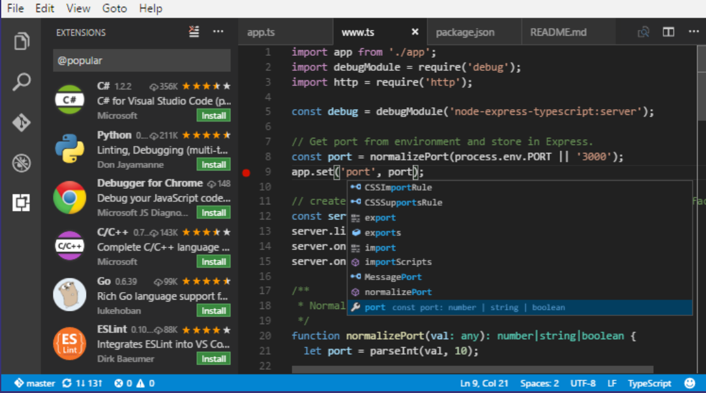
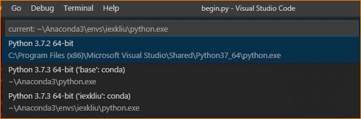
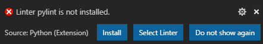
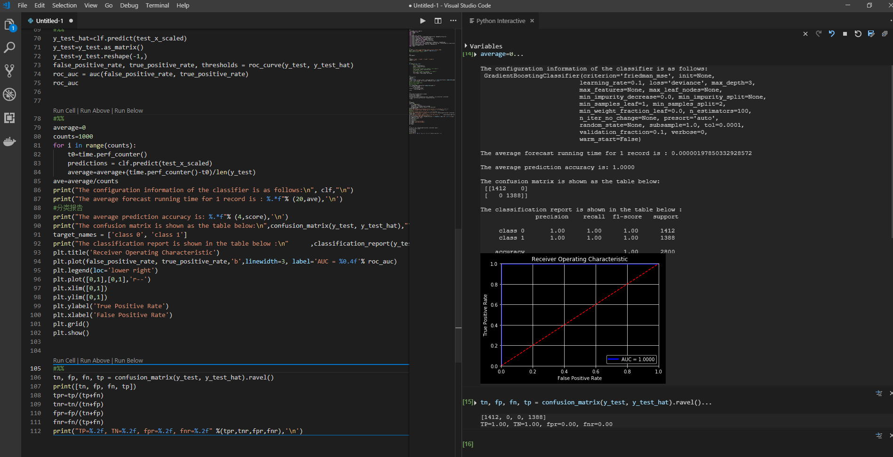
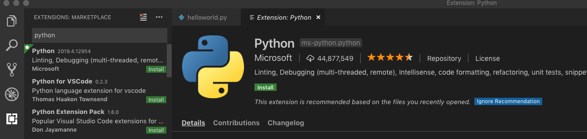
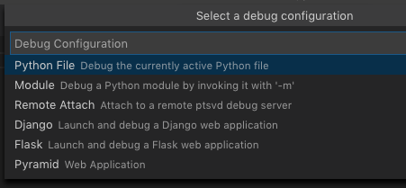
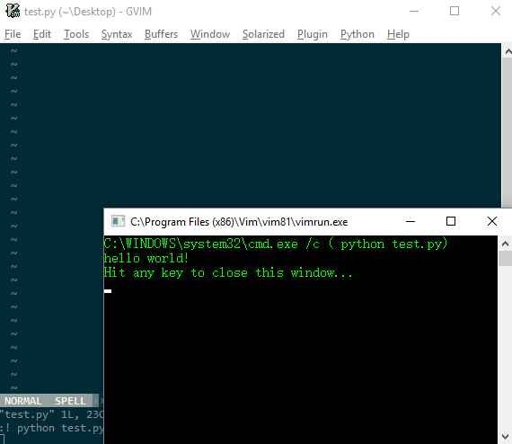

# 2.5 文本开发环境

### 2.5.1 VSCode

图

Visual Studio Code（简称VS
Code/VSC）是一款免费开源的现代化编辑器。虽然VSCode十分轻量，安装包不到50MB，但是，麻雀虽小五脏俱全，VSC不仅仅支持几乎所有主流的开发语言的语法高亮、智能代码补全、自定义快捷键、括号匹配和颜色区分、代码片段、代码对比
Diff、GIT命令
等特性，支持插件扩展，并针对网页开发和云端应用开发做了优化，而且还跨平台支持Windows，Linux和Mac。

下面我们介绍如何使用VSCode来进行Python开发：

1.  在VSCode里使用Jupyter服务

    要想在VSCode里获得Jupyter支持，需要遵循以下几个步骤。

2.  打开已编写好的.py，按下ctrl+shift+p组合键，输入Python：Select
    Interpreter，也可以输入一部分，visual
    studio会自动推荐相关候选项，接着选择已安Jupyter
    Notebook的目标环境。如图所示【】，

    

    选择环境。

    在此案例中，我们一共有3个Python环境，分别为，python3.7标准环境，anaconda3下的，默认环境（base）和我们创建的自定义环境（iexkliu）。

3.  打开.py文件时，VSC提示我们需要安装py我们还需要通过conda或pip安装插件。如图

    

    我们单击install。即可完成安装。也可以使用pip，conda工具对pylint进行安装。

    pylint 是一个 Python 代码分析工具，它分析 Python
    代码中的错误，查找不符合代码风格标准和有潜在问题的代码。

4.  通过在目标代码前一行键入\#%%来创建代码单元，可按下shift+enter键，运行代码单元。

5.  打开ipynb文件。

    如果使用vscode打开一个ipynb文件，python扩展程序会提示您将笔记本作为python代码文件导入：

    

    选择导入，等待几秒钟，然后vs
    code将在无标题文件中打开转换后的笔记本。笔记本的单元格在python文件中用\#%%注释分隔；Markdown单元完全被转换为带有\#%%[markdown]的注释语句，并在交互窗口中与代码和输出一起以HTML的形式进行展示。如图所示。

    

    图

6.  在VSCode里开启调试

7.  如图【】，所示，在VSCode拓展商场里搜索插件python，并安装插件。

    

    图

8.  按下ctrl+shift+p组合键，选择Python：Select Interpreter，选择目标运行环境.

9.  如图所示，打开调试的.py文件，按下F5，在调试配置选项中，选择python文件，即可开始调试。

    

    图

### 2.5.2 Vim

Vim是一个类似于[Vi](https://baike.baidu.com/item/Vi/8987313)的著名的功能强大、高度可定制的[文本编辑器](https://baike.baidu.com/item/%E6%96%87%E6%9C%AC%E7%BC%96%E8%BE%91%E5%99%A8/8853160)，在Vi的基础上改进和增加了很多特性。VIM是[自由软件](https://baike.baidu.com/item/%E8%87%AA%E7%94%B1%E8%BD%AF%E4%BB%B6/405190)。

Vim普遍被推崇为类[Vi编辑器](https://baike.baidu.com/item/Vi%E7%BC%96%E8%BE%91%E5%99%A8)中最好的一个，事实上真正的劲敌来自Emacs的不同变体。1999
年[Emacs](https://baike.baidu.com/item/Emacs)被选为Linuxworld文本编辑分类的优胜者，Vim屈居第二。但在2000年2月Vim赢得了Slashdot
Beanie的最佳[开放源代码](https://baike.baidu.com/item/%E5%BC%80%E6%94%BE%E6%BA%90%E4%BB%A3%E7%A0%81/114160)文本编辑器大奖，又将Emacs推至二线，
总的来看， Vim和Emacs在文本编辑方面都是非常优秀的。

第一步，进入vim官方下载页面<https://www.vim.org/download.php>，遵循相关指导，安装vim。

第二步，进入spf13官网<http://vim.spf13.com/>
，遵循相关指导，安装vim插件集-spf13。spf13会为vim安装各种编程语言的插件，如智能提示，代码高亮等。

第三步，进入用户家目录(Windows用户，默认C:/Users/用户名/spf13-vim3，\*nix用户，默认\~/)，对vim配置文件.vimrc（隐藏文件）进行编辑。（原vim配置文件位于用户家目录下，安装插件集后，vim配置文件重定向为家目录下的spf13-vim-3文件下的.vimrc文件。

在.vimrc最后一行键入以下代码：

“run the code

map \<F5\> :call CompileRun()\<CR\>

func! compileRun()

exec “w”

if \&filetype==’python’

exec “!time python %”

endif

endfunc

按f5运行

新建一个py文件，键入print(“hello
world!”)，按F5键，即可在控制台中输出。如图所示【】

【】

vim学习曲线十分陡峭。需要付出极大的努力，才能将其掌握。不建议初学者在vim的使用上投入过多时间，因为掌握vim所需要花费的时间不亚于精通一门编程语言所需要的时间。vim博大精深，其蕴含的知识，即使用一本书来写，也是不够的。关于vim更多的知识，我们在此不再进行讲解，但我们鼓励有经验的读者通过Vim官方教程或其他途径自学。