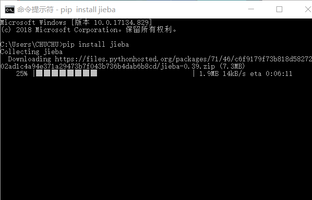

# 3.3 组合类型

组合类数据类型，顾名思义，是多个同类或者不同类型的数据的组合。组合数据类型可分为：集合类型，序列类型和字典类型。其中，序列类型又包含了字符串类型，元组类型和列表类型。图【】展示了组合数据类型所包含的数据类型。

通过组合数据类型，将大量数据有效地组织起来进行统一表示，可以极大地提高数据的处理效率。

### 3.3.1组合类型概述

**序列（squence）**是Python种最基本的数字结构。序列中的每个元素按序进行编号和排列，第一个元素的编号为0，第二个元素的编号为1。序列包含字符串，列表和元组。表是序列通用函数，这些函数可以通用在字符串，列表和元组对象类型中；反之，字符串，列表和元组特有的函数却不都能通用。

序列 通用函数与对象方法

| 函数                   | 描述                                             |
|------------------------|--------------------------------------------------|
| len(S)                 | 求序列S中元素的个数                              |
| min(S)                 | 求序列S中的最小元素                              |
| max(S)                 | 求序列中的最大元素                               |
| S.index(x, [, i[, j]]) | 求序列S中x第一次出现的介于第i到第j个位置间的位置 |
| S.count(x)             | 求序列S中x的出现次数                             |

序列通用操作

| 操作        | 描述                                           |
|-------------|------------------------------------------------|
| S+T         | 连接S和T                                       |
| S\*n 或n\*S | 将序列S复制n次                                 |
| S[i]        | 序列索引，返回序列的第i个元素                  |
| S[i: j]     | 序列分片，返回序列S第i到第j-1个位置的子序列    |
| S[i: j: k]  | 步骤分片，以步长k返回序列S第i到第j-1个的子序列 |
| x in S      | 判断元素x是否在S中                             |
| x not in S  | 判断元素x是否不在S中                           |

此外Python还支持五种基本组合数据类型之间部分转换，转换函数见表，
转换关系见图。但是通常，除字典以外的组合数据类型之间可以相互转换而不会丢使信息，字典数据类型可以转换为其他四种组合数据类型，但是却会在转换过程中只保留键而丢失键对应的值，此外，不支持其他数据类型向字典数据类型转换。

表 转换函数

| 函数     | 描述                                   |
|----------|----------------------------------------|
| tuple(S) | 构建元组；将组合数据类型转换为元组     |
| str(S)   | 构建字符串；将组合数据类型转换为字符串 |
| list(S)  | 构建列表；将组合数据类型转换为列表     |
| set(S)   | 构建集合；将组合数据类型转换为集合     |
| dict(S)  | 构建字典                               |

图：转换关系

del

### 3.3.2 集合

哈希运算可以将任意长度的二进制值映射为较短的固定长度的二进制值（哈希值）。通过哈希运算，可以将数据有损地映射为较为紧凑的表示形式。可以通过Python内置函数hash，对数据进行哈希计算。

例：对DNA编码“CGCCGCGC”进行hash运算

\>\>\>hash(“CGCCGCGC”)

161638525563229824

\>\>\>type(hash("CGCCGCGC")), len(str(hash("CGCCGCGC")))

(\<class 'int'\>, 18)

\>\>\>type(hash('AGCTGCCA')), len(str(hash('AGCTGCCA')))

(\<class 'int'\>, 20)

因为集合中的元素具有无序性和互异性，所以当我们创建一个包含两个相同元素的集合时，集合中只会保留一个元素，同时，集合中元素的位置也会打乱。

\>\>\>S={“ZZU”, 1956, (211，”双一流“), “ZZU”}

{1956, 'ZZU', (211, '双一流')}

除了使用花括号来创建集合外，我们还可以使用set函数来创建集合。同集合中的元素一样，它的输入参数是可以进行哈希运算的任何类型

set函数的使用方法如下:

set(Obect)

例

\>\>\>S=set(“apple”)

{'e', 'l', 'p', 'a'}

\>\>\>S=set((“apple”, “orange”, “pear”))

\>\>\> S=set(("ZZU", 1956, (211, "双一流")))

{(211, '双一流'), 1956, 'ZZU'}

常见的集合操作有：交集、并集、差集，我们使用表达式运算符&，\|，-就可以完成这些操作。

例：现有两个集合a={1, 2, 3}, b={2, 3, 4}， 求a，b两集合的交集，并集和差集：

\>\>\>a={1, 2, 3}

\>\>\>b={2, 3, 4}

\>\>\>a&b

{2, 3}

\>\>\>a\|b

{1, 2, 3, 4}

\>\>\>a-b

{1}

我们使用成员运算符in, not in 可以对集合中是否存在特定元素进行判断。

例：现有集合vegetables={“apple”, “orange”,
“pear”}，请使用成员运算符判断集合中是否存在”apple”和”pineapple”。

\>\>\> vegetables={“apple”, “orange”, “pear”}

\>\>\>apple in vagetables

true

\>\>\> "pineapple" in vagetables

false

表是集合的表达式运算符，表是集合的操作函数

表集合的表达式运算符与对应函数

| 表达式运算符 | 对应函数                         | 描述                          |
|--------------|----------------------------------|-------------------------------|
| S-T          | S.different(T)                   | 求集合S与T的差集              |
| S&T          | S.intersection(T)                | 求集合S与T的并集              |
| S\|T         | S.Union(T)                       | 求集合S与T的交集              |
| S\^T         | S.symmetric_difference(T)        | 求集合S与T的独有元素的并集    |
| S-=T         | S.difference_update(T)           | 使用S与T的差集更新S           |
| S&=T         | S.intersection_update(T)         | 使用S与T的并集更新S           |
| S\|=T        | S.Union_update(T)                | 使用S与T的交集更新S           |
| S\^=T        | S.symmetric_difference_update(T) | 使用S与T的独有元素的并集更新S |
| S\<=T        | S.issubset(T)                    | 判断s是否是T的子集            |
| S\>=T        | S.issuperset(T)                  | 判断S是否是T的超集            |

表 集合的函数（打乱此表）

| 函数           | 描述                                                                   |
|----------------|------------------------------------------------------------------------|
| S.add(x)       | 如果数据对象x不在S中，则将x加入S                                       |
| S.clear()      | 清空集合S                                                              |
| S.copy()       | 复制集合S                                                              |
| S.pop()        | 随机返回并删除集合S中的一个元素。集合S不能为空，否则返回KeyError异常。 |
| S.discard(x)   | 移除集合S中的x元素。如果集合S中不能存在该元素，则无回应。              |
| s.remove(x)    | 移除集合S中的x元素。如果集合S中不能存在该元素，则抛出KeyError异常。    |
| S.isdisjoint() | 返回集合S中元素的个数(?)                                               |

**集合的操作函数**

1.  add()函数

描述：如果集合s中不存在元素x，则将元素x添加到集合s中；如果集合s已经存在元素x，也不会报错。

\>\>\> s={1,2,"a"}

\>\>\> s.add(1)

\>\>\> s.add("z")

\>\>\> print(s)

{1, 2, 'z', 'a'}

1.  clear()函数

描述：删除集合s中的所有元素。

\>\>\> s={1,2,"zzu"}

\>\>\> s.clear()

\>\>\> print(s)

set()

1.  copy()函数

描述：复制生成一个新的集合。

\>\>\> s={1,2,"a"}

\>\>\> s1=s.copy()

\>\>\> s.add(3)

\>\>\> s1.add("zzu")

\>\>\> print(s)

{1, 2, 3, 'a'}

\>\>\> print(s1)

{'zzu', 1, 2, 'a'}

1.  discard()函数

描述：移除集合中的x元素，若该元素不存在，不报错。

\>\>\> s={1,2,3,"a","z","zzu"}

\>\>\> s.discard(1)

\>\>\> s.discard("a")

\>\>\> print(s)

{2, 3, 'zzu', 'z'}

1.  remove()函数

描述：移除集合中的x元素，若该元素不存在，则报错。

\>\>\> s={1,2,3,"a","z","zzu"}

\>\>\> s.remove("b")

Traceback (most recent call last):

File "\<pyshell\#11\>", line 1, in \<module\>

s.remove("b")

KeyError: 'b'

1.  pop()函数

描述：随机移除集合s中的一个元素并返回该元素。若集合为空则报错。

\>\>\> s1={1,2,3,4,5,"a","zzu"}

\>\>\> print(s1.pop())

1

\>\>\> print(s1)

{2, 3, 4, 5, 'zzu', 'a'}

1.  isdisjoint()函数

描述：判断两个集合是否包含相同的元素，若没有相同元素则返回True,否则返回False.

\>\>\> a={1,2,3,"a"}

\>\>\> b={4,5,"zzu"}

\>\>\> c={6,7,8,"zzu"}

\>\>\> print(a.isdisjoint(b))

True

\>\>\> print(b.isdisjoint(c))

False

### 3.3.3 字符串

字符串（string）：字符串是字符的序列表示。字符串由一对单引号(' ')、双引号("
")或者三引号(''' ''')构成。

#### jieba库

jieba库是优秀的中文分词第三方库，jieba支持精确模式、全模式和搜索引擎模式这三种分词模式。三种模式各自的特点如下：

（1）精确模式：试图将语句进行最精确的切分，不存在冗余数据，适合做文本分析。

（2）全模式：将语句中所有可能是词的词语都切分出来，切分速度快，但存在冗余数据。

（3）搜索引擎模式：在精确模式的基础上，对长词进行再次切分。

1.  jieba库的安装

由于jieba库是一个第三方库，所以需要额外进行安装。

Windows系统下使用命令提示符进行安装：在联网状态下在命令行下输入pip install
jieba进行安装，之后系统会提示相关界面告诉我们jieba库已经安装成功。

1.  jieba库常用函数

| 函数                       | 描述                                                                                                                                                                                      |
|----------------------------|-------------------------------------------------------------------------------------------------------------------------------------------------------------------------------------------|
| Jieba.lcuts(s)             | 精确模式，返回一个列表类型的分词结果 \>\>\>jieba.lcut(“中国是一个伟大的国家”) [‘中国’，‘是’，‘一个’，‘伟大’，‘的’，‘国家’]                                                                |
| Jieba.lcut(s,cut_all=True) | 全模式，返回一个列表类型的分词结果，存在冗余 \>\>\>jieba.lcut(“中国是一个伟大的国家”，cut_all=True) [‘中国’，‘国是’，‘一个’，‘伟大’，‘的’，‘国家’]                                        |
| Jieba.lcut_for_search(s)   | 搜索引擎模式，返回一个列表类型的分词结果，存在冗余 \<\<\<Jieba.lcut_for_search(“中华人民共和国是伟大”) [‘中华’，‘华人’，‘人民’，‘共和’，‘共和国’，‘中华恩人民共和国’，‘是’，‘伟大’，‘的’] |
| Jieba.add_word(w)          | 向分词词典增加新词w \>\>\>Jieba.add_word(“蟒蛇语言”’)                                                                                                                                     |

1.  文本词频统计

《三国演义》人物出场统计

\#CalThreeKingdomsV1.py

import jieba

txt=open("threekingdoms.txt","r",encoding="utf-8").read()

words=jieba.lcut(txt)

counts={}

for word in words:

if len(word)==1:

continue

else:

counts[word]=counts.get(word,0)+1

items=list(counts.items())

items.sort(key=lambda x:x[1],reverse=True)

for i in range(15):

word,count=items[i]

print("{0:\<10}{1:\>5}".format(word,count))

\>\>\>

曹操 953

孔明 836

将军 772

却说 656

玄德 585

关公 510

丞相 491

二人 469

不可 440

荆州 425

玄德曰 390

孔明曰 390

不能 384

如此 378

张飞 358

**3.3.4 元组**

元组（tuple）：一旦创建无法修改。使用逗号或圆括号表示。

\>\>\>T1=(1, 2, 3, 4) \#创建元组

\>\>\>T2=T1+(5, 4, 3, 4) \#元组的拼接

\>\>\>len(T2) \#显示元组长度

8

\>\>\>T[7] \#显示第7号元素

4

\>\>\>T.index(4) \#显示元素4首次出现的索引

3

\>\>\>T.count(4) \#计算元素4出现的次数

3

### 3.3.5 列表

列表（list）：列表是包含一个或多个对象引用的有序序列。表

表是列表对象的方法

表 列表对象的方法

| 函数              | 描述                         |
|-------------------|------------------------------|
| list.append(x)    | 在列表list后追加元素x        |
| list.insert(i, x) | 在列表list第i个位置插入元素x |
| list.pop(i)       | 返回并删除列表list第i个元素  |
| list.remove(x)    | 删除列表首次出现的元素x      |
| list.reverse()    | 反转列表元素                 |

### 3.3.6 字典

字典（Dictionary）：字典是由一个或多个键-值（key-value）对组成的**集合**。字典具有集合的一般性质，同时可以高效地对数据进行查询和存储。字典是映射类型中唯一的数据类型。所谓映射类型是“键-值”（Key-Value）对的组合。在映射类型中，每个元素即是一个键值对。键（key）表示一个属性，值（value）是属性的内容。键值对将映射关系结构化。

字典使用大括号来创建，使用中括号向字典中增加元素：

例：

\>\>\>School={} \#创建一个空的字典

\>\>\>School

{}

\>\>\>School={"张三":"校长", "李四":"书记", "王五":"教授", "赵六":"副教授"}

\>\>\>School

{'张三': '校长', '李四': '书记', '王五': '教授', '赵六': '副教授'}

\>\>\>School[“孙七”, “周八”, “吴九”]=”讲师”, “讲师”, “博士后”

{'张三': '校长', '李四': '书记', '王五': '教授', '赵六': '副教授', '孙七':
'讲师'}

表是字典对象的方法

| 函数          | 描述 |
|---------------|------|
| Dic.keys()    |      |
| Dic.values()  |      |
| Dic.items()   |      |
| Dic.get()     |      |
| Dic.pop       |      |
| Dic.popitem() |      |
| Dic.clear()   |      |