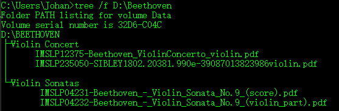

# 3.4 文件类型

我们之前运行的代码都是在内存执行。然而在某些特殊的情况下会牵涉到对外存的读写：比如我们需要将数据保存到本地磁盘以供进一步处理，或者读取磁盘中存放的文件并对其进行操作。Python中的**文件对象**，是对磁盘文件进行处理的主要接口。通过文件对象，我们可以对文本记录、音频、图片等任何磁盘中的文件进行读写。

我们可以根据文件中数据的组织方式把文件分为文本文件和二进制文件。

**文本文件**是可以被理解的字符串，这些字符串以文本行的形式组织起来。可以使用文本编辑器直接对其进行编辑。

**二进制文件**以字节串（bytes）的形式对数据对象的内容在内存中进行存储。这些存储的内容不经过转码，无法被人理解。无法使用文本编辑器对其进行编辑。

### 3.4.1 字符编码

编码是使用数字来对符号和文字进行表示的一种规范。通过编码，可以将符号和文字在计算机体系结构中进行存储与显示。

美国标准信息交换码ASCII码，是最早的编码。ASCII码采用8位（1字节）进行编码，最多支持对256个字符进行编码。ASCII码包含10个数字，26个大写字母，26个小写字母以及一些其他符号的编码。图，是部分ASCII码表。

常用ASCII码对照表

附录

常用的编码位：UTF-8，GB2312，GBK，CP936和Unicode。

GB2312编码的全称是《信息交换用汉字编码字符集》，它是由是由中国国家标准总局1980年发布，1981年5月1日开始实施的一套国家标准。GB2312使用16位（2字节）表示中文。GBK编码的全称是《汉字编码扩展规范》，于1995年颁布，是对GB2312的扩充。CP936编码是微软在GBK基础上完成的编码。因此GB2312，GBK和CP936编码都采用2字节来表示中文。

Unicode是国际组织指定的计算机科学领域的一项**业界标准**，被称为统一码、万国码或单一码。Unicode编码可以容纳世界上所有文字和符号。Unicode是编码转换的基础，在需要进行编码转换时，总是需要先把一种待转换的编码转换成Unicode编码，然后再将转换后的编码转换成另外一种编码。在使用Python进行编程时，通过在字符串前加u来表示Unicode编码的字符串。在Unicode下，一个汉字占用8位（1一个字节）

UTF-8（8-bit Unicode Transformation
Format），是国际通用的编码，与ASCII码兼容，又称万国码。UTF-8是一种针对Unicode的可变长度字符编码。表示英语，用24位（3字节）来表示中文以及其他语言。
UTF-8对全世界所有国家需要用到的符号都进行了编码。使用UTF-8的编码的优势是显然的，它可以使在任何平台上，任何一种已安装特定语言的操作系统下，显示其他国家的语言。

Python3中的默认编码时UTF-8，我们通过运行以下代码，可以获取Python解释器的默认编码。

\>\>\>import sys

\>\>\>sys.getdefaultencoding()

'utf-8'

Python中字符编码的转换需要使用到encode和decode函数。特别是进行**爬虫操作**的时候，因为需要爬取的网页的编码各不相同，所以需要对网页进行解码，重新编码操作。

encode方法，可以计算机展现的可以被人理解的字符转为计算机内部字节表示。decode方法可以把字节形式的字符转换成我们可以理解的字符。

encode方法的使用方法如下：

str.encode(encoding='UTF-8',errors='strict')

encodeing后跟需要使用的编码，如UTF-8。errors 后设置不同错误的处理方案。默认为
'strict',意为编码错误引起一个UnicodeError。其他可选参数有’ignore’,
‘repplace’等。 该方法返回编码后的字符串。

decode方法的使用方法如下：

str.decode(encoding='UTF-8',errors='strict')

encodeing后跟需要使用的编码。errors
后设置不同错误的处理方案。该方法返回解码后的字符串。

例：将’蟒蛇‘ 分别转换为UTF-8编码和
GB2312编码，然后对编码进行解码。同时，输出每一种编码，汉字所占的字符数。

len方法的使用方式如下：

len( s )

s为数据对象。该方法返回对象的长度。

\>\>\>s1=”蟒蛇”

\>\>\>s2=s1.encode(“UTF8”)

\>\>\>s3=s1.encode(“GB2312”)

\>\>\>s2, len(s2)/2

(b'\\xe8\\x9f\\x92\\xe8\\x9b\\x87', 3) \#u

\>\>\>s3, len(s3)/2

(b'\\xf2\\xfe\\xc9\\xdf', 2)

\>\>\>print(s2=s2.decode('UTF-8'), s3=s3.decode(‘GB2312’))

蟒蛇 蟒蛇

除了在python脚本中我们对字符进行编码解码外，我们还可以指定程序中字符串编码方式：

\#coding=utf-8

\#coding:utf-8

\#-\*-coding:utf-8 -\*-

以上三种方式都可以对字符串编码方式进行指定（查一查对不对）

### 3.4.2 文件读写基础

我们使用Python内置函数Open()来打开或创建文件。

Open函数的使用方式如下：

variable_name= open(name[, mode[, buffering]])

name是要访问的文件地址，直接输入文件名的话，则会在当前目录下寻找文件；mode决定了文件的打开方式，文件的打开方式有读，写，追加等。表【】列出了文件的打开方式。默认访问方式是只读；buffereing代表缓存区，如果
buffering 值为 0，就不会缓存。如果 buffering 的值为1，表示缓存。如果将buffering
值为大于1
的整数，则buffering的值即为缓存大小。如果值为负，则寄存区的缓冲大小为系统默认。

表文件的打开方式

| 打开方式 | 描述                                                                   |
|----------|------------------------------------------------------------------------|
| ‘r’      | 以只读方式打开文本文件。若打开文件不存在，则抛出异常                   |
| ‘r+’     | 以读写方式打开文本文件，不删除原内容。若打开文件不存在，则抛出异常     |
| ‘w’      | 以只写方式打开文本文件，删除原内容。若打开文件不存在，则新建文件并打开 |
| ‘w+’     | 以读写方式打开文本文件，删除原内容，若打开文件不存在，则新建文件并打开 |
| ‘a’      | 以读写方式打开文本文件，删除原内容，若打开文件不存在，则新建文件并打开 |
| ‘a+’     | 以读写方式打开文本文件，删除原内容，若打开文件不存在，则新建文件并打开 |
| ‘rb’     | 以读写方式打开文本文件，删除原内容，若打开文件不存在，则新建文件并打开 |
| ‘rb+’    | 以读写方式打开文本文件，删除原内容，若打开文件不存在，则新建文件并打开 |
| ‘wb’     | 以读写方式打开文本文件，删除原内容，若打开文件不存在，则新建文件并打开 |
| ‘wb+’    | 以读写方式打开文本文件，删除原内容，若打开文件不存在，则新建文件并打开 |
| ‘ab’     | 以读写方式打开文本文件，删除原内容，若打开文件不存在，则新建文件并打开 |
| ‘ab+’    | 以读写方式打开文本文件，删除原内容，若打开文件不存在，则新建文件并打开 |

表 文件对象常用属性

|  属性  | 描述               |
|--------|--------------------|
| Name   | 判断文件是否关闭   |
| Mode   | 返回文件的打开模式 |
| Closed | 判断文件是否关闭   |

表 文件对象常用方法

| 方法                               | 说明                                                                                                                                                                                               |
|------------------------------------|----------------------------------------------------------------------------------------------------------------------------------------------------------------------------------------------------|
| file.flush()                       | 将缓存写入磁盘，不关闭文件                                                                                                                                                                         |
| file.close()                       | 将缓存写入磁盘，释放文件对象                                                                                                                                                                       |
| file.read([size])                  | 从文件中读取size个字节作为结果返回，若省略size则读取整个文件                                                                                                                                       |
| file.readline()                    | 从文本文件读取1行并以字符串的形式返回                                                                                                                                                              |
| file.readlines()                   | 将文本文件的每行以字符串的形式依次插入列表中，将此列表返回                                                                                                                                         |
| file.seek(offset[, whence])        | 将文件指针指向新位置。wherece可以理解为参照字节，offset可以理解为相对于字节的字节偏移量。当whence为0时，参照字节为首字节；whence为1时，参照字节为当前指针所指字节；whence为2时，参照字节为末尾字节 |
| file.tell()                        | 返回文件指针当前所指位置                                                                                                                                                                           |
| file.truncate([size])              | 删除当前字节后第size个字节之后所有字节。size默认值为0。                                                                                                                                            |
| file.write(s)                      | 将字符串s的内容写入文本文件或二进制文件                                                                                                                                                            |
| file.writelines(sequenceOfstrings) | 将字符串列表以省略换行符的形式写入文本文件                                                                                                                                                         |

### 3.4.3 使用文件 

#### 文本文件

##### 读取文件

##### 写入文件

我们通过open函数，使用相应的操作模式打开文件后，就可以对文件的任何位置进行读写操作了。当我们使用’r+’，’w+’，’rb+’和’wb+’模式打开文件后，文件指针位于文件头，位置为0；当我们使用’a+’h额’ab+’模式打开文件后，文件指针位于文件尾（文件最后一个字符的后继）。如何能对文件的任何位置进行读写操作？文件对象的seek方法可以帮助我们达成这个目标。使用seek()方法可以对文件指针进行移动，从而完成对文件任意位置的读写操作

seek()的使用方法如下：

fileObject.seek(offset[, whence])

offset为指针相对于开始的偏移量，也就是距离开始的字节数。whence默认值为零，设置指针开始位置，当whence设置为0使，代表指针从文件头开始计算偏移量，1代表从当前位置计算偏移量，2代表从文件末尾计算偏移量。

例：对love_python.txt文件进行操作

#### 二进制文件

##### 读二进制文件

##### 写二进制文件

#### JSON文件

JSON（JavaScript Object Notation,
JS对象简谱）文件是一种新型的数据交换格式。Python内置了JSON标准库，因为JSON的语法与列表和字典的很相似，所以可以很方便地使用JSON标准库使JSON对象和PYTHON对象之间来回转换。

### 3.4.4 操作文件

常用文件处理函数（把这个表函数顺序打乱，同类还是要放在一起）

| 所属模块 | 函数                              | 描述                                                                                             |
|----------|-----------------------------------|--------------------------------------------------------------------------------------------------|
| os       | access(path)                      | 按照mode指定的权限访问文件                                                                       |
|          | chmod()                           | 改变文件的访问权限                                                                               |
|          | open(filename, flag[, mode=0777]) | 按照mode指定的权限打开文件。默认权限0777。（所有人，用户组，其他用户均拥有可读可写可执行的权限） |
|          | remove(path)                      | 删除path指定文件                                                                                 |
|          | rename(src, dst)                  | 重命名文件或目录。将src重命名为dst                                                               |
|          | stat(path)                        | 返回path指定文件的属性                                                                           |
|          | fstat(path)                       | 返回打开的文件的属性                                                                             |
|          | listdir(path)                     | 返回path指定下的文件和目录                                                                       |
| os path  | abspath(path)                     | 返回path所在的绝对路径                                                                           |
|          | dirname(p)                        | 返回目录所在路径                                                                                 |
|          | exists(path)                      | 判断文件是否存在                                                                                 |
|          | getatime(filename)                | 返回文件的最后访问时间                                                                           |
|          | getctime(filename)                | 返回文件的创建时间                                                                               |
|          | getmtime(filename)                | 返回文件的最后修改时间                                                                           |
|          | getsize(filename)                 | 返回文件的大小                                                                                   |
|          | isabs(s)                          | 测试路径是否为绝对路径                                                                           |
|          | isdir(path)                       | 判断path指定的是否是目录                                                                         |
|          | isfile(path)                      | 判断path指定的是否是文件                                                                         |
|          | split(p)                          | 对路径进行分割，并以列表的方式返回                                                               |
|          | splitext(p)                       | 从路径中分割文件的拓展名                                                                         |
|          | splitdrive(p)                     | 从路径中分割驱动器的名称                                                                         |
|          | walk(top, func, arg)              | 遍历目录树                                                                                       |

##### 文件检验

exsist()函数，检验文件及文件夹是否存在

import os.path

\>\>\>os.chdir(‘d:/’) \#切换路径

\>\>\>os.path.exsists(‘Beethoven’)

True

##### 路径操作

dirname() 获取文件路径

\>\>\>import os

\#如果一行写不完代码\#，则可以在该行代码末尾加上续行符“ \\”（即空格+\\）

\>\>\>path=’ D:/Ludwig van Beethoven/Violin Concert/IMSLP12375- \\

Beethoven_ViolinConcerto_violin.pdf’

\>\>\>os.path.dirname(path)

'D:/Ludwig van Beethoven/Violin Concert'

split()将文件和路径分离

\>\>\>os.path.split(path)

('D:/Ludwig van Beethoven/Violin Concert', 'IMSLP12375-
Beethoven_ViolinConcerto_violin.pdf')

splitdrive(path) \#将文件所在的驱动器分离出来

\>\>\>os.path.splitdrive(path)

('D:', '/Ludwig van Beethoven/Violin
Concert/IMSLP12375-Beethoven_ViolinConcerto_violin.pdf')

splitext(path)\#将文件拓展名分离出来

\>\>\>os.path.splitext(path)

('D:/Ludwig van Beethoven/Violin Concert/IMSLP12375-
Beethoven_ViolinConcerto_violin', '.pdf')

##### 文件复制

除了使用read()、write()函数可以完成文件的复制以外，还可以使用shutil模块来对文件进行复制。使用shutil模块的copyfile()函数可以实现文件以及文件夹的复制。

shutil.copyfile(src, dst)

复制文件 src 的内容（不包含元素据）到文件 dst 中。 dst
必须为一个完整的目标文件。 如果要将文件复制目标文件夹中，查看 shutil.copy() 。
src 和 dst 不能为同一个文件，否则会报错。 目标文件位置必须为可写状态，否则会触发
[IOError](https://docs.python.org/2/library/exceptions.html#exceptions.IOError)。
如果 dst 已经存在，则会被覆盖。 特别的，
字符设备、块设备和管道不能使用此方法复制。 使用字符串指定src 和 dst
路径。（改说法）

例 拷贝IMSLP12375- Beethoven_ViolinConcerto_violin.pdf文件到D:/下

\>\>\>import shutil

\>\>\>shutil.copyfile(’ D:/Ludwig van Beethoven/Violin Concert/IMSLP12375-
Beethoven_ViolinConcerto_violin.pdf’, ‘D:/Beethoven_ViolinConcerto_violin.pdf)’)

'D:/Beethoven_ViolinConcerto_violin.pdf'

\#完成对pdf问价复制的同时，对文件进行了重命名。

##### 文件删除

os.remove()
方法可以删除指定路径的文件。如果指定的路径是一个目录，将抛出OSError异常。

remove函数的使用方法如下

\>\>\>os.remove(path)

例：删除D:/下的Beethoven_ViolinConcerto_violin.pdf文件

\>\>\>os.remove(“D:/Beethoven_ViolinConcerto_violin.pdf”)

##### 文件重命名

我们可以通过文件复制对文件以及文件夹重命名，还可以使用rename()函数，重命名文件和文件夹。

\>\>\>os.rename(‘Beethoven’, ‘Ludwig van Beethoven’)

### 3.4.5 目录操作

#### 3.4.4.1 创建目录

1.  使用mkdir函数创建一个指定目录

    mkdir函数的使用方法如下

    os.mkdir(path[,mode])

path为需要创建的目录，
mode为要为目录设置的权限数字。mode默认为0777(八进制)，表示所有者、用户组和其他用户拥有读取，写入和执行的权限。可以使用os.chmod更改权限，在此不再讨论。

\>\>\>import os

\>\>\>os.chdir(‘d:/’) \#切换目录

\>\>\>os.listdir() \#显示目录下的文件夹和文件

['\$RECYCLE.BIN', 'caffe-master', 'environment.yaml', 'love_python.txt',
'NugetPackages', 'Program File', 'Program Files (x86)', 'Recovery', 'System
Volume Information']

\>\>\>os.mkdir(‘iexkliu’) \#创建iexkliu目录

\>\>\>os.listdir() \#再次显示目录下的文件夹和文件，确认是否创建成功

['\$RECYCLE.BIN', 'caffe-master', 'environment.yaml', 'iexkliu',
'love_python.txt', 'NugetPackages', 'Program File', 'Program Files (x86)',
'Recovery', 'System Volume Information']

1.  使用makedirs函数创建多级目录

    makedir函数的使用方法如下：

os.makedirs(path1[, path2, …][,mode])

\>\>\>os.makedirs('./iexkliu/python/love_python')
\#创建了iexkliu目录下的两级目录

#### 3.4.4.2 删除目录

1.  使用rmdir删除目录

    rmdir函数的使用方式如下：

    os.rmdir(path)

    例：删除D:/iexkliu/python/love_python目录

\>\>\>os.listdir('d:/iexkliu/python/')

['love_python']

\>\>\> os.rmdir('d:/iexkliu/python/love_python')

\>\>\>os.listdir('d:/iexkliu/python/')

[] \#返回空列表，表示目录已被删除

1.  使用removedirs删除多级目录

os.removedirs(path)

>   例：删除D:/iexkliu/python两级目录

\>\>\>os.removedirs(‘./iexkliu/python’)

\>\>\>os.listdir()

['\$RECYCLE.BIN', 'caffe-master', 'environment.yaml', 'love_python.txt',
'NugetPackages',

'Program File', 'Program Files (x86)', 'Recovery', 'System Volume Information']

#### 3.4.4.3 目录的遍历

如图[]所示，在terminal中，我们可以使用tree命令获取目录树。

图

如果我们希望在python解释器中看到指定目录树，我们需要对目录进行遍历。要完成目录遍历操作，除了可以使用递归法对目录进行遍历，还可以使用os.path.walk和os.walk函数。

我们使用如图[]所示的目录结构，作为测试目录，完成对目录的遍历

例：使用递归法显示测试目录D:/Beethoven下的所有目录及文件

\>\>\>import os

\>\>def visitDir(path):

for path_name in os.listdir(path):

sub_path=os.path.join(path, path_name)

print(path)

if os.path.isdir(sub_path):

visitDir(sub_path)

\>\>\>visitDir(D:/Beethoven)

例：使用os.path.walk函数显示测试目录D:/Beethove下的所有目录及文件

例：使用os.walk函数显示测试目录D:/Beethoven下的所有目录及文件
