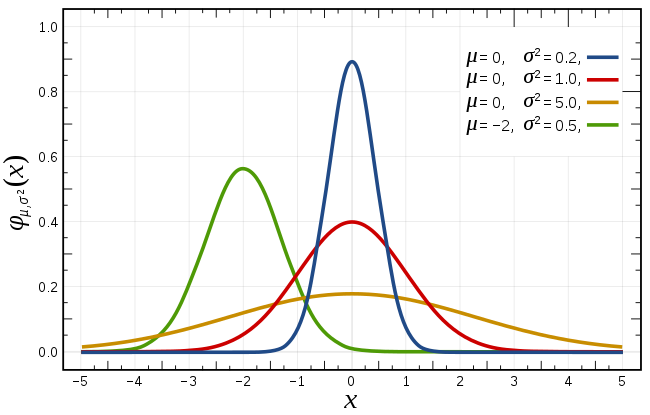
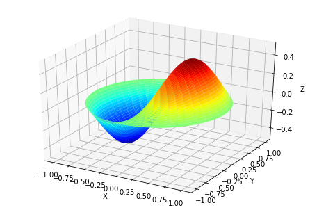

# 8.2 SciPy基础

scipy的主要特性。特殊包是数学物理中许多特殊函数的定义。可用的函数包括艾里函数、椭圆函数、贝塞尔函数、伽玛函数、贝塔函数、超几何函数、抛物柱面函数、马蒂厄函数、椭球波函数、斯特鲁夫函数和开尔文函数。也有一些低级的stats函数，它们不适合一般使用，因为stats模块提供了这些函数的更简单的接口。这些函数中的大多数可以接受数组参数，并按照与Numerical
Python中的其他数学函数相同的广播规则返回数组结果。许多函数也接受复数作为输入。使用单行描述类型\>\>\>
help(special)查看可用函数的完整列表。每个函数都有自己的文档，可以使用help访问。如果没有看到需要的函数，可以考虑编写它并将其贡献给库。可以用C语言、Fortran语言或Python编写函数。在库的源代码中可以找到每种函数的示例。

### 8.2.1 当SciPy遇见NumPy

SciPy建立在NumPy的基础上，对于所有基本的数组处理需求，您可以使用NumPy函数:。

scipy的顶层还包含numpy和numpy.lib.scimath的函数。但是，最好直接从numpy模块使用它们。

### 8.2.2 超越函数

特殊函数是超越函数。所谓超越函数是指变量之间的关系不能用有限次加、减、乘、除、乘方、开方
运算表示的函数。如初等函数中的三角函数、反三角函数与对数函数、指数函数都是初等超越函数，一般来说非初等函数都是超越函数。初等函数：指由基本初等函数经过有限次四则运算与复合运算所得到的函数

常用的一些函数如下：

-   贝塞尔函数，比如scipy.special.jn() (第n个整型顺序的贝塞尔函数)

-   椭圆函数 (scipy.special.ellipj() Jacobian椭圆函数, ...)

-   Gamma 函数: scipy.special.gamma(), 也要注意 scipy.special.gammaln()
    将给出更高准确数值的 Gamma的log。

-   Erf, 高斯曲线的面积：scipy.special.erf()

    下面我们对scipy.special中的部分常用函数进行说明:

####  常用特殊函数介绍

##### 函数

函数，也称伽玛函数，是由欧拉积分定义的函数，是阶乘函数在实数域与复数域上的扩展，当时,函数可以定义为：

由解析延拓原理可以将这个定义拓展到整个复数域上，非正整数除外。

在scipy.special中使用scipy.special.gamma()实现函数的计算，如果对于精度有更高要求，可以使用采用对数坐标的scipy.special.gammaln()函数进行计算。

##### 贝塞尔函数

在介绍贝塞尔函数之前，先对贝塞尔方程进行说明，一般来说，我们将形如：

的二阶线性常微分方程称为贝塞尔方程,而贝塞尔方程的标准解函数就是贝塞尔函数。其中，参数被称为对应贝塞尔函数的阶。贝塞尔方程是一个二阶线性齐次常微分方程，必然存在两个线性无关的解，然而通常情况下它的解无法用初等函数表示，但是当时，注意到是贝尔塞方程的正则奇点，则由常微分方程的广义幂级数解法可以得出贝塞尔方程的两个广义幂级数解：

其中被称为第一类贝塞尔函数，被称为第二类贝塞尔函数（诺依曼函数）。（求解方法参考常微分方程教程
7.4 广义幂级数解法）。

贝塞尔方程是在柱坐标或球坐标下使用分离变量法求解拉普拉斯方程和亥姆霍兹方程时得到的,因此贝塞尔函数在波动问题以及各种涉及有势场的问题中占有非常重要的地位，其应用有：

在圆柱形波导中的电磁波传播问题

圆柱体中的热传导问题

圆形或环形薄膜的震动膜态分析问题

信号处理中的调频合成（FMsynthesis）

波动声学

在scipyspecial中使用scipy.special.jn()计算阶贝塞尔函数

##### 椭圆函数

椭圆函数是定义在有限复平面上亚纯的双周期函数。所谓的双周期是指具有两个基本周期的单复变函数，即存在两个非0复数，对任意整数有：

于是

构成的全部周期。

在scipy.special中使用scipy.special.ellipj()函数计算椭圆函数。

##### Erf(高斯曲线的面积)

高斯曲线是指高斯分布也就是我们常说的正态分布

其概率密度函数为：

其概率密度函数曲线就是高斯曲线也叫钟形曲线，如下：

>   

>   图：不同参数下的高斯曲线

当时，高斯分布被称为标准正态分布。

scipy.special使用scipy.special.erf()计算高斯曲线的面积。

#### 实例：贝塞尔函数

贝塞尔函数是贝塞尔微分方程实阶或复阶的一系列解:

在其它用途中，这些函数出现在波传播问题中，例如薄鼓头的振动模式。下面是一个固定在边缘的圆桶头的例子:

**from** **scipy** **import** special

**def** drumhead\_height(n, k, distance, angle, t):

kth_zero = special.jn\_zeros(n, k)[-1]

**return** np.cos(t) \* np.cos(n\*angle) \* special.jn(n, distance\*kth_zero)

theta = np.r\_[0:2\*np.pi:50j]

radius = np.r\_[0:1:50j]

x = np.array([r \* np.cos(theta) **for** r **in** radius])

y = np.array([r \* np.sin(theta) **for** r **in** radius])

z = np.array([drumhead_height(1, 1, r, theta, 0.5) **for** r **in** radius])

下面我们来对这个例子进行可视化：

[]:\#matplotlib inline

import matplotlib.pyplot as plt

from mpl\_toolkits.mplot3d import Axes3D

from matplotlib import cm

fig = plt.figure()

ax = Axes3D(fig)

ax.plot\_surface(x, y, z, rstride=1, cstride=1, cmap=cm.jet)

ax.set_xlabel('X')

ax.set_ylabel('Y')

ax.set_zlabel('Z')

plt.show()

