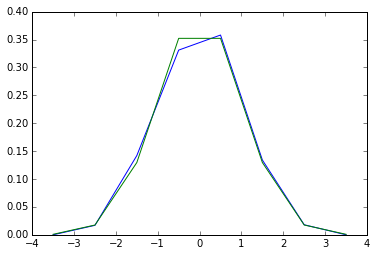

# 8.5 统计学

在本教程中，我们讨论了scipy.stats的许多（但肯定不是全部）特性。这里的目的是为scipy.stats模块包含统计工具和随机过程的概率描述。在numpy.random中可以找到多个随机数生成器。

### 8.7.1 统计学

给定随机过程的观察值，它们的直方图是随机过程的PDF（概率密度函数）的估计值：

In [31]:

a = np.random.normal(size=1000)

bins = np.arange(-4, 5)

bins

Out[31]:

array([-4, -3, -2, -1, 0, 1, 2, 3, 4])

In [32]:

histogram = np.histogram(a, bins=bins, normed=True)[0]

bins = 0.5\*(bins[1:] + bins[:-1])

bins

Out[32]:

array([-3.5, -2.5, -1.5, -0.5, 0.5, 1.5, 2.5, 3.5])

In [35]:

from scipy import stats

import pylab as pl

b = stats.norm.pdf(bins) \# norm 是一种分布

pl.plot(bins, histogram)

pl.plot(bins, b)

Out[35]:

[\<matplotlib.lines.Line2D at 0x10764cd10\>]

如果我们知道随机过程属于特定的随机过程家族，比如正态过程，我们可以做一个观察值的最大可能性拟合，来估计潜在分布的参数。这里我们用随机过程拟合观察数据：

In [5]:

loc, std = stats.norm.fit(a)

loc

Out[5]:

\-0.063033073531050018

In [6]:

std

Out[6]:

0.97226620529973573

### 8.7.2 百分位数

中数是有一半值在其上一半值在其下的值：

In [7]:

np.median(a)

Out[7]:

\-0.061271835457024623

中数也被称为百分位数50，因为50%的观察值在它之下：

In [8]:

stats.scoreatpercentile(a, 50)

Out[8]:

\-0.061271835457024623

同样，我们也能计算百分位数90：

In [10]:

stats.scoreatpercentile(a, 90)

Out[10]:

1.1746952490791494

百分位数是CDF的估计值：累积分布函数。
