# 9.1 SymPy初步

### 9.1.1 初识SymPy

SymPy是一个数学符号计算库(sym代表了symbol,符号)，包括了积分、微分方程等各种数学运算方法，为Python提供了强大的数学运算支持。它保证自身的代码尽可能简单，且易于理解，容易扩展。它完全由Python写成，不依赖于外部库。

我们之所以选择SymPy，主要出于以下原因：

免费：SymPy遵循BSD开源协议。使用者可以自由地使用，修改源代码，甚至作商业用途。

基于Python:
SymPy完全是用Python编写的，并使用Python作为其语言，拥有Python语言简洁、易于理解等优良特性。

轻量: SymPy只依赖于个用于任意浮点运算的纯Python库mpmath。

灵活:除了用作交互工具之外，SymPy还可以嵌入到其他应用程序中，并使用自定义函数进行扩展。

### 9.1.2 安装SymPy

我们可以使用conda命令或者pip命令对SymPy进行安装：

conda install sympy

pip instal sympy

安装完成，即可使用普通模块导入方法，对sympy库进行导入。为了方便起见，我们在本章开始对SymPy包下所有模块进行导入，但是为了了解各个模块的归属，我们会在新使用模块第一次出现的地方，使用from
import语句对其进行二次加载，虽然这样做并不会真正地二次加载。

[1]:from sympy import \*

另外，让我们在Cell [1]中继续键入下面几行代码，并运行。

init_session()

这将会给我们之后讲述带来便利。我们会在接下来的课程中对上述代码进行讲解。

### 9.1.3 SymPy语法

#### 数学符号的创建

一门优秀编程语言最重要的优点之一即：贴近自然语言。SymPy尽可能地保留了原有的数学习惯，但是不可避免地在某些情况下，还需要进行额外的声明，来保证代码语义的确定性。

我们使用sympy库下的symbols函数来创建一个数学变量。

symbols函数的使用方法如下：

symbols(‘str1[, str2, …]’)

symbols的传入参数为一个或多个字符串对象，依次返回对应的sympy符号对象类型。

[2]:x=symbols(‘x’)

x

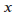[2]:

[3:y, z, k=symbols(‘z k y’)

y, z, k

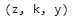[3]

在这种赋值情况下，变量z，k，y对应的符号不再是’z’, ‘k’,
‘y’，而是发生了错位。这也就是说，变量的实际符号，与变量的名称无关。

#### 符号表达式

在数学上，等号‘=’通常有两层含义，赋值与等价。当我们尝试为变量S赋值时如，我们不会认为等号的意义是等价，当我们在解含有未知量x的方程的时候，如，我们同样也不会认为等号的意义是赋值。在Python中，我们使用=代表赋值，==号代表等价，而SymPy保留了这个传统。

但是，Python中的等价与数学上的等价又有区别，Python中的等价会严格比较’==’左右的表达式结构，而数学上的等价则是比较两端化简规约后是否相等。

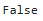[4]:(x+1)\*\*2==x\*\*2+x\*2+1

[4]:

如果您学习过Matlab或Mathematica等编程语言，那么通常我们会习惯性地用\^来进行幂运算，用/来进行除法运算。在Python中双星号\*\*代替了\^的职能，\^的功能是进行异或运算，而/的作用则是进行数值除法运算。

如果我们希望保留分数形式，那么我们需要使用SymPy下的Rational函数

Rational函数的用法如下：

Rational(dividend, divisor)

例

[5]:1/3

0.3333333333333333

[6]:from sympy import Rational

Rational(1, 3)

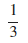[6]:

#### 当 SymPy遇见Python

最后我们将要探讨当SymPy数据类型与Python数据类型进行混合计算时，计算结果的数据类型问题。

当多个SymPy数据类型进行计算时，会按定义在SymPy数据类型上的操作方法进行，计算结果仍然为SymPy类型。当SymPy与Python数据类型进行混合运算需要遵循由简到繁的原则，即先Python内置数据类型要转换为SymPy数据类型，然后按照SymPy数据类型的运算规则进行计算

例

[]:Rational(Integer (1)/Integer(2))

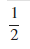[]:

[]:type(Rational(Integer (1)/Integer(2)))

\<class 'sympy.core.numbers.Half'\>

[]:Rational(Integer (1)/Integer(2))+1

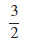[]:

[]:type(Rational(Integer (1)/Integer(2))+1)

\<class 'sympy.core.numbers.Rational'\>

SymPy集成了各种数学工具，在实践中，这些工具使用频繁。因此，我们通常将这些工具一次导入。

from sympy import \*

### 9.2.1 基本操作

在这里，我们讨论一些最基本的手术需要的表现手法和症状（？）。高级表达式操作部分稍后将讨论一些更高级的操作。

为了讲解方便，我们先创建三个符号变量。

\>\>\>x, y, z=symbols(“ x y z”)

#### 替换

使用数学表达式最常见的一种方法是替换。替换将表达式中某物的所有实例替换为另一物。这是使用symbols对象的subs方法完成的。

普通替换

[]:expr=cos(x)+sin(pi/2)

expr.subs(x, pi/2)

[]:

例：循环替换，执行5次除法嵌套

[]:expr=1/(1+x)

for i in range(5): expr=expr.subs(x, 1/(1+x))

expr

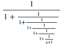[]:

#### 字符串转为SymPy表达式

使用simpify函数，可以将字符串类型的表达式转为SymPy表达式

[]:str_expr=’x\*\*2+2\*x+1’

expr=sympify(str_expr)

expr

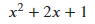[]:

#### 表达式求值

使用exalf(precision)可以对数值表达式求值，precision为小数保留位数，precision默认为15。

[]:expr=sqrt(13)

expr.evalf(13)

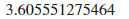[]:

#### 使用NumPy和SciPy计算

尽管subs和evalf可以很好的帮助我们进行计算，但是如果我们希望同时代入大量参数到一个公式进行计算，那么这时候你可能就忍受不了SymPy的运行效率了。

另外SymPy在计算精度上不如NumPy和SciPy，如果对机器精度有较高的要求的话，应该使用NumPy或SciPy这样的库。

将一个SymPy符号表达式转换成一个数值计算表达式最简单的方法是使用lambdify函数。lambdify的作用类似于lambda函数，只不过它将SymPy名称转换为特定数值库的名称，通常是NumPy。（？）

lambdify()函数用于转换表达式进行数值计算时需要指定三个参数，分别是变量，表达式和数值库。

例 将符号表达sin(x)+cos(x) 转为函数，并分别将0\~9十个整数代入计算。

[]:import numpy

arr=numpy.arange(10)

expr=sin(x)+cos(x)

f=lambdify(x, expr, 'numpy')

type(f)

[]:function

[]:f(arr)

[]:array([ 1. , 1.38177329, 0.49315059, -0.84887249, -1.41044612, -0.67526209,

0.68075479, 1.41088885, 0.84385821, -0.49901178])

### 9.2.2 打印

通过前面的例子，我们可以发现，Jupyter
Lab可以对SymPy符号进行优美地展现。事实上，我们还可以通过自定义打印机，来根据我们实际需求打印不同风格的数学符号。常用的打印机有str，srepr，ASCII，Unicode，LaTex，
MathML，Dot。

我们可以使用init_print()函数自动启用环境中可用的最佳打印机以获得最好的打印效果。下面让我们尝试在默认Python解释器中输出下列积分符号：

\>\>\>from sympy import \*

\>\>\>x=symbols(‘x’)

\>\>\>Integral(sqrt(1/x), x)

\>\>\>init_printing()

\>\>\>Integral(sqrt(1/x), x)

输出结果如图所示

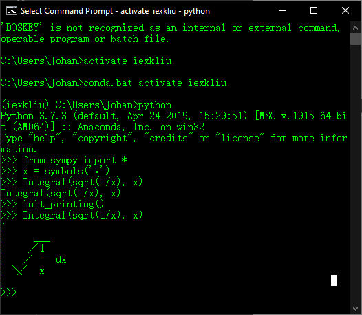

图

如果在交互式计算器类型的会话中工作，init_session()函数将自动导入SymPy中的所有内容，与此同时，创建一些公共符号，设置绘图，并运行init_printing()。如图所示

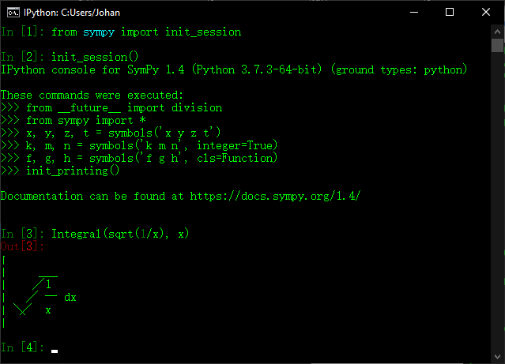

图

此外，还需要注意以下几点：

1.  如果LATEX被安装，那么在Ipython QTConsole中，打印机将使用Latex

2.  要显式地不使用LATEX，请将use_latex=False传递给init_printing()或init_session()。要显式地不使用Unicode，传递use_unicode=False。

3.  在IPython控制台会话或常规Python会话中，如果终端支持Unicode，它将使用Unicode
    pretty打印机。在不支持Unicode的终端中，使用ASCII pretty打印机。

### 9.2.3 绘图

绘图模块允许您制作二维和三维绘图。目前，这些绘图是使用matplotlib作为后端呈现的。如果没有matplotlib，也可以使用textback绘制二维图。

表[]列举了本节所用到的plot, plot_parametric, plot3d,
plot3d_parametric函数的通用参数及其功能描述，在sympy.plotting模块中可以导入这些绘图函数，在实际绘图中，我们可以改变相应参数的取值来绘制不同的图形。如果您使用过Mathematica或者Matlab这些专业数学软件，会发现SymPy中存在大量与Mathematica和Matlab中同名的函数。这不仅仅表现在SymPy的绘图模块上，也表现在SymPy的积分，微分等模块。

表[]

| 参数         | 描述                             |
|--------------|----------------------------------|
| title        | 字符串，标题                     |
| xlabel       | 字符串，x轴坐标，                |
| ylabel       | 字符串，y轴坐标                  |
| legend       | 布尔类型，显示图例               |
| xscale       | {‘linear’,’log’} ，设置x轴范围， |
| yscale       | {‘linear’,’log’}，设置y轴范围    |
| axis         | 布尔类型，显示坐标轴             |
| axis_center  | 浮点型二元组或{‘center’, ‘auto’} |
| xlim         | 浮点型，x轴的极限                |
| yim          | 浮点型，y轴的极限                |
| aspect_ratio | 浮点型二元组或{‘auto’}           |
| autoscale:   | 布尔类型                         |
| margin       | 0\~1之间的浮点数，图边距         |

#### 二维图形

我们使用SymPy绘制的图形都是在特定的画布上展现的，画布上可以展示一张图也可以同时展示多张图。由于不同图形的范围不同，在同一画布上展示多种图形的时候不同图形的绘图范围也会不同。我们在对SymPy中的绘图函数进行讲解时，按照从单图到多图，从同一画布同范围到同一画布不同范围的方式进行展开。

##### 一元函数

使用plot函数可以绘制一元函数代表的二维图形。

Plot()函数的用法如下：

单图

plot(expr, range, \*\*kwargs)

一张画布显示同范围多图

plot(expr1, expr2, ..., range, \*\*kwargs)

一张画布显示不同范围多图

plot((expr1, range), (expr2, range), ..., \*\*kwargs)

例：在统一张画布中绘制函数与，其中

[]:from sympy.plotting import plot

[]:p1=plot(x\*\*(-1), (x, -3, 3), ylim=(0, 10), show=False)

p2=plot(x, (x, -3, 3), show=False)

p1.append(p2[0])

p1.show()

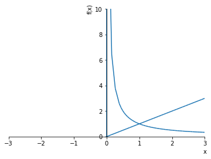

在绘制图形的时候，变量p1存储的图形对象,
p2存储的图形对象。如果将plot()函数中的show参数改为True，则会在创建plot对象的同时，显示plot图像。使用append方法可以将其他图形增加到已有图形对象的画布中去，使用show()方法可以显示图形对象。plot函数和其他绘图函数一样，默认返回一个列表，其中第0号元素存储第一个图形。因此在使用append方法追加p2列表对象存储的图形时，一定要指定图形所在的位置。在上例中同一样被分别存储在列表p1和p2的第0号位置。

例：在同张画布中绘制函数，其中

[]:x=symbols('x')

p1=plot(x\*\*(-1),ylim=(0, 10), show=False)

p2=plot(x\*\*(1/2), show=False)

p3=plot(x, show=False)

p4=plot(x\*\*2, show=False)

p5=plot(x\*\*3, show=False)

p1.append(p2[0])

p1.extend(p3)

p1.extend(p4)

p1.extend(p5)

p1.show()

使用extend方法可以将向extend方法中传入的列表对象中的图形元素全部追加到目标图形列表后。

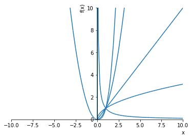

例：做出的函数趋势图。并将图形取名为graph of functions。

[]:plot(x\*\*(-1), log(x), x, x\*log(x), x\*\*2, x\*\*3, (x, -3, 3), ylim=(0,
10), lengend=True, title='graph of functions')

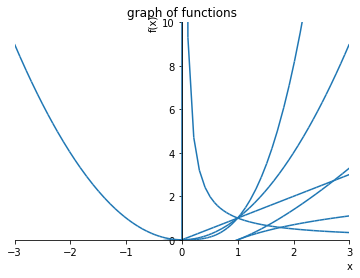

[]:\<sympy.plotting.plot.Plot at 0x141d0400\>

##### 参数方程

SymPy中的plot_parametric()函数可以绘制参数方程代表的二维图形。

plot_parametric()函数的用法如下：

单图

plot_parametric(expr_x, expr_y, range, \*\*kwargs)

一张画布显示同范围多图

plot_parametric((expr1_x, expr1_y), (expr2_x, expr2_y), range, \*\*kwargs)

一张画布显示不同范围多图

plot_parametric((expr_x, expr_y, range), ..., \*\*kwargs)

例：画出参数方程的图像

[]:from sympy.plotting import plot_parametric

[]:plot_parametric(cos(x), sin(x))

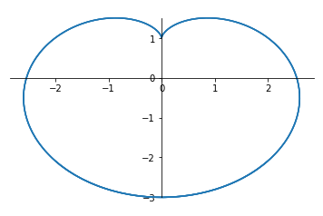

[]:\<sympy.plotting.plot.Plot at 0x1430a588\>

例：画出参数方程与

[]:plot_parametric((cos(x), sin(x)), (x, cos(x)))

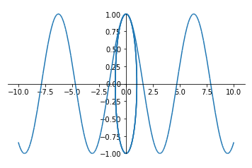

[]:\<sympy.plotting.plot.Plot at 0xbb0f6d8\>

#### 三维图形

##### 二元函数

使用plot3d函数可以绘制二元函数代表的三维图形。

plot3d ()函数的用法如下：

plot3d(expr, range_x, range_y, \*\*kwargs)

一张画布显示同范围多图

plot3d(expr1, expr2, range_x, range_y, \*\*kwargs)

一张画布显示不同范围多图

plot3d((expr1, range_x, range_y), (expr2, range_x, range_y), ..., \*\*kwargs)

例：画出函数的图像，其中

[]:from sympy.plotting import plot3d

[]:plot3d(x\*\*2\*y, (x, -5, 5), (y, -5, 5))

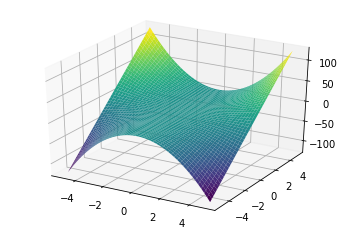

[]:\<sympy.plotting.plot.Plot at 0x17364eb8\>

例：画出函数与的组合图像，其中

[]:plot3d(x\*\*2+y\*\*2, x\*\*2-y\*\*2, (y, -5, 5))

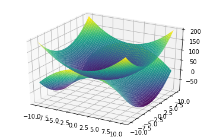

[]:\<sympy.plotting.plot.Plot at 0x17238e10\>

##### 参数方程

###### 空间曲线

使用plot3d_parametric_line函数可以绘制参数方程代表的三维图形。

plot3d_parametric_line的用法如下：

单图

plot3d_parametric_line(expr_x, expr_y, expr_z, range_u, range_v, \*\*kwargs)

一张画布显示不同范围多图

plot3d_parametric_line((expr_x, expr_y, expr_z, range_u, range_v), ...,
\*\*kwargs)

例：绘制螺旋线

[]:from sympy.plotting import plot3d_parametric_line

[]:plot3d_parametric_line(x,sin(6\*x)\*x/3,cos(6\*x)\*x/5,(x,0,6\*pi))

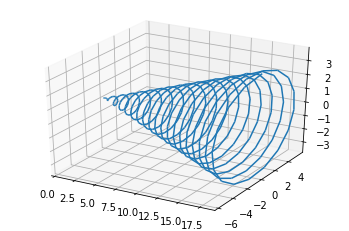

[]:\<sympy.plotting.plot.Plot at 0x18f410f0\>

###### 空间曲面

使用plot3d_parametric_surface函数可以绘制参数方程代表的三维图形。

plot3d_parametric_surface的用法如下：

单图

plot3d_parametric_surface(expr_x, expr_y, expr_z, range_u, range_v, \*\*kwargs)

一张画布显示不同范围多图

plot3d_parametric_surface((expr_x, expr_y, expr_z, range_u, range_v), ...,
\*\*kwargs)

例：绘制的图像。

[]:from sympy.plotting import plot3d_parametric_surface

[]:plot3d_parametric_surface(cos(x + y), sin(x - y), x - y, (x, -5, 5), (y, -5,
5))

[]: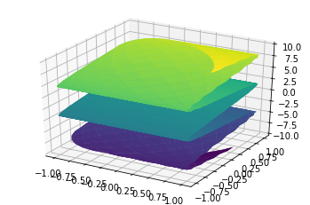

[]:\<sympy.plotting.plot.Plot at 0xbe42550\>
